# Game Design Document (GDD) - The Living Garden
Versión Alpha

**Autor:** Ripple Games

**Fecha:** 19 de octubre de 2025

# Índice
[1. Introducción](#1-introducción)   
[2. Monetización](#2-monetización)   
[3. Planificación y costes](#3-planificación-y-costes)   
[4. Mecánicas de juego y elementos de juego](#4-mecánicas-de-juego-y-elementos-de-juego)   
[5. Trasfondo](#5-trasfondo)   
[6. Arte](#6-arte)   
[7. Interfaz](#7-interfaz)   
[8. Hoja de ruta de desarrollo](#8-hoja-de-ruta-de-desarrollo)   

# 1. Introducción
## 1.1. Descripción breve del concepto del juego
Es un videojuego de **simulación y gestión de recursos** con enfoque en la ecología de la supervivencia y en la interdependencia de especies ante el colapso climático. El jugador debe cultivar un jardín no como un simple _hobby_, sino como un **santuario vital**, gestionando recursos básicos como el agua y el abono, y creando **micro-ecosistemas de resistencia** donde la sombra que da una planta, los insectos que atrae y la salud del suelo interactúan de forma dinámica para mitigar los factores externos extremos. Cada partida será única, ya que las condiciones iniciales del terreno y los patrones climáticos se generan procedimentalmente, obligando a una adaptación constante. El objetivo final es alcanzar la máxima biodiversidad y autosuficiencia del jardín, asegurando la supervivencia de especies botánicas y de fauna raras que ya no pueden prosperar en el mundo exterior.

## 1.2. Descripción breve de la historia y personajes
En un futuro cercano, el lento pero constante deterioro climático ha transformado la civilización. La mayoría de la humanidad reside en ciudades autosuficientes y tecnológicamente avanzadas, dando la espalda a un mundo rural que se desmorona. Los ecosistemas naturales están en un declive acelerado, perdiendo especies de flora y fauna que ya no pueden sobrevivir fuera de los confines urbanos.

El personaje principal es un joven idealista que rechaza la idea de una naturaleza confinada a los archivos digitales. Este se une al Programa de Santuarios Botánicos, una iniciativa financiada privadamente que se opone a la extinción biológica. Su misión es clara: habitar una parcela olvidada y crear un Jardín Santuario. Este refugio vital debe albergar, proteger y hacer prosperar especies vulnerables.

La historia es un viaje de resistencia ecológica. El objetivo es alcanzar y mantener la máxima biodiversidad y autosuficiencia, logrando el equilibrio crítico de un número determinado de especies (por ejemplo, 10 plantas y 5 especies de fauna). Al lograr este equilibrio, el santuario se convierte en un faro de esperanza biológica, demostrando que la naturaleza puede ser rescatada y regenerada con conocimiento y dedicación, generando un legado de esperanza biológica.

## 1.3. Propósito, público objetivo y plataformas
El principal objetivo de _The Living Garden_ es ofrecer una experiencia de simulación ecológica y gestión de recursos que sea a la vez acogedora e inspiradora. El juego sirve como vehículo didáctico y reflexivo, logrando concienciar a los jugadores sobre los efectos del cambio climático y la vital importancia de la biodiversidad y regeneración en los ecosistemas. Además, la experiencia de juego está diseñada para ser gratificante y desestresante, fomentando la paciencia y la observación. El interés no solo se debe enfocar en la gestión precisa de recursos y planificación de microclimas, sino en la propia evolución biológica del santuario y el logro de su autosuficiencia.

_The Living Garden_ está dirigido a jugadores de un amplio rango de edades entre jóvenes y adultos, especialmente aquellos que disfrutan de juegos de simulación y experiencias _cozy_. El diseño está pensado para ser una experiencia para un único jugador, centrándose en la inmersión personal y en la gestión ambiental.  

En cuanto a las especificaciones operacionales, el lanzamiento se dirigirá a PC y Tablet, con una distribución optimizada para ser accesible vía Web. La fecha de lanzamiento objetivo está fijada para Diciembre de 2025. 

Finalmente, el modelo de monetización se basará en Ventas "In-Game", lo que puede incluir la venta de cosméticos, expansiones o contenido adicional, asegurando que el _core_ del juego sea accesible para todos los jugadores.

# 2. Monetización
## 2.1. Tipo de modelo de monetización
The Living Garden será un juego Free-to-Play (F2P) con microtransacciones centradas en cosméticos, junto a publicidad no intrusiva (solo anuncios recompensados).

El objetivo es mantener una experiencia relajada, coherente con la filosofía del juego, evitando modelos invasivos o de pago obligatorio. Los pagos se orientan a la personalización, la estética y la mejora de la experiencia, sin ofrecer ventajas competitivas de pay-to-win que afecten el equilibrio ecológico.

### 2.1.1. Estructura del modelo
**Moneda principal: Pétalos.**

Se obtienen por juego normal (logros, hitos), por ver anuncios recompensados y mediante compra directa (IAP).

Sirven para comprar packs de recursos (agua/abono/semillas) y “comodines” de conveniencia (ej. aceleradores de crecimiento).

**Anuncios/estrategia:**

El juego incluirá una fuente de ingresos limitada a los **Vídeos Recompensados**. Estos anuncios son una opción siempre voluntaria que el jugador activa para recibir un beneficio inmediato, sin interrumpir la jugabilidad principal. Las recompensas consisten en pequeñas cantidades de **néctar** (la divisa premium para cosméticos) o recursos básicos. Estratégicamente se ofrecerán en puntos de bajo estrés (como al iniciar sesión o después de haber jugado un periodo), o para ayudar a paliar una pérdida importante. Este formato es el más valioso (alto eCPM) y aumenta la retención, siempre manteniendo el diseño no forzado y coherente con la filosofía _cozy_ del juego. 

**Microtransacciones (IAP):**

- Packs de Néctar (ver tabla).
- Packs de recursos (pétalos/bolsas de abono/agua extra), para jugadores que quieran acelerar el progreso. 
- Cosméticos y DLC tipo "Libro de arte" para público nicho y merchandising.

**Política anti pay-to-win:**

Ningún objeto que afecte de forma permanente la competencia o desbloquee especies raras de forma instantánea estará detrás de un paywall. Estos recursos comprables aceleran o facilitan, pero siempre es posible lograr con todo con tiempo y buena gestión.

## 2.2. Tablas de productos y precios
**Tienda de néctar:**
| Pack | Precio (€) | Néctar | €/1 de néctar |
|-----------|-----------|-----------|-----------|
| Ver 1 anuncio | Gratis | 1 de néctar | - |
| Pack Pequeño | 1,99€ | 30 de néctar   | 0,066 €/1 de néctar |
| Pack Medio | 2,99€ | 50 de néctar   | 0,059 €/1 de néctar |
| Pack Grande | 4,99€ | 100 de néctar   | 0,049 €/1 de néctar |
| Pack XL | 9,99€ | 250 de néctar   | 0,04 €/1 de néctar |
| Pack Súper | 19,99€ | 600 de néctar   | 0,033 €/1 de néctar |

**Tienda de cosméticos:**
- Cosméticos escenario:
  
| Escenario | Néctar |
|-----------|-----------|
| Escenario rústico | 55 de néctar |
| Escenario moderno | 60 de néctar |
| Escenario naturalista | 70 de néctar |

- Sombreros para Leo:
  
| Sombrero | Néctar |
|-----------|-----------|
| Sombrero de copa | 20 de néctar |
| Sombrero de cumpleaños | 20 de néctar |
| Gorra | 20 de néctar |

- Interfaz:
  
| Interfaz | Néctar |
|-----------|-----------|
| Interfaz rústica | 15 de néctar |
| Interfaz moderna | 20 de néctar |
| Interfaz naturalista | 25 de néctar |

- Bundles (oferta):
  
| Bundle | Néctar |
|-----------|-----------|
| Bundle “Inicio” (Interfaz rústica + Gorra + 20 de néctar) | 45 de néctar (pequeño descuento) |
| Bundle “Decorador” (2 escenarios + 3 sombreros) | 140 de néctar (descuento frente a comprar por separado) |

**Tienda de recursos (consumibles, comprables con néctar o pétalos):**
- Pétalos (in-game currency usada para semillas básicas, ventas menores):
  
| Pétalos | Néctar |
|-----------|-----------|
| 500 pétalos | 5 de néctar |
| 1.500 pétalos | 12 de néctar |
| 4.000 pétalos | 30 de néctar |

- Packs de recursos (para partidas rápidas):
  
| Pack | Néctar |
|-----------|-----------|
| Kit Riego (rellena regadera + 1 día extra de riego automático) | 10 de néctar |
| Saco Abono (x3 abonos listos)| 12 de néctar |
| Pack Semillas Mixto (3 semillas comunes + 1 rara) | 25 de néctar |

- Ofertas y economía:
    - **Introducir ofertas diarias/semana** (ej. “Oferta del mercader ambulante”): 1 planta rara por 40% menos de néctar), para incentivar compras repetidas.
    - **Elasticidad**: ajustar precio/valor en función de datos reales (A/B tests).

# 3. Planificación y costes
## 3.1. El equipo humano
El proyecto _The Living Garden_ será desarrollado por un equipo de 5 integrantes dentro del contexto académico.

Cada miembro asume un rol principal, aunque todos colaboran de manera transversal en distintas áreas del diseño y la producción.

## 3.2. Estimación temporal del desarrollo
El desarrollo del prototipo se estima en 3 meses, estructurado en 3 hitos principales:
| Mes | Hito | Descripción |
|-----------|-----------|-----------|
| 1 | Prototipo básico | Implementación del sistema de parcelas, plantación y riego. |
| 2 | Integración de arte y mecánicas completas | Sistema de recursos, crecimiento de plantas, interfaz inicial. |
| 3 | Pulido y presentación final | Ajuste de balance, testeo, implementación de sonido y entrega del GDD. |

## 3.3. Costes asociados
Aunque el proyecto no implica gastos reales, se identifican los recursos y herramientas necesarias para el desarrollo:
| Categoría | Descripción | Observación |
|-----------|-----------|-----------|
| Hardware | Ordenadores personales de los integrantes. | Recursos propios del equipo. |
| Software | Motor de desarrollo (Unity), suite de diseño (Photoshop, Illustrator…). | Se utilizarán versiones estudiantiles o gratuitas. |
| Recursos artísticos y sonoros | Imágenes, efectos de sonido, fuentes tipográficas… | Recursos originales o libres de derechos. |
| Licencias | Software de uso puntual, si aplica. | Generalmente no necesarias. |
| Publicación y documentación | Creación del GDD, presentaciones y mockups visuales. | Sin coste adicional. |

**Coste total estimado:** 0 € (sin inversión económica directa).
En un contexto profesional, el presupuesto rondaría entre 50.000 € y 70.000 €, considerando salarios, licencias y hardware, pero en el entorno académico solo se contabiliza el tiempo invertido y el aprendizaje del equipo.

# 4. Mecánicas de juego y elementos de juego
## 4.1. Descripción detallada del concepto del juego
“The Living Garden” es un videojuego de simulación y gestión ecológica de recursos. El juego se centra en la creación, el mantenimiento y la prosperación de un Jardín Santuario, un micro-ecosistema diseñado para proteger y albergar especies de flora y fauna amenazadas por el colapso climático.

El núcleo de la jugabilidad está en el equilibrio ecológico y la interdependencia de especies. El jugador no solo gestiona recursos básicos como el agua y el abono, sino que debe planificar la ubicación de las plantas para maximizar los efectos sinérgicos. Las condiciones iniciales del juego y los patrones climáticos extremos son procedimentales, lo que obliga a una adaptación constante y a una toma de decisiones estratégica.

El objetivo final es alcanzar la máxima biodiversidad, midiendo el progreso por el número de especies y su salud. 

## 4.2. Descripción detallada de las mecánicas del juego
### 4.2.1. Gestión de recursos
- **Gestión de recursos primarios:** El jugador debe gestionar el suministro limitado de **Agua** y **Abono**. Estos recursos son vitales para la salud de las plantas.
    - **Adquisición**: Los recursos básicos se reciben diariamente al inicio del día. Cuantas más especies tenga el jardín, mayor será la cantidad de recursos recibidos. También se pueden comprar en la tienda con recursos.
    - **Uso**: El jugador tiene que decidir regar y abonar cada parcela manualmente, considerando la previsión meteorológica y las necesidades de cada especie. El uso eficiente es crucial dada su escasez.
    
- **Gestión financiera:**   Los pétalos en el juego se utilizan para comprar semillas y recursos esenciales. Se obtienen a través de la cosecha y el suministro.

### 4.2.2. Cultivo y planificación del jardín
- **Plantación y cosecha:**
    - **Plantación:** El jugador puede comprar semillas en la tienda y plantarlas en cualquiera de las parcelas disponibles, teniendo en cuenta los requerimientos de la semilla y lo que puede aportar a las parcelas adyacentes. Las especies de plantas tienen requerimientos específicos de sol, agua y atracción o repulsión de especies.
    - **Cosecha y suministro:** Una vez que las plantas alcanzan la madurez, el jugador puede cosechar sus productos (ej: semillas, flores, frutos). Estos productos se envían a las Fundaciones Ecológicas a cambio de pétalos.

- **Sinergias y micro-ecosistemas (planificación ecológica):**
    - El jugador debe planear estratégicamente la **disposición de las plantas**.
    - La proximidad de ciertas especies genera **efectos positivos (sinergias) o negativos**. Por ejemplo, una planta alta puede dar sombra a una planta vecina sensible al sol extremo, o una flor puede insectos polinizadores que beneficien a otra planta.
    - El éxito a largo plazo depende de la **creación de cadenas de interdependencia** que refuercen la salud general del jardín.

### 4.2.3. Interacción con el entorno
- **Ciclo diario:** el juego opera con un ciclo temporal donde los eventos climáticos y el consumo de recursos de las plantas se simulan al inicio de cada día. El jugador puede pasar de día cuando decida que ha acabado de hacer sus tareas de ese día.
- **Adaptación climática:** El jugador debe consultar la previsión meteorológica para tomar decisiones preventivas. Por ejemplo regar más antes de un sol muy intenso o plantar variedades resistentes.
- **Eventos ecológicos (plagas y fauna):** El juego simula la aparición de plagas o la llegada de fauna beneficiosa. El jugador debe gestionar estos eventos, simulando una planificación ecológica para que la propia biodiversidad actúe como defensa natural.

### 4.2.4. Progresión y objetivo
- **Logro de biodiversidad:** El progreso se mide por la cantidad de especies y fauna crítica que el jardín logra albergar y mantener en equilibrio.
- **Sistema de salud de la planta:** Cada planta tiene un estado de salud dinámico que se recalcula diariamente en función de si ha cubierto sus requerimientos de recursos y el clima. Mantener la salud de las especies es un reto constante.

## 4.3. Controles
Dado que "The Living Garden" está diseñado para ser jugado en plataformas web (ordenador) y dispositivos táctiles (tablet y móvil), el esquema de control se basa exclusivamente en la interacción de un solo punto, es decir, **el clic izquierdo del ratón en escritorio y el toque o tap en pantallas táctiles**.

Este enfoque garantiza una curva de aprendizaje mínima y una alta accesibilidad, eliminando la necesidad de gestos complejos o comandos de teclado.

Las navegación de menús, la selección de elementos (parcelas, herramientas…), y el avance de día se harán a usando el clic izquierdo o haciendo tap en los dispositivos móviles. El uso de herramienta consta de dos pasos, hacer clic en el icono del recurso y hacer clic o tocar la parcela donde se aplica el recurso.

## 4.4. Niveles y misiones
El videojuego **no cuenta con niveles ni misiones tradicionales**, sino con una **partida continua y progresiva**, centrada en la evolución ecológica del Jardín Santuario.
La progresión se define por el crecimiento del ecosistema y la capacidad del jugador para adaptarse a las condiciones cambiantes del entorno, más que por una estructura lineal de objetivos. 

El juego se basa en un único espacio jugable que evoluciona con el tiempo. No existen misiones predefinidas ni una secuencia de niveles cerrada. El jugador establece su propio ritmo y metas, guiado por la exploración, la curiosidad y la búsqueda del equilibrio ecológico.

A futuro, se contempla la posibilidad de integrar un **sistema de misiones o encargos del PSB (Programa de Santuarios Botánicos)**, que ofrezca desafíos opcionales como “recuperar una especie en peligro” o “restaurar la fertilidad de una zona”. Sin embargo, esta funcionalidad no está confirmada.

La **curva de dificultad es orgánica y ambiental**. A medida que avanza la partida, la frecuencia y la intensidad de los **eventos meteorológicos extremos** (sequías, tormentas, heladas) aumentan gradualmente.

El jugador deberá anticiparse a estos cambios mediante una planificación más precisa del jardín y una mejor gestión de recursos. La dificultad no se basa en penalizaciones directas, sino en la **complejidad del ecosistema**, que demanda cada vez más atención y equilibrio.

## 4.5. Objetos
- **Plantas:**
  
<table>
    <thead>
        <tr>
            <th style="width: 25%; text-align: center;">Planta</th>
            <th style="width: 30%; text-align: center;">Descripción</th>
            <th style="width: 15%; text-align: center;">Categoría</th>
            <th style="width: 15%; text-align: center;">Necesidades</th>
            <th style="width: 7.5%; text-align: center;">Crecimiento</th>
            <th style="width: 7.5%; text-align: center;">Precio</th>
        </tr>
    </thead>
    <tbody>
        <tr>
            <td>
                <b>Nombre:</b> Abelia 
                <b>Nombre científico:</b> <i>Abelia chinensis</i> 
                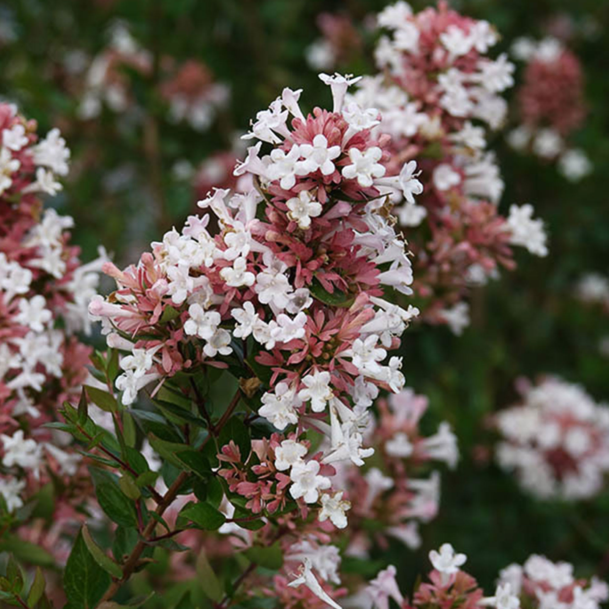
            </td>
            <td>No aguanta muy bien las heladas. Resistente. Flores durante el verano y principios de otoño.</td>
            <td>Atractor de Polinizadores / Refugio para fauna</td>
            <td>
                <b>Necesidad de agua:</b> 2 
                <b>Necesidad de abono:</b> Suelo fértil (3) 
                <b>Exposición solar:</b> Sol directo
            </td>
            <td>
                <b>Días hasta brotar:</b> 1 
                <b>Días hasta crecer:</b> 2 
                <b>Días hasta madurar:</b> 3
            </td>
            <td>2 pétalos</td>
        </tr>
        <tr>
            <td>
                <b>Nombre:</b> Gerbera 
                <b>Nombre científico:</b> <i>Asteraceae gerbera</i> 
                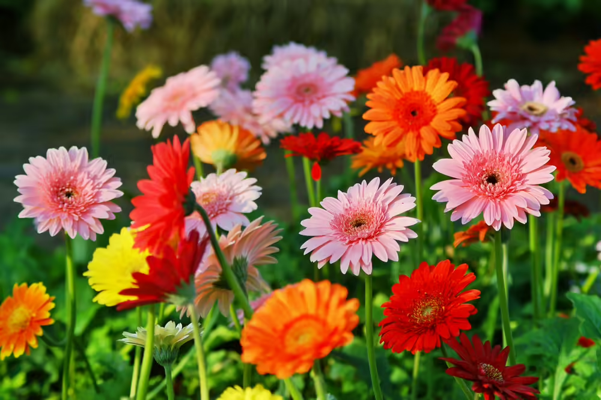
            </td>
            <td>Flor colorida y ornamental que aporta alegría al jardín. Su alto consumo de agua la hace ideal para zonas húmedas o bien regadas.</td>
            <td>Atractor de Polinizadores</td>
            <td>
                <b>Necesidad de agua:</b> 3 
                <b>Necesidad de abono:</b> 2 
                <b>Exposición solar:</b> Sol directo
            </td>
            <td>
                <b>Días hasta brotar:</b> 1 
                <b>Días hasta crecer:</b> 2 
                <b>Días hasta madurar:</b> 3
            </td>
            <td>3 pétalos</td>
        </tr>
        <tr>
            <td>
                <b>Nombre:</b> Margarita 
                <b>Nombre científico:</b> <i>Bellis perennis</i> 
                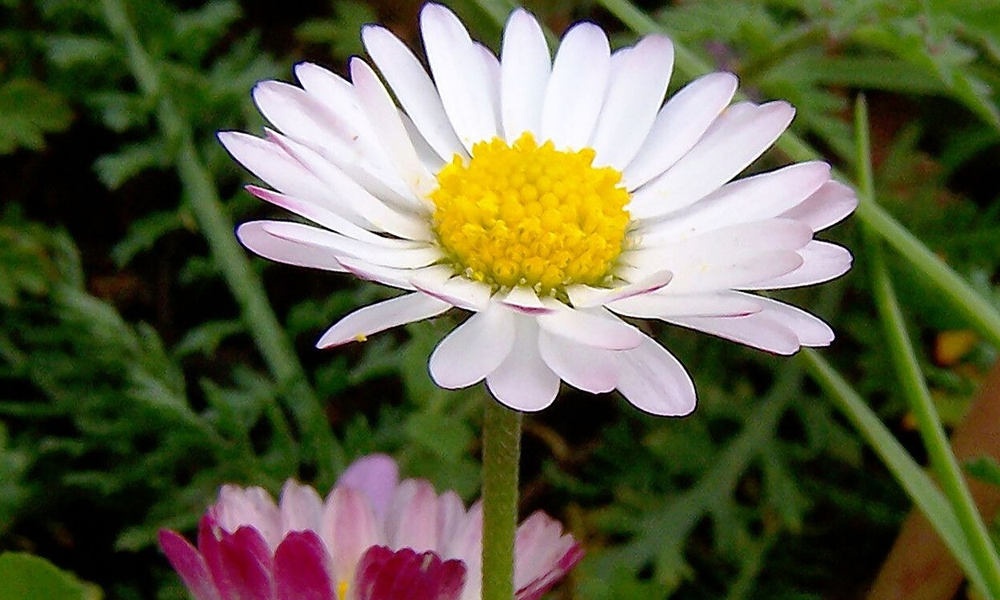
            </td>
            <td>Planta simple y común, de rápido crecimiento. Perfecta para principiantes y para estabilizar suelos secos.</td>
            <td>Atractor de Polinizadores</td>
            <td>
                <b>Necesidad de agua:</b> 1 
                <b>Necesidad de abono:</b> 1 
                <b>Exposición solar:</b> Sol parcial
            </td>
            <td>
                <b>Días hasta brotar:</b> 1 
                <b>Días hasta crecer:</b> 1 
                <b>Días hasta madurar:</b> 2
            </td>
            <td>1 pétalo</td>
        </tr>
        <tr>
            <td>
                <b>Nombre:</b> Flor de Pascua 
                <b>Nombre científico:</b> <i>Euphorbia pulcherrima</i> 
                
            </td>
            <td>Planta ornamental delicada con hojas rojas características. Necesita suelos fértiles y ambientes estables.</td>
            <td>Atractor de Polinizadores</td>
            <td>
                <b>Necesidad de agua:</b> 2 
                <b>Necesidad de abono:</b> 3 
                <b>Exposición solar:</b> Semisombra
            </td>
            <td>
                <b>Días hasta brotar:</b> 1 
                <b>Días hasta crecer:</b> 2 
                <b>Días hasta madurar:</b> 4
            </td>
            <td>3 pétalos</td>
        </tr>
        <tr>
            <td>
                <b>Nombre:</b> Hibisco 
                <b>Nombre científico:</b> <i>Hibiscus rosa-sinensis</i> 
                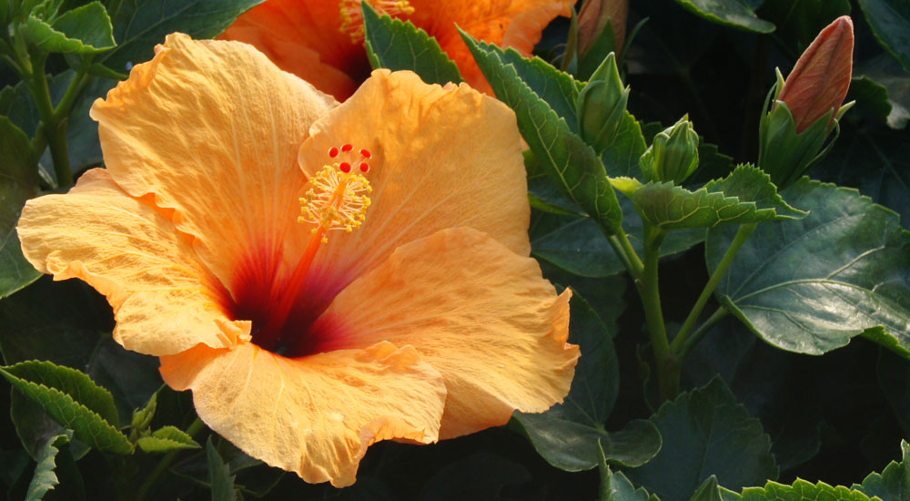
            </td>
            <td>Flor tropical de gran tamaño y color intenso. Su alto consumo de agua se compensa con su capacidad para atraer fauna variada.</td>
            <td>Atractor de Polinizadores</td>
            <td>
                <b>Necesidad de agua:</b> 3 
                <b>Necesidad de abono:</b> 2 
                <b>Exposición solar:</b> Sol directo
            </td>
            <td>
                <b>Días hasta brotar:</b> 1 
                <b>Días hasta crecer:</b> 2 
                <b>Días hasta madurar:</b> 3
            </td>
            <td>3 pétalos</td>
        </tr>
        <tr>
            <td>
                <b>Nombre:</b> Lavanda 
                <b>Nombre científico:</b> <i>Lamiaceae lavandula</i> 
                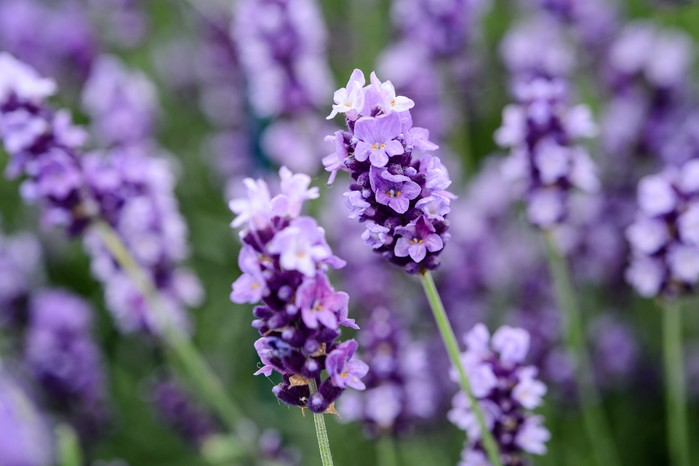
            </td>
            <td>Planta aromática resistente a la sequía. Mejora la salud del suelo y atrae abejas incluso en climas secos.</td>
            <td>Atractor de Polinizadores</td>
            <td>
                <b>Necesidad de agua:</b> 1 
                <b>Necesidad de abono:</b> 1 
                <b>Exposición solar:</b> Sol directo
            </td>
            <td>
                <b>Días hasta brotar:</b> 1 
                <b>Días hasta crecer:</b> 2 
                <b>Días hasta madurar:</b> 3
            </td>
            <td>2 pétalos</td>
        </tr>
        <tr>
            <td>
                <b>Nombre:</b> Lirio 
                <b>Nombre científico:</b> <i>Lilium candidum</i> 
                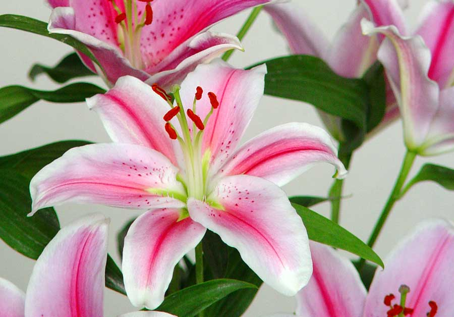
            </td>
            <td>Planta elegante de crecimiento equilibrado. Sus flores blancas mejoran la biodiversidad del jardín.</td>
            <td>Atractor de Polinizadores</td>
            <td>
                <b>Necesidad de agua:</b> 2 
                <b>Necesidad de abono:</b> 2 
                <b>Exposición solar:</b> Sol parcial
            </td>
            <td>
                <b>Días hasta brotar:</b> 1 
                <b>Días hasta crecer:</b> 2 
                <b>Días hasta madurar:</b> 3
            </td>
            <td>2 pétalos</td>
        </tr>
        <tr>
            <td>
                <b>Nombre:</b> Adelfa 
                <b>Nombre científico:</b> <i>Nerium oleander</i> 
                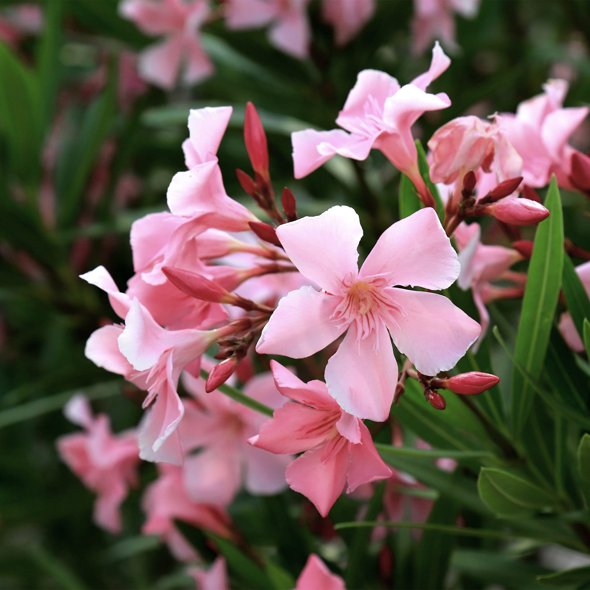
            </td>
            <td>Arbusto muy resistente al calor y suelos pobres. Florece incluso en condiciones difíciles, aunque es tóxica si se manipula mal.</td>
            <td>Atractor de Polinizadores</td>
            <td>
                <b>Necesidad de agua:</b> 1 
                <b>Necesidad de abono:</b> 2 
                <b>Exposición solar:</b> Sol directo
            </td>
            <td>
                <b>Días hasta brotar:</b> 1 
                <b>Días hasta crecer:</b> 2 
                <b>Días hasta madurar:</b> 3
            </td>
            <td>2 pétalos</td>
        </tr>
        <tr>
            <td>
                <b>Nombre:</b> Orquídea 
                <b>Nombre científico:</b> <i>Orchidaceae</i> 
                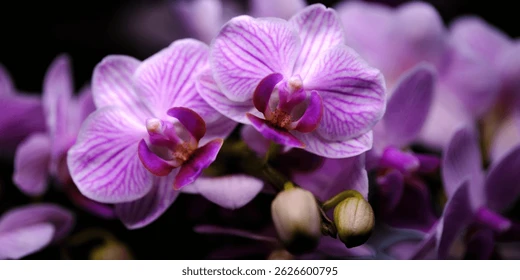
            </td>
            <td>Planta exótica que florece lentamente. Necesita humedad constante y suelos ricos.</td>
            <td>Atractor de Polinizadores</td>
            <td>
                <b>Necesidad de agua:</b> 2 
                <b>Necesidad de abono:</b> 3 
                <b>Exposición solar:</b> Sombra
            </td>
            <td>
                <b>Días hasta brotar:</b> 2 
                <b>Días hasta crecer:</b> 3 
                <b>Días hasta madurar:</b> 4
            </td>
            <td>3 pétalos</td>
        </tr>
        <tr>
            <td>
                <b>Nombre:</b> Guayabo 
                <b>Nombre científico:</b> <i>Psidium guajava</i> 
                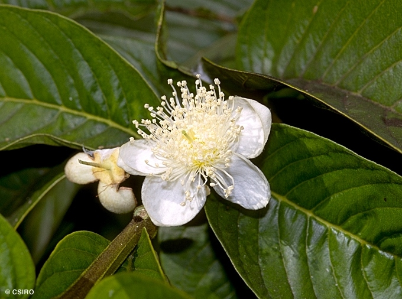
            </td>
            <td>Árbol frutal tropical que atrae fauna y mejora la fertilidad del suelo. Su mantenimiento es alto, pero sus frutos generan beneficios.</td>
            <td>Atractor de Polinizadores</td>
            <td>
                <b>Necesidad de agua:</b> 3 
                <b>Necesidad de abono:</b> 3 
                <b>Exposición solar:</b> Sol directo
            </td>
            <td>
                <b>Días hasta brotar:</b> 1 
                <b>Días hasta crecer:</b> 3 
                <b>Días hasta madurar:</b> 4
            </td>
            <td>3 pétalos</td>
        </tr>
        <tr>
            <td>
                <b>Nombre:</b> Rosa 
                <b>Nombre científico:</b> <i>Rosa chinensis</i> 
                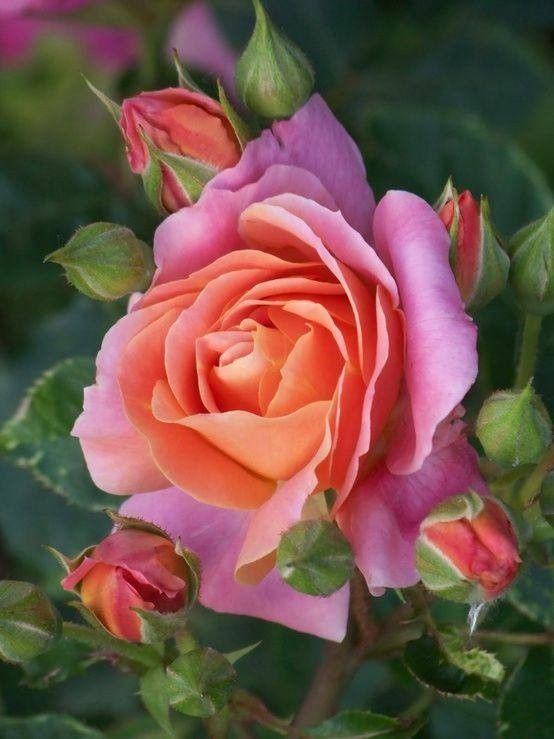
            </td>
            <td>Flor clásica, de crecimiento medio y sensible a plagas. Su presencia incrementa la polinización general del jardín.</td>
            <td>Atractor de Polinizadores</td>
            <td>
                <b>Necesidad de agua:</b> 2 
                <b>Necesidad de abono:</b> 2 
                <b>Exposición solar:</b> Sol parcial
            </td>
            <td>
                <b>Días hasta brotar:</b> 1 
                <b>Días hasta crecer:</b> 2 
                <b>Días hasta madurar:</b> 3
            </td>
            <td>2 pétalos</td>
        </tr>
        <tr>
            <td>
                <b>Nombre:</b> Tulipán 
                <b>Nombre científico:</b> <i>Tulipa</i> 
                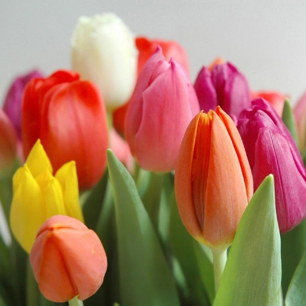
            </td>
            <td>Planta de temporada con floración intensa y breve. Ideal para marcar el ciclo natural del jardín y dar color temporal.</td>
            <td>Atractor de Polinizadores</td>
            <td>
                <b>Necesidad de agua:</b> 2 
                <b>Necesidad de abono:</b> 2 
                <b>Exposición solar:</b> Sol directo
            </td>
            <td>
                <b>Días hasta brotar:</b> 1 
                <b>Días hasta crecer:</b> 2 
                <b>Días hasta madurar:</b> 3
            </td>
            <td>2 pétalos</td>
        </tr>
        <tr>
            <td>
                <b>Nombre:</b> Agave 
                <b>Nombre científico:</b> <i>Agave americana</i> 
                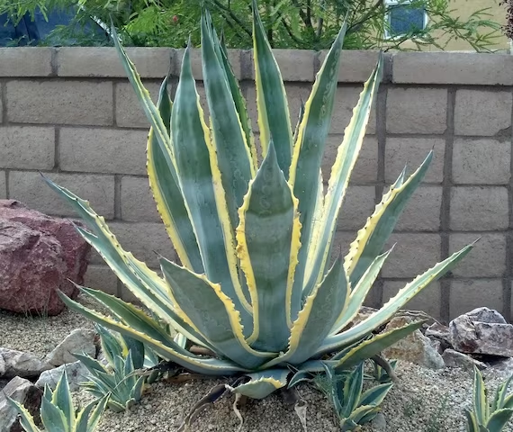
            </td>
            <td>Planta suculenta resistente a la sequía. Genera sombra densa a su alrededor, reduciendo la evaporación del suelo y protegiendo especies sensibles al sol.</td>
            <td>Sombra</td>
            <td>
                <b>Necesidad de agua:</b> 1 
                <b>Necesidad de abono:</b> 1 
                <b>Exposición solar:</b> Sol directo
            </td>
            <td>
                <b>Días hasta brotar:</b> 1 
                <b>Días hasta crecer:</b> 2 
                <b>Días hasta madurar:</b> 4
            </td>
            <td>2 pétalos</td>
        </tr>
        <tr>
            <td>
                <b>Nombre:</b> Bambú 
                <b>Nombre científico:</b> <i>Bambusoideae</i> 
                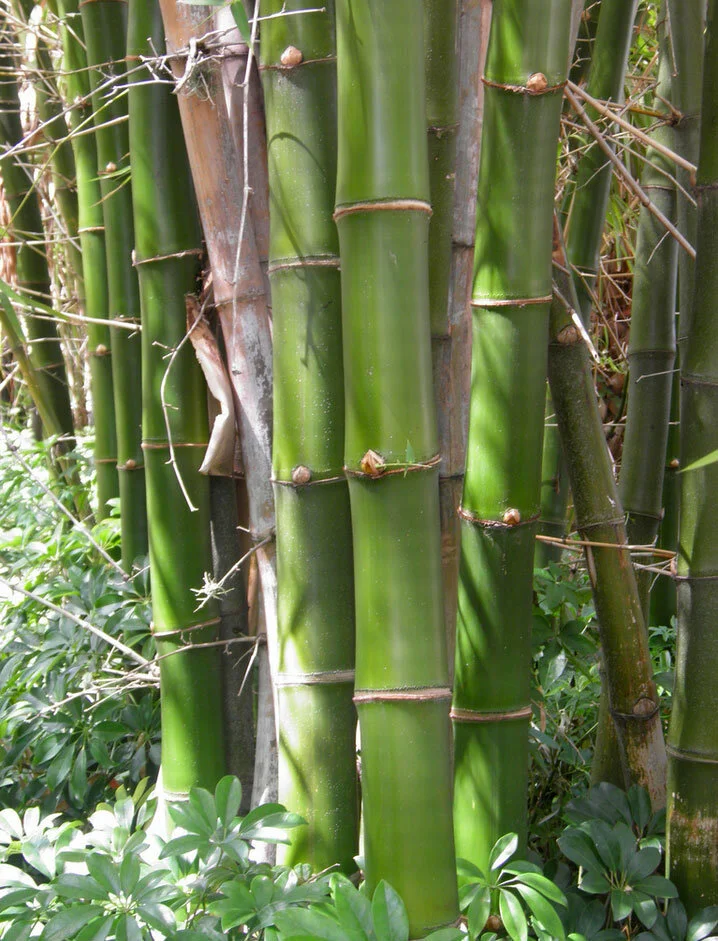
            </td>
            <td>Planta de rápido crecimiento vertical. Su sombra amplia y su capacidad para retener humedad lo convierten en una pieza clave para equilibrar zonas áridas del jardín.</td>
            <td>Sombra</td>
            <td>
                <b>Necesidad de agua:</b> 3 
                <b>Necesidad de abono:</b> 2 
                <b>Exposición solar:</b> Semisombra
            </td>
            <td>
                <b>Días hasta brotar:</b> 1 
                <b>Días hasta crecer:</b> 3 
                <b>Días hasta madurar:</b> 4
            </td>
            <td>3 pétalos</td>
        </tr>
        <tr>
            <td>
                <b>Nombre:</b> Garambullo 
                <b>Nombre científico:</b> <i>Myrtillocactus geometrizans</i> 
                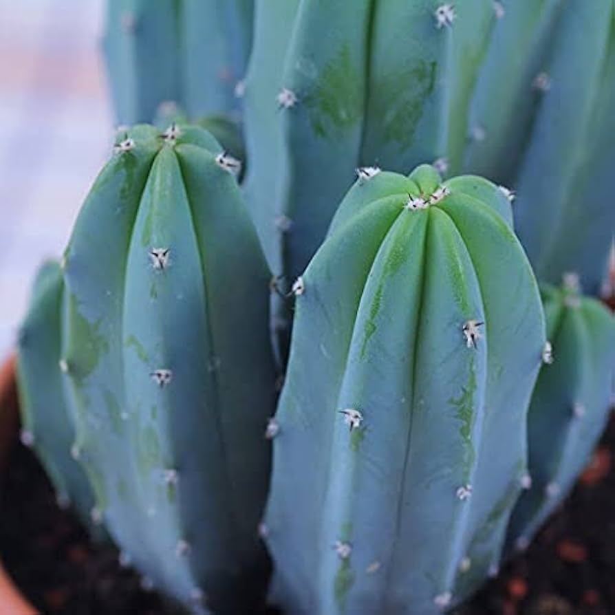
            </td>
            <td>Cactus arborescente que genera sombra ligera y florece con pequeñas flores que atraen polinizadores. Su fruto comestible añade valor ecológico y económico.</td>
            <td>Sombra / Atractor de Polinizadores</td>
            <td>
                <b>Necesidad de agua:</b> 1 
                <b>Necesidad de abono:</b> 2 
                <b>Exposición solar:</b> Sol directo
            </td>
            <td>
                <b>Días hasta brotar:</b> 1 
                <b>Días hasta crecer:</b> 2 
                <b>Días hasta madurar:</b> 3
            </td>
            <td>3 pétalos</td>
        </tr>
        <tr>
            <td>
                <b>Nombre:</b> Flor de papel 
                <b>Nombre científico:</b> <i>Bougainvillea glabra</i> 
                
            </td>
            <td>Planta trepadora de colores vivos. Su floración abundante aporta belleza y atrae insectos, además de poder usarse como materia prima decorativa o cosmética.</td>
            <td>Productora</td>
            <td>
                <b>Necesidad de agua:</b> 2 
                <b>Necesidad de abono:</b> 2 
                <b>Exposición solar:</b> Sol directo
            </td>
            <td>
                <b>Días hasta brotar:</b> 1 
                <b>Días hasta crecer:</b> 2 
                <b>Días hasta madurar:</b> 3
            </td>
            <td>2 pétalos</td>
        </tr>
        <tr>
            <td>
                <b>Nombre:</b> Trompetilla 
                <b>Nombre científico:</b> <i>Bouvardia ternifolia</i> 
                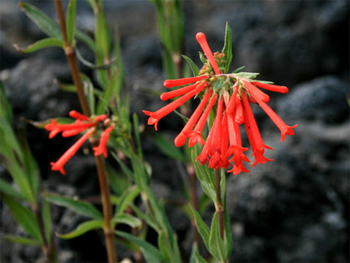
            </td>
            <td>Arbusto de flores tubulares y racimos de intenso color rojo. Planta muy vistosa y compacta, apreciada en la jardinería por su floración duradera y su capacidad para atraer colibríes.</td>
            <td>Productora</td>
            <td>
                <b>Necesidad de agua:</b> 2 
                <b>Necesidad de abono:</b> 3 
                <b>Exposición solar:</b> Sol directo
            </td>
            <td>
                <b>Días hasta brotar:</b> 1 
                <b>Días hasta crecer:</b> 2 
                <b>Días hasta madurar:</b> 3
            </td>
            <td>2 pétalos</td>
        </tr>
        <tr>
            <td>
                <b>Nombre:</b> Tomatera 
                <b>Nombre científico:</b> <i>Solanum lycopersicum</i> 
                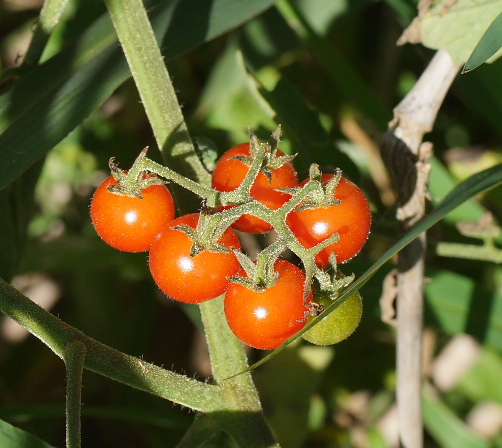
            </td>
            <td>Planta de fruto comestible. Requiere riego constante y suelos ricos. Al madurar, produce tomates que pueden venderse o usarse como recurso alimenticio.</td>
            <td>Productora</td>
            <td>
                <b>Necesidad de agua:</b> 3 
                <b>Necesidad de abono:</b> 3 
                <b>Exposición solar:</b> Sol directo
            </td>
            <td>
                <b>Días hasta brotar:</b> 1 
                <b>Días hasta crecer:</b> 2 
                <b>Días hasta madurar:</b> 3
            </td>
            <td>3 pétalos</td>
        </tr>
        <tr>
            <td>
                <b>Nombre:</b> Fresa 
                <b>Nombre científico:</b> <i>Fragaria vesca</i> 
                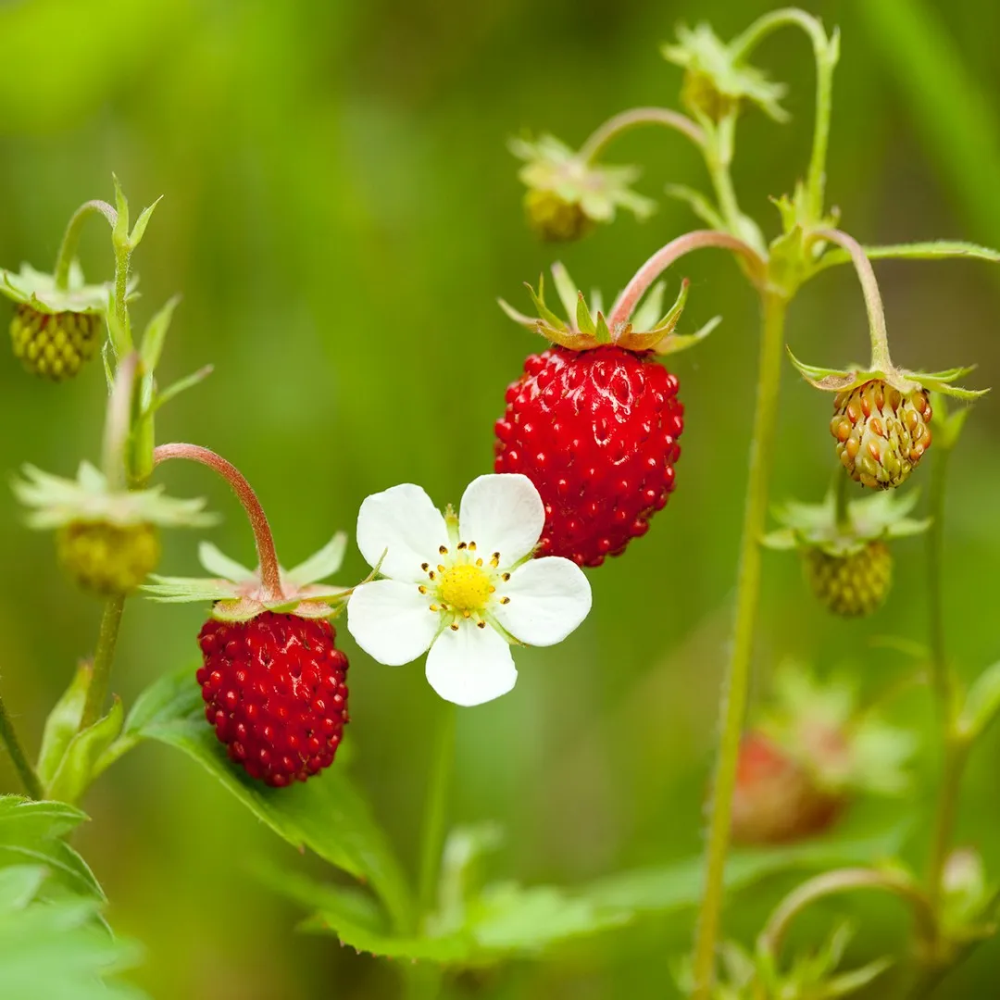
            </td>
            <td>Planta pequeña y frutal que crece en zonas húmedas. Produce frutos dulces que atraen fauna y aportan ingresos moderados.</td>
            <td>Productora / Atractor de fauna</td>
            <td>
                <b>Necesidad de agua:</b> 2 
                <b>Necesidad de abono:</b> 2 
                <b>Exposición solar:</b> Sol parcial
            </td>
            <td>
                <b>Días hasta brotar:</b> 1 
                <b>Días hasta crecer:</b> 2 
                <b>Días hasta madurar:</b> 3
            </td>
            <td>2 pétalos</td>
        </tr>
        <tr>
            <td>
                <b>Nombre:</b> Cafeto arábico 
                <b>Nombre científico:</b> <i>Coffea arabica</i> 
                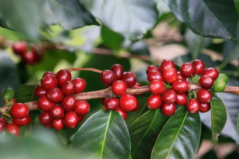
            </td>
            <td>Arbusto tropical de gran valor económico. Sus granos sirven como recurso avanzado. Exige condiciones estables de humedad y fertilidad.</td>
            <td>Productora</td>
            <td>
                <b>Necesidad de agua:</b> 3 
                <b>Necesidad de abono:</b> 3 
                <b>Exposición solar:</b> Semisombra
            </td>
            <td>
                <b>Días hasta brotar:</b> 1 
                <b>Días hasta crecer:</b> 3 
                <b>Días hasta madurar:</b> 4
            </td>
            <td>3 pétalos</td>
        </tr>
        <tr>
            <td>
                <b>Nombre:</b> Trigo 
                <b>Nombre científico:</b> <i>Triticum aestivum</i> 
                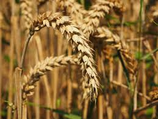
            </td>
            <td>Cereal básico de bajo mantenimiento. Aporta alimento, semillas y refugio para pequeños animales e insectos. Favorece la fauna y la estabilidad del suelo.</td>
            <td>Productora / Refugio para fauna</td>
            <td>
                <b>Necesidad de agua:</b> 2 
                <b>Necesidad de abono:</b> 2 
                <b>Exposición solar:</b> Sol directo
            </td>
            <td>
                <b>Días hasta brotar:</b> 1 
                <b>Días hasta crecer:</b> 2 
                <b>Días hasta madurar:</b> 3
            </td>
            <td>2 pétalos</td>
        </tr>
        <tr>
            <td>
                <b>Nombre:</b> Cheflera 
                <b>Nombre científico:</b> <i>Schefflera arboricola</i> 
                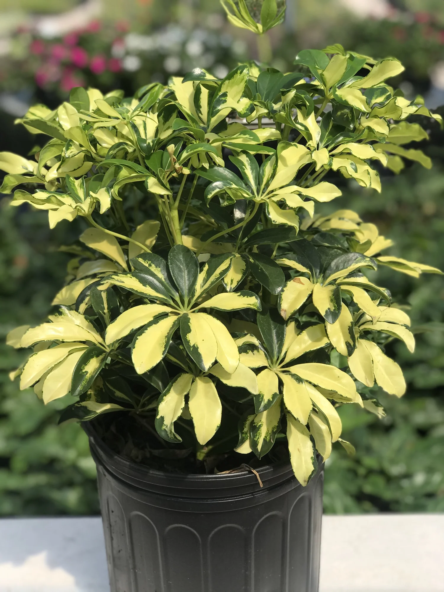
            </td>
            <td>Arbusto de hojas grandes y brillantes que crea un microclima fresco bajo su copa. Sirve como refugio para insectos y aves pequeñas, estabilizando la humedad del entorno y mejorando la salud general del jardín.</td>
            <td>Refugio para fauna</td>
            <td>
                <b>Necesidad de agua:</b> 2 
                <b>Necesidad de abono:</b> 2 
                <b>Exposición solar:</b> Sol parcial
            </td>
            <td>
                <b>Días hasta brotar:</b> 1 
                <b>Días hasta crecer:</b> 2 
                <b>Días hasta madurar:</b> 4
            </td>
            <td>2 pétalos</td>
        </tr>
    </tbody>
</table>

<table>
    <tbody>
        <tr>
            <td>
                <b>Regadera:</b> La regadera es la herramienta utilizada para regar cada casilla de la cuadrícula. La regadera tiene un depósito que podrás usar en cada una de las parcelas. Cada día, el depósito de agua se rellena.
            </td>
            <td style="text-align: center;">
                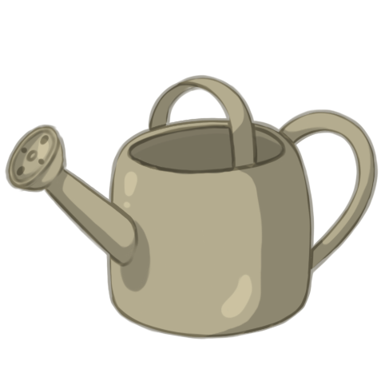
            </td>
        </tr>
        <tr>
            <td>
                <b>Saco de abono:</b> El saco de abono es la herramienta utilizada para abonar cada casilla de la cuadrícula. El saco de abono tiene un depósito que podrás usar en cada una de las parcelas. Cada día, el saco de abono se rellena.
            </td>
            <td style="text-align: center;">
                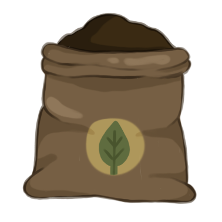
            </td>
        </tr>
    </tbody>
</table>

# 5. Trasfondo
## 5.1. Descripción detallada de la historia y la trama
El marco narrativo de _The Living Garden_ se sitúa en un futuro cercano, marcado por la inevitable consecuencia del colapso climático. No ha sido un evento cataclísmico, sino un lento y constante deterioro que ha alterado drásticamente los patrones estacionales y la estabilidad de los ecosistemas:

- Las estaciones se han vuelto erráticas. Los veranos son brutalmente secos e intensos; los inviernos, impredecibles con nevadas tardías o sequías. Esta variabilidad climática extrema ha desequilibrado la flora y la fauna, volviendo inhabitables vastas extensiones de tierra. 

- La respuesta dominante de la humanidad fue la centralización y la tecnología. La gran mayoría de la población migró a las Neo-ciudades autosuficientes (a veces llamadas “Arcas”), megaestructuras cerradas y tecnológicamente avanzadas. Dentro de sus muros, la naturaleza es un archivo digital o una instalación de laboratorio controlada. El mundo exterior, el mundo rural, fue abandonado. 

- Sin la mano de obra, los ciudadanos y la inversión que mantenían el campo, los vastos ecosistemas naturales entraron en una espiral de declive ecológico. Especies vegetales y de fauna, incapaces de adaptarse a los patrones climáticos alterados, están al borde de la extinción en el exterior. 

En medio de esta resignación global, surge una iniciativa de esperanza, financiada por fundaciones y biólogos disidentes que rechazan la idea de que la única solución sea rendirse al control tecnológico total.

### 5.1.1. La iniciativa
El Programa de Santuarios Botánicos (PSB) es una red descentralizada de micro-reservas dispersas por el mundo rural. Su filosofía es simple: la supervivencia de la vida silvestre no puede depender de los archivos digitales, sino de la creación de focos de resistencia ecológica _in situ_.

### 5.1.2. El rol del jugador
El jugador encarna a un joven idealista que ha rechazado la comodidad y el confinamiento de las Neo-Ciudades y que, motivado por un profundo respeto por la biología y la interconexión de la vida, se une al PSB como “Curador de Santuario”.

### 5.1.3. La tarea inicial
El PSB asigna al jugador una parcela estéril. Esta parcela es el lienzo inicial, un entorno desafiante pero con el potencial de convertirse en una micro-Arca de Noé biológica. El programa facilita una asignación diaria de recursos básicos (pétalos, agua, abono) para compensar las condiciones extremas y los desafíos iniciales.

### 5.1.4. La trama
La trama no es lineal ni cinemática, sino ecológica y de propósito. Se centra en el proceso de curación y la lucha constante contra un entorno hostil. 

El **objetivo principal** es transformar la parcela olvidada en un Jardín Santuario que no solo sobreviva a los adversos eventos climáticos, sino que prospere, logrando la máxima biodiversidad y autosuficiencia ecológica. 

El jugador debe dominar los principios de la interdependencia de especies. La trama se desarrolla a través del reto de crear micro-ecosistemas de resistencia donde cada planta, insecto y la salud del suelo interactúan dinámicamente. Esto se evidencia en la necesidad de:
- Gestionar la sombra de las plantas altas para proteger a las sensibles. 
- Atraer polinizadores y controladores de plagas.
- Mejorar la salud del suelo para mitigar la escasez de agua.

El **clímax** de la partida es alcanzar y mantener el **equilibrio crítico**, un número predefinido de especies raras (ej. 10 plantas y 5 especies de fauna) que ya no pueden sobrevivir en el exterior. Lograr este equilibrio significa que el jardín es autosuficiente y que las especies más vulnerables están seguras. 

Al alcanzar el objetivo, el Santuario se valida como un “Laboratorio de resistencia”. El PSB lo utiliza como una prueba tangible de que la ecología puede restablecerse con cuidado y conocimiento, ofreciendo un legado de esperanza biológica, en un mundo que ha optado por la seguridad tecnológica. El jardín del jugador se convierte en un modelo crucial para futuras iniciativas de reforestación y conservación. 

### 5.1.5. El conflicto
El principal conflicto no proviene de un antagonista humano, sino del entorno hostil y la mala gestión.

El enemigo principal es la variabilidad climática y los eventos extremos (sequías intensas, lluvias torrenciales, plagas súbitas). Estos se generan procedimentalmente, garantizando que el jugador deba adaptarse constantemente.

Este lucha contra la interdependencia y la escasez de recursos. Un error de cálculo (demasiada sombra, escasez de agua, falta de abono) puede provocar un efecto dominó que afecte a todo el ecosistema del jardín. 

### 5.2. Personajes
El juego es íntimo y centrado en la simulación, por lo que los personajes se limitarán a figuras clave que apoyan la jugabilidad y la narrativa del PSB (Programa de Santuarios Botánicos). El protagonista es el personaje central del jugador.

### 5.2.1. El curador (Protagonista - Jugador)
Es el guardián del santuario, la voz de la acción, la paciencia y el conocimiento ecológico. Un joven idealista que ha rechazado el aislamiento tecnológico de las Neo-Ciudades. 

Su motivación no es la riqueza, sino el profundo convencimiento de que la vida silvestre debe ser protegida in situ, no solo archivada digitalmente. 

No tiene un modelo de personaje visible en pantalla. Su presencia se manifiesta únicamente a través de la mano invisible de la gestión: la interfaz de usuario, la colocación de objetos, el riego, la plantación. Esta ausencia refuerza la inmersión, permitiendo al jugador ser directamente el gestor del jardín.

Es el agente del Core Loop. El jugador interactúa directamente con el jardín: regando, plantando, comprando, investigando y observando el ecosistema. Su éxito se mide por la salud y biodiversidad de la parcela. 

### 5.2.2. El contacto del PSB
Es el asesor y administrador de recursos. Es la única conexión directa y regular del curador con el mundo exterior y el Programa de Santuarios Botánicos. Esta figura tampoco aparece nunca físicamente, solo a través de mensajes o notas. Es la fuente de la recompensa diaria (pétalos, agua y abono) y el receptor de la producción del jardín. 

Gestiona la venta de la producción excedente del jardín a cambio de pétalos para la investigación y la compra de semillas raras y envía informes de progreso y reconocimiento al alcanzar hitos de biodiversidad. 

### 5.2.3. Leo (El loro guía/mascota)
Leo es un pequeño loro que lucha por sobrevivir en el exterior. Fue rescatado y asignado al Curador por el PSB para guiarle y acompañarle en su misión. Es inteligente y vocal, y simboliza el éxito inicial de la conservación. 

Dado que no hay un avatar visible del jugador, Leo ofrece una presencia emocional en la pantalla.

Su función es guiar al jugador a través de los primeros pasos, explicando el Core Loop (regar, plantar, abonar) mediante cuadros de texto y flechas. Además, sirve como una forma de comunicar el estado del jardín al jugador, sin recurrir a menús secos (ej. Durante la sequía: “¡Hace mucho calor! El suelo se ve muy triste…”). También es el primero en reaccionar visiblemente al atraer una nueva especie de fauna o al florecer una planta, con animaciones de celebración. 

Con Leo, la experiencia se vuelve más personal y el tutorial se integra de forma orgánica con la estética del juego. 

### 5.3. Entornos y lugares
El juego opera con una perspectiva top-down inclinada y se enfoca en un solo espacio jugable altamente detallado, rodeado de un entorno de fondo ilustrativo. 

El **Jardín Santuario**, es el espacio jugable primario, el foco de toda la simulación y gestión. Un terreno rectangular dividido en una cuadrícula de parcelas. La vista cenital inclinada permite una lectura clara de la cuadrícula para la planificación, mientras que el ángulo frontal sutil mantiene la expresividad de los elementos, como las plantas o los alrededores del jardín. 

Está compuesto por **parcelas de cultivo**, donde se plantan las semillas y que muestran visualmente el estado del suelo (fertilidad, humedad).

El entorno inmediato al jardín incluye la **casa de campo**, un edificio pequeño y acogedor donde se hospeda el jugador, que proyecta sombra sobre algunas parcelas, lo que debe ser tenido en cuenta en la planificación; y un **árbol perenne** grande en la frontera del terreno. Este árbol es un factor de rejugabilidad clave, ya que su posición se genera procedimentalmente en cada partida, impactando dónde caen las sombras e influyendo en la planificación inicial. 

### 5.4. Tutorial
A continuación se muestra el guión del tutorial que aparecerá la primera vez que se juegue una partida:

Leo habla
- _¡Buenos días, Curador! Soy Leo, el guardián de este Santuario. Hace mucho que la naturaleza duerme aquí... pero contigo puede volver a florecer._
    - **PULSAR SIGUIENTE**

Leo habla
- _"El mundo exterior se marchita, pero este lugar aún tiene esperanza. Cada planta que cuides devolverá equilibrio a la tierra. Aquí, cada acción cuenta."_
    - **PULSAR SIGUIENTE**

Leo habla y se enfatiza visualmente en el ciclo de Plantar → Regar → Abonar.
- _"Planta, riega, abona y pasa el día. Así crece la vida, así respira el Santuario."_
    - **PULSAR SIGUIENTE**

Leo habla y se enfatiza en una casilla vacía; cursor seleccionando "Tienda -> Semillas -> Margarita". Flecha al botón "Plantar".
- _"Selecciona una semilla y plántala en una parcela. Todo comienza con un pequeño gesto."_
    - **PULSAR SIGUIENTE**

Leo habla y se enfatiza en la regadera en la barra de herramientas con área de riego señalada.
- _"Usa la regadera para hidratar la parcela. El depósito se rellena cada día; el agua es vida."_
    - **PULSAR SIGUIENTE**

Leo habla
- _“Cada parcela tiene su propio nivel de agua y abono, ¡no dejes a tus plantas sin los recursos básicos!”_
    - **PULSAR SIGUIENTE**

Leo habla y se enfatiza en el saco de abono en barra.
- _“El abono mejora la fertilidad del suelo y ayuda a mantener las plantas fuertes y sanas, pero no acelera su crecimiento. Úsalo hábilmente para su uso en todas las parcelas.”_
    - **PULSAR SIGUIENTE**

Leo habla y se enfatiza en el botón grande "Pasar día" en la esquina.
- _“Cuando todo esté listo, pasa de día. Durante la noche, las plantas consumen el agua y el abono de sus parcelas, y al amanecer, el clima entrará en juego.”_
    - **PULSAR SIGUIENTE**

Leo habla y se enfatiza en el panel meteorológico con iconos: sol intenso, lluvia, granizo. 
- _“El clima cambia cada día. La lluvia regará tus parcelas, el calor las secará… y las tormentas pueden ser un desafío. ¡Planifica con previsión!”_
    - **PULSAR SIGUIENTE**

Leo habla y se enfatiza en las plantas.
- _“Hay cuatro tipos de plantas: Productoras, atractoras de polinizadores, refugio de fauna y de sombra”_
    - **PULSAR SIGUIENTE**

Leo habla y se enfatiza en las plantas productoras.
- _“Algunas plantas son productoras: si están sanas, te darán recursos o dinero al final del día. Cuídalas bien y el Santuario prosperará contigo”_
    - **PULSAR SIGUIENTE**

Leo habla y se enfatiza en las plantas atractoras de polinizadores.
- _"Algunas especies son atractoras: atraen amigos que controlan plagas. Usa la biodiversidad a tu favor."_
    - **PULSAR SIGUIENTE**

Leo habla y se enfatiza en las plantas refugios de fauna.
- _"Algunas especies son refugios para nuestros amigos: cuantas más plantas refugio, ¡más fauna atraerá tu ecosistema!."_
    - **PULSAR SIGUIENTE**

Leo habla y se enfatiza en las plantas de sombra.
- _"Por último, están las plantas de sombra: generan una sombra a su alrededor que puede favorecer el bienestar de otras especies vegetales."_
    - **PULSAR SIGUIENTE**

Leo habla y se enfatiza en dos casillas contiguas con Agave (sombra) + Margarita (sensible al sol) y un halo verde mostrando beneficios.
- _“Las plantas colaboran entre sí: unas dan sombra, otras atraen polinizadores… Aprende qué combinaciones crean armonía.”_
    - **PULSAR SIGUIENTE**

Leo habla y se enfatiza en el ejemplo de plaga y mariquita.
- _“Algunas especies atraen aliados naturales, como las mariquitas, que controlan las plagas. La diversidad es tu mejor defensa.”_
    - **PULSAR SIGUIENTE**

Leo habla y se enfatiza en el menú de la planta con tres estados (buena, regular, mala) y pequeña lista de causas (falta agua, plaga, sombra).
- _“Cada planta tiene un nivel de salud. Si su parcela se seca o pierde fertilidad, enfermará… y los climas duros pueden acabar con ella.”_
    - **PULSAR SIGUIENTE**

Leo habla
- _“Si tus plantas no están sanas, el frío o el calor extremo pueden matarlas. Observa sus niveles de agua y abono cada día.”_
    - **PULSAR SIGUIENTE**

Leo habla
- _“Tu meta: crear un Santuario autosuficiente, equilibrado y lleno de vida. Escucha al clima y deja que la naturaleza hable contigo.”_
    - **PULSAR SIGUIENTE**

Leo habla
- _“Recuerda: planta con cuidado, riega antes del calor, abona con moderación y usa las sinergias entre especies.”_
    - **PULSAR SIGUIENTE**

Leo habla
- _"Léelo cuando quieras desde el menú 'Ayuda'. ¡Buena suerte, Curador, y que el Santuario florezca contigo!”_
    - **PULSAR CERRAR**

# 6. Arte
Esta sección define la filosofía visual de _The Living Garden_, garantizando que la estética refuerce la jugabilidad de simulación y el trasfondo de esperanza ecológica. 

## 6.1. Estética general del videojuego
La estética visual se centra en tres pilares fundamentales:

* **Cozy (calidez y cercanía):** El juego debe generar una sensación de refugio y confort. Esto se logra mediante colores suaves, animaciones fluidas y la representación de materiales con una textura amable. La meta es que el jardín se sienta como un santuario vital y personal, un lugar de calma frente al caos del exterior. 
* **Minimalista (claridad y legibilidad):** Puesto que es un juego de gestión y planificación, la claridad visual es primordial. El diseño evita el detalle excesivo y el desorden vital. Los elementos clave deben ser iconográficos y fácilmente legibles a simple vista. 
* **Armónica (paleta controlada):** La paleta de colores será restringida y muy cuidada para asegurar que el conjunto sea visualmente agradable. El contraste se utiliza para dirigir la atención del jugador, no para crear tensión visual.

### 6.1.1. Paleta de color y tono
Predominio de tonos pasteles, verdes suaves, terrosos claros y colores primarios atenuados. Los colores vivos (como el rojo de una flor) se reservarán para destacar los elementos de la biodiversidad y las recompensas visuales, manteniendo el resto del entorno en calma. 

Los eventos climáticos extremos se comunicarán principalmente a través de la iluminación y los efectos de filtro sobre el entorno en lugar de colores agresivos. Las alertas de plaga o de salud baja de una planta se señalizarán con un halo suave y diferenciado que no rompa la armonía visual.

### 6.1.2. Estilo de ilustración
El estilo de arte se basa en la ilustración 2D pintada digitalmente con una sutil aplicación de textura para dar personalidad y calidez, similar a un papel o tela. Esto evita que el arte se sienta demasiado plano o digital, reforzando la sensación cozy y manual del jardinero. 

El contorno es muy suave, primando las formas y los bloques de color para definir los objetos.  

La fauna (Leo y otros) tiene diseños expresivos y adorables. Las animaciones de los insectos y pájaros son suaves y centradas en el movimiento, no en la velocidad o la agresividad. 

### 6.1.3. Perspectiva
La perspectiva (vista cenital inclinada), mantiene el equilibrio entre la claridad de gestión y la expresividad visual. Permite ver el diseño de la cuadrícula de parcelas y facilita la planificación de la sombra, a la vez que el ligero ángulo frontal permite apreciar la altura de las plantas, la textura de la fachada de la Casa de Campo y la tridimensionalidad de los elementos, como se ve en juegos cozy con vista isométrica.

### 6.1.4. Interfaz de usuario (UI)
La interfaz es una extensión de la estética cozy y minimalista. La iconografía es plana, clara y coherente con la paleta de colores suaves. Se prioriza la legibilidad y el uso de símbolos e ilustraciones sencillas sobre el texto siempre que sea posible. 

Las transiciones de los menús son suaves y fluidas para mantener la sensación de tranquilidad. Los medidores de recursos son también minimalistas y ocupan un espacio discreto en la pantalla. 

## 6.2. Apartado visual
En este apartado se incluyen las descripciones detalladas de los elementos visuales del videojuego.

### 6.2.1. Plantas y especies
Cada planta sigue un proceso de crecimiento y putrefacción que se observa también visualmente. 

Empezando por la semilla, continuando con un brote pequeño, uno un poco más grande y, por último, la planta madura. Esta última etapa es distinta para cada especie.

Una planta se puede encontrar en tres niveles de salud en cualquiera de sus etapas: bueno, regular y malo. Esto se visualiza con la pérdida de color y el decaimiento de las hojas, de las flores y la putrefacción de los frutos.

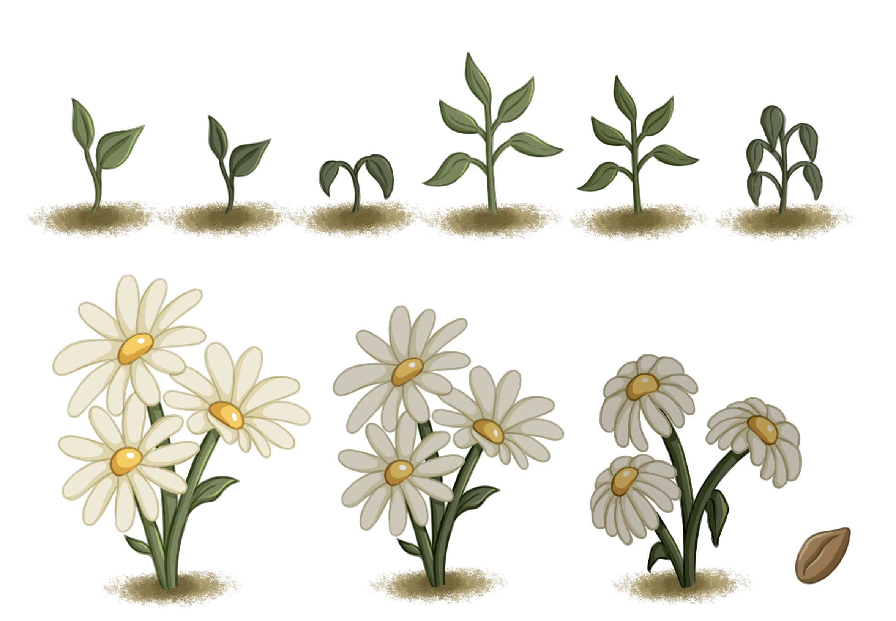

### 6.2.2. Fauna
La fauna se diseñará para ser expresiva, adorable y funcionalmente clara, manteniendo el estilo de ilustración 2D y la paleta de colores suaves. 

- **El guía y mascota Leo:** Como personaje constante y guía del jugador, Leo requiere un diseño que equilibre adorabilidad con claridad funcional en la UI. Utiliza colores primarios y brillantes pero suavizados, para que destaque sin romper la armonía general. 

  Contará con poses y expresiones para:
    * Alerta/Advertencia
    * Éxito/Celebración
    * Ocio

  A continuación se muestran algunos bocetos del personaje:

  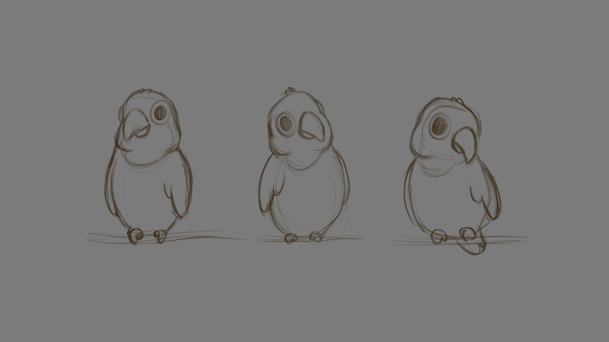

- **Fauna jugable:** Todos los animales tendrán una clara diferenciación visual que dirija la atención del jugador de manera sutil, coherente con el principio de Armonía Visual.

| Tipo de fauna | Objetivo del diseño | Ejemplos |
| --- | --- | --- |
| Polinizadores (fauna beneficiosa) | Deben evocar movimiento fluido, pureza y brillo. | Abejas, mariposas, colibríes, etc. |
| Plagas y amenazas | Deben ser fácilmente legibles, pero su diseño debe ser más aburrido o apagado, no agresivo. | Pulgón, caracoles, etc. |
| Fauna | Se aplica la estética beneficiosa pero con un diseño más complejo. | Conejos, mariquitas, ranas, etc. |

### 6.2.3. Recursos y objetos
<table>
    <tbody>
        <tr>
            <td style="text-align: center;">
                 
                Regadera
            </td>
            <td style="text-align: center;">
                 
                Saco de abono
            </td>
        </tr>
        <tr>
            <td style="text-align: center;">
                 
                Néctar
            </td>
            <td style="text-align: center;">
                 
                Pétalo
            </td>
        </tr>
    </tbody>
</table>

### 6.2.4. Escenario
El escenario consiste en una vista cenital inclinada del Jardín santuario, que combina la claridad de la cuadrícula con la calidez del estilo cozy. El espacio jugable se centra en una cuadrícula central de parcelas de tierra rodeada de césped de textura suave. En el borde superior, la Casa de campo y un árbol perenne proyectan sombras suaves sobre las parcelas, un factor de diseño clave. Los tonos son armónicos, enfatizando que este espacio es un refugio de vida y calma frente al mundo exterior. 

El color de las parcelas de tierra cambia visualmente en función de si están fértiles, abonados o secos, es decir, en función del agua y el abono que tengan. 

## 6.3. Música
La música de _The Living Garden_ busca transmitir serenidad y sensación de refugio emocional. Algunas de las influencias más grandes que se han tenido ha sido el álbum de Mort Garson ***Mother Earth’s Plantasia***, ***Minecraft*** de C418 y ***Ambient 1*** de Brian Eno. Esto implica ciertas técnicas en el sonido que se quiere buscar: Sintetizadores cálidos, acústica suave y textura ambiental para dar vida al movimiento de las plantas.

El enfoque musical se estructura por capas ambientales que evolucionan con el jardín:
- **Inicio (parcela estéril):** música minimalista y melancólica, con acordes suspendidos, respiración amplia y sonidos suaves que sugieren calma.
- **Crecimiento:** progresión armónica ascendente con incorporación gradual de instrumentos orgánicos: marimba, glockenspiel… además de ligeros toques de percusión natural (chasquidos o gotas).
- **Madurez y equilibrio ecológico:** temas más melódicos y armónicos, donde el ritmo y la instrumentación se estabilizan; el jardín suena más vivo.
- **Eventos climáticos:** variaciones dinámicas (sonidos más densos en sequías, ecos metálicos en tormentas…) para  expresar la tensión del evento natural.

## 6.4. Ambiente sonoro
El diseño sonoro refuerza la idea de un ecosistema íntimo, respirando y respondiendo a las acciones del jugador. El objetivo es crear una **atmósfera viva y reactiva**, donde los sonidos contribuyan a la sensación de cuidado y evolución. El ambiente sonoro tendrá las siguientes caracteristicas:
- **Interactividad ecológica:** cada acción del jugador tiene respuesta sensorial, por ejemplo, regar produce un goteo claro y relajante, abonar genera un sonido terroso y húmedo, las plantas al crecer emiten pequeños “suspiros” o brotes armónicos.
- **Fauna y vida:** Leo (el loro) aporta calidez y personalidad mediante silbidos y sonidos suaves. Otros sonidos naturales (abejas, ranas, viento, lluvia sobre hojas) aparecen gradualmente a medida que el ecosistema prospera.
- **Eventos climáticos:** el sonido es el primer indicador del cambio ambiental. La lluvia se aproxima con un murmullo distante, el sol intenso reduce los insectos y genera un zumbido térmico, las tormentas traen graves envolventes. 
- **Silencio expresivo:** en los momentos críticos (muerte de una planta, sequía extrema), el paisaje sonoro se apaga parcialmente, reforzando el impacto emocional.

## 6.5. Referencias
Los principales videojuegos que se han tomado de referencia para _The Living Garden_ son el “Animal Crossing” y el “Stardew Valley”, que comparten esa estética cozy, la gestión de cultivos y el ciclo temporal.
Estas son algunas de las referencias visuales para el diseño del juego:
<table>
    <tbody>
        <tr>
            <td style="text-align: center;">
                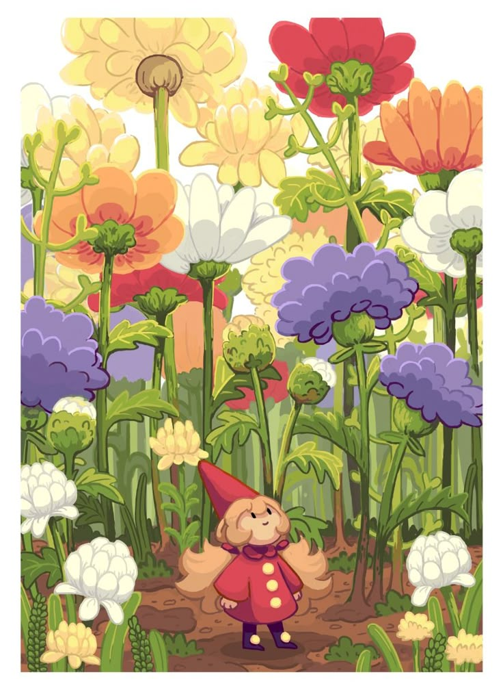
            </td>
            <td style="text-align: center;">
                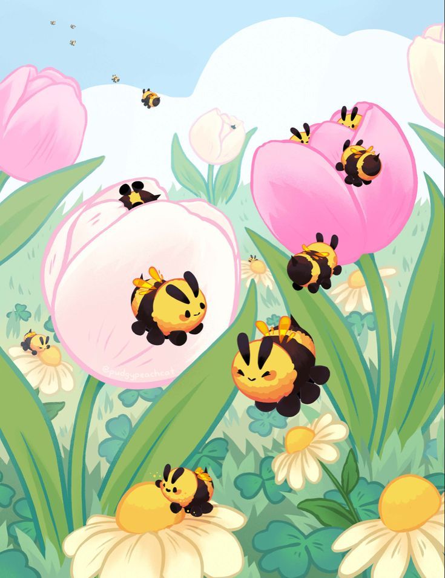
            </td>
            <td style="text-align: center;">
                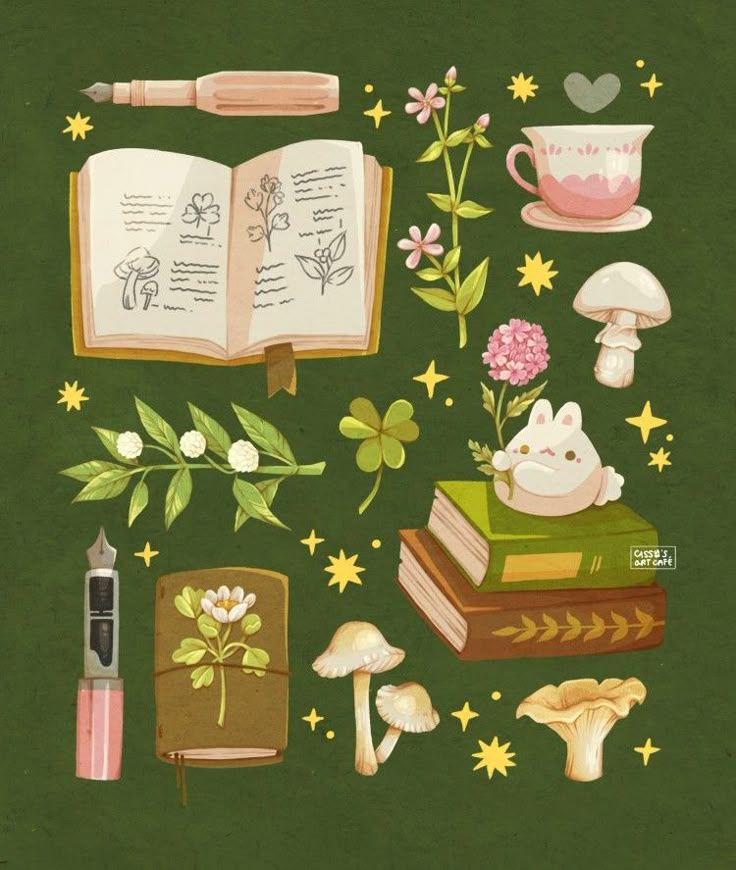
            </td>
        </tr>
    </tbody>
</table>

# 7. Interfaz
En esta sección se detallarán las pantallas clave que componen la experiencia de _The Living Garden_ manteniendo siempre un diseño que fomente la calma, la claridad y el foco en el entorno natural (acorde con la filosofía _Cozy Game_). Se especificarán las transiciones entre las vistas principales, así como la utilidad y el posicionamiento de cada elemento de la Interfaz Gráfica de Usuario (GUI).

## 7.1. Diagrama de flujo
El siguiente diagrama de flujo muestra las pantallas a lo largo del juego y las transiciones entre ellas:
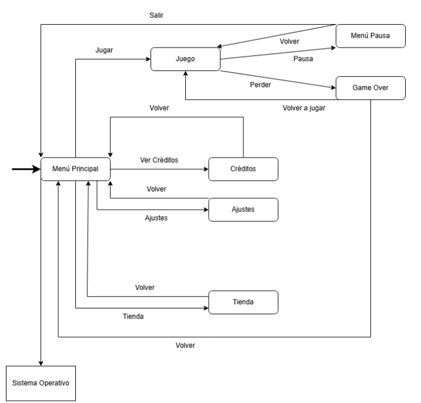

## 7.2. Diseños básicos de los menús
A continuación, se muestran unos bocetos de cómo serían las diferentes pantallas a lo largo del juego y sus botones.

**Menú principal:**

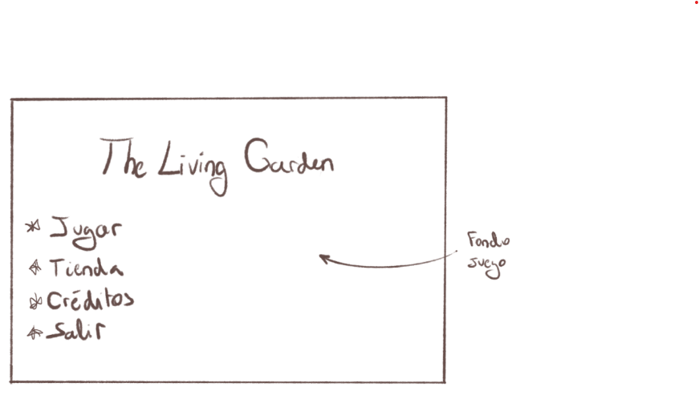

**Tienda:**

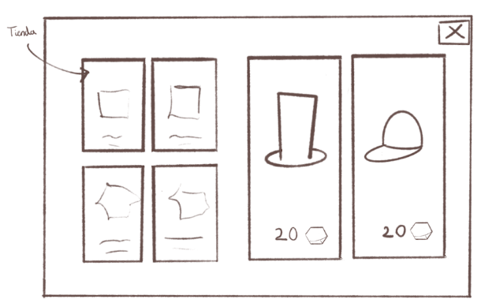

**Ajustes:**

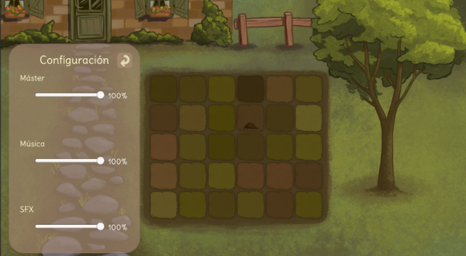

**Pantalla de juego:**

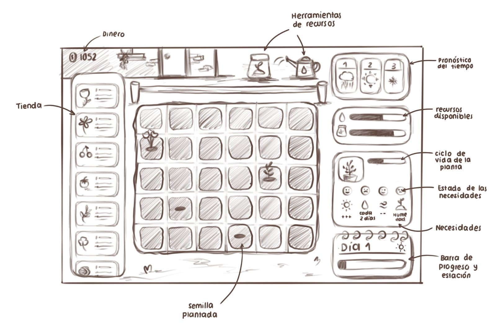

**Menú de pausa:**

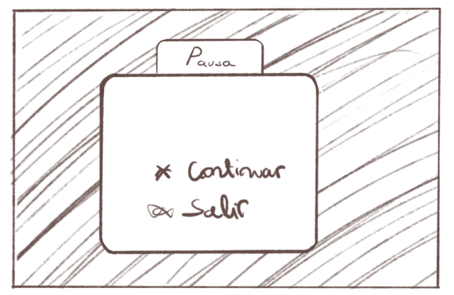

# 8. Hoja de ruta de desarrollo
| Hito | Descripción | Fecha |
|-----------|-----------|-----------|
| 1 | GDD | 19/10/25 |
| 2 | Prototipo | 19/10/25 |
| 3 | Integración estética | - |
| 4 | Mecánicas completas | - |
| 5 | Contenido final y narrativa | - |
| 6 | Pulido completo | - |
| 7 | Día de lanzamiento | 12/25 |
