# Game Design Document - The Living Garden
Versión Final

**Autor:** Ripple Games

**Fecha:** 09 de diciembre de 2025

---

## Índice
- **[1. Introducción](#1-introducción)**
    - [1.1. Descripción breve del concepto](#11-descripción-breve-del-concepto-del-juego)
    - [1.2. Descripción breve de la historia y personajes](#12-descripción-breve-de-la-historia-y-personajes)
    - [1.3. Propósito, público objetivo y plataformas](#13-propósito-público-objetivo-y-plataformas)

- **[2. Monetización](#2-monetización)**
    - [2.1. Visión Estratégica: Serious Game de Impacto](#21-visión-estratégica-serious-game-de-impacto)
    - [2.2. Financiación Institucional y Cultural](#22-financiación-institucional-y-cultural)
    - [2.3. Patrocinio de marcas y Product Placement](#23-patrocinio-de-marcas-y-product-placement)
    - [2.4. A futuro: Modelo de Temporadas, Retención y Cosméticos](#24-a-futuro-modelo-de-temporadas-retención-y-cosméticos)
        - [2.4.1 Economía In-Game y Micropagos](#241-economía-in-game-y-micropagos)
        - [2.4.1 Tablas de productos y precios](#241-tablas-de-productos-y-precios)
    - [2.7. A futuro: Propuesta de valor añadido — Impacto real](#27-a-futuro-propuesta-de-valor-añadido-impacto-real)

- **[3. Planificación y Costes](#3-planificación-y-costes)**
    - [3.1. El equipo humano](#31-el-equipo-humano)
    - [3.2. Estimación temporal del desarrollo](#32-estimación-temporal-del-desarrollo)
    - [3.3. Costes asociados](#33-costes-asociados)

- **[4. Mecánicas de Juego y Elementos de Juego](#4-mecánicas-de-juego-y-elementos-de-juego)**
    - [4.1. Descripción detallada del concepto del juego](#41-descripción-detallada-del-concepto-del-juego)
    - [4.2. Descripción detallada de las mecánicas del juego](#42-descripción-detallada-de-las-mecánicas-del-juego)
        - [4.2.1. Gestión de Recursos](#421-gestión-de-recursos)
        - [4.2.2. Cultivo y Planificación del Jardín](#422-cultivo-y-planificación-del-jardín)
        - [4.2.3. Climas y Plagas](#423-climas-y-plagas)
        - [4.2.4. Interacción con el entorno](#424-interacción-con-el-entorno)
        - [4.2.5. Progresión y Objetivo](#425-progresión-y-objetivo)
    - [4.3. Controles](#43-controles)
    - [4.4. Niveles y misiones](#44-niveles-y-misiones)
    - [4.5. Objetos](#45-objetos)
    - [4.6. A futuro: Sistema de Temporadas](#46-a-futuro-sistema-de-temporadas)
        - [4.6.1. Santuario Base](#461-santuario-base)
        - [4.6.2. Funcionamiento del ciclo de temporada](#462-funcionamiento-del-ciclo-de-temporada)

- **[5. Narrativa y Trasfondo](#5-trasfondo)**
    - [5.1. Descripción detallada de la historia y la trama](#51-descripción-detallada-de-la-historia-y-la-trama)
    - [5.2. Personajes](#52-personajes)
    - [5.3. Entornos y lugares](#53-entornos-y-lugares)
    - [5.4. Tutorial](#54-tutorial)
        - [5.4.1. Mensajes iniciales (día 1)](#541-mensajes-iniciales-día-1)
        - [5.4.2. Mensajes según acciones del jugador](#542-mensajes-según-acciones-del-jugador)
            - [5.4.2.1. Primera planta plantada](#5421-primera-planta-plantada)
            - [5.4.2.2. Seleccionar una parcela (primera vez)](#5422-seleccionar-una-parcela-primera-vez)
            - [5.4.2.3. Primer riego y primer abonado: cuidados básicos completados](#5423-primer-riego-y-primer-abonado-cuidados-básicos-completados)
            - [5.4.2.4. Mensajes según el tipo de planta plantada](#5424-mensajes-según-el-tipo-de-planta-plantada)
        - [5.4.3. Tutoriales contextuales](#543-tutoriales-contextuales)
            - [5.4.3.1. Resumen del día](#5431-resumen-del-día)
            - [5.4.3.2. Clima](#5432-clima)
            - [5.4.3.3. Plagas](#5433-plagas)
            - [5.4.3.4. Strikes](#5434-strikes)

- **[6. Arte](#6-arte)**
    - [6.1. Estética general del videojuego](#61-estética-general-del-videojuego)
    - [6.2. Apartado visual (Assets)](#62-apartado-visual)
        - [6.2.1. Plantas y especies](#621-plantas-y-especies)
        - [6.2.2. Fauna](#622-fauna)
        - [6.2.3. Recursos y objetos](#623-recursos-y-objetos)
        - [6.2.4. Escenario](#624-escenario)
    - [6.3. Música](#63-música)
    - [6.4. Ambiente sonoro](#64-ambiente-sonoro)
    - [6.5. Referencias](#65-referencias)

- **[7. Interfaz](#7-interfaz)**
    - [7.1. Diagrama de flujo](#71-diagrama-de-flujo)
    - [7.2. Diseños básicos de los menús](#72-diseños-básicos-de-los-menús)

- **[8. Hoja de ruta de desarrollo](#8-hoja-de-ruta-de-desarrollo)**

- **[9. Historial de Versiones y Cambios](#9-historial-de-versiones-y-cambios)**
    - [9.1. Versión v.0.3 Gold Release (Diciembre 2025)](#91-versión-v03-gold-release-diciembre-2025)
    - [9.2. Versión v.0.2 Beta (Octubre 2025)](#92-versión-v02-beta-octubre-2025)

## 1. Introducción
### 1.1. Descripción breve del concepto del juego
Es un videojuego de **simulación y gestión de recursos** con enfoque en la ecología de la supervivencia y en la interdependencia de especies ante el colapso climático. El jugador debe cultivar un jardín no como un simple _hobby_, sino como un **santuario vital**, gestionando recursos básicos como el agua y el abono, y creando **micro-ecosistemas de resistencia** donde la sombra que da una planta, los insectos que atrae y la salud del suelo interactúan de forma dinámica para mitigar los factores externos extremos. Cada partida será única, ya que las condiciones iniciales del terreno y los patrones climáticos se generan procedimentalmente, obligando a una adaptación constante. El objetivo final es alcanzar la máxima biodiversidad y autosuficiencia del jardín, asegurando la supervivencia de especies botánicas y de fauna raras que ya no pueden prosperar en el mundo exterior.

### 1.2. Descripción breve de la historia y personajes
En un futuro cercano, el lento pero constante deterioro climático ha transformado la civilización. La mayoría de la humanidad reside en ciudades autosuficientes y tecnológicamente avanzadas, dando la espalda a un mundo rural que se desmorona. Los ecosistemas naturales están en un declive acelerado, perdiendo especies de flora y fauna que ya no pueden sobrevivir fuera de los confines urbanos.

El personaje principal es un joven idealista que rechaza la idea de una naturaleza confinada a los archivos digitales. Este se une al Programa de Santuarios Botánicos, una iniciativa financiada privadamente que se opone a la extinción biológica. Su misión es clara: habitar una parcela olvidada y crear un Jardín Santuario. Este refugio vital debe albergar, proteger y hacer prosperar especies vulnerables.

La historia es un viaje de resistencia ecológica. El objetivo es alcanzar y mantener la máxima biodiversidad y autosuficiencia, logrando el equilibrio crítico de un número determinado de especies (por ejemplo, 10 plantas y 5 especies de fauna). Al lograr este equilibrio, el santuario se convierte en un faro de esperanza biológica, demostrando que la naturaleza puede ser rescatada y regenerada con conocimiento y dedicación, generando un legado de esperanza biológica.

### 1.3. Propósito, público objetivo y plataformas
El principal objetivo de _The Living Garden_ es ofrecer una experiencia de simulación ecológica y gestión de recursos que sea a la vez acogedora e inspiradora. El juego sirve como vehículo didáctico y reflexivo, logrando concienciar a los jugadores sobre los efectos del cambio climático y la vital importancia de la biodiversidad y regeneración en los ecosistemas. Además, la experiencia de juego está diseñada para ser gratificante y desestresante, fomentando la paciencia y la observación. El interés no solo se debe enfocar en la gestión precisa de recursos y planificación de microclimas, sino en la propia evolución biológica del santuario y el logro de su autosuficiencia.

_The Living Garden_ está dirigido a jugadores de un amplio rango de edades entre jóvenes y adultos, especialmente aquellos que disfrutan de juegos de simulación y experiencias _cozy_. El diseño está pensado para ser una experiencia para un único jugador, centrándose en la inmersión personal y en la gestión ambiental.  

En cuanto a las especificaciones operacionales, el lanzamiento se dirigirá a PC, Tablet y Móvil, con una distribución optimizada para ser accesible vía Web. La fecha de lanzamiento objetivo está fijada para Diciembre de 2025. 

## 2. Monetización
### 2.1. Visión Estratégica: Serious Game de Impacto
The Living Garden tiene el potencial para trascender el concepto tradicional de entretenimiento y posicionarse como un **Serious Game** con un fuerte componente educativo y de concienciación ecológica. Dado que el juego será accesible bajo un modelo **Free-to-Play**, la estrategia de sostenibilidad económica se aleja de la monetización agresiva para centrarse en tres pilares éticos: **la financiación institucional, el patrocinio de marcas integrado y la retención a largo plazo mediante contenido estacional.**

### 2.2. Financiación Institucional y Cultural
El juego se presenta como una herramienta digital de concienciación climática, alineada con los **Objetivos de Desarrollo Sostenible (ODS)**.

The Living Garden servirá como plataforma divulgativa sobre la flora y fauna, y los peligros de la crisis climática, justificando la inversión pública por su retorno social.

Se buscará **subvenciones y ayudas** a través de convocatorias culturales y de medio ambiente (ej. Comunidad de Madrid, Ministerio de Cultura) destinadas a proyectos que fomenten la educación ambiental y la biodiversidad.

### 2.3. Patrocinio de marcas y Product Placement
Para mantener la inmersión y la estética cozy, eliminamos los anuncios intrusivos en favor de una **integración orgánica de marcas (Product Placement)**.

Las herramientas dentro del juego reflejarán productos del mundo real. Por ejemplo, el jugador usará un Saco de Abono o una herramienta específica, de una **marca real de agricultura o jardinería sostenible**. Esta publicidad no interrumpe la partida, sino que aporta realismo y valida la calidad de los productos utilizados en el santuario virtual.

### 2.4. A futuro: Modelo de Temporadas, Retención y Cosméticos.
Para asegurar la vida útil del juego y la retención de usuarios, implementamos un sistema de Temporadas Temáticas (ver 4.6). Cada temporada transportará al jugador a una nueva región climática del mundo real. Esto renueva el ciclo de juego con nuevas especies de flora y fauna para coleccionar.

Cada temporada traerá consigo una línea exclusiva de **elementos decorativos y skins** (para el escenario, la interfaz o la mascota Leo) que los jugadores podrán adquirir. Esto genera ingresos recurrentes sin afectar al equilibrio jugable.

#### 2.4.1. Economía In-Game y Micropagos
Aunque los pilares anteriores sostienen la estructura, se mantiene una tienda interna para ofrecer flexibilidad y personalización al jugador.
- **Moneda Premium (Néctar)**: Utilizada principalmente para adquirir los cosméticos de temporada y elementos decorativos exclusivos. Se obtienen por juego normal (logros, hitos) y mediante compra directa (IAP).

**Política anti pay-to-win:**
Ningún objeto que afecte de forma permanente la competencia, a la jugabilidad o desbloquee especies estará detrás de un paywall. Los objetos comprados serán simplemente cosméticos.

### 2.4.1 Tablas de productos y precios

**Tienda de néctar:**
| Pack | Precio (€) | Néctar | €/1 de néctar |
|-----------|-----------|-----------|-----------|
| Pack Pequeño | 1,99€ | 30 de néctar   | 0,066 €/1 de néctar |
| Pack Medio | 2,99€ | 50 de néctar   | 0,059 €/1 de néctar |
| Pack Grande | 4,99€ | 100 de néctar   | 0,049 €/1 de néctar |
| Pack XL | 9,99€ | 250 de néctar   | 0,04 €/1 de néctar |
| Pack Súper | 19,99€ | 600 de néctar   | 0,033 €/1 de néctar |

**Tienda de cosméticos:**
  
| Escenario | Néctar |
|-----------|-----------|
| Escenario rústico | 55 de néctar |
| Escenario moderno | 60 de néctar |
| Escenario naturalista | 70 de néctar |

| Sombrero Leo | Néctar |
|-----------|-----------|
| Sombrero de copa | 20 de néctar |
| Sombrero de cumpleaños | 20 de néctar |
| Gorra | 20 de néctar |
  
| Interfaz | Néctar |
|-----------|-----------|
| Interfaz rústica | 15 de néctar |
| Interfaz moderna | 20 de néctar |
| Interfaz naturalista | 25 de néctar |
  
| Bundle (oferta) | Néctar |
|-----------|-----------|
| Bundle “Inicio” (Interfaz rústica + Gorra + 20 de néctar) | 45 de néctar (pequeño descuento) |
| Bundle “Decorador” (2 escenarios + 3 sombreros) | 140 de néctar (descuento frente a comprar por separado) |

### 2.7. A futuro: Propuesta de valor añadido: Impacto real
The Living Garden conecta el mundo digital con el físico. Planteamos retos comunitarios globales (ej. "Cultivar 1.000 Margaritas entre todos los jugadores"). Al cumplir estos hitos, una empresa patrocinadora se compromete a realizar una acción ecológica real, como la **plantación de árboles o la reforestación de una zona degradada**. El jugador siente que su tiempo de juego tiene un impacto positivo directo en el planeta, aumentando drásticamente la fidelización y el compromiso con la marca.

## 3. Planificación y costes
### 3.1. El equipo humano
El proyecto _The Living Garden_ será desarrollado por un equipo de 5 integrantes dentro del contexto académico.

Cada miembro asume un rol principal, aunque todos colaboran de manera transversal en distintas áreas del diseño y la producción.

### 3.2. Estimación temporal del desarrollo
El desarrollo del prototipo se estima en 3 meses, estructurado en 3 hitos principales:
| Mes | Hito | Descripción |
|-----------|-----------|-----------|
| 1 | Prototipo básico | Implementación del sistema de parcelas, plantación y riego. |
| 2 | Integración de arte y mecánicas completas | Sistema de recursos, crecimiento de plantas, interfaz inicial. |
| 3 | Pulido y presentación final | Ajuste de balance, testeo, implementación de sonido y entrega del GDD. |

### 3.3. Costes asociados
Aunque el proyecto no implica gastos reales, se identifican los recursos y herramientas necesarias para el desarrollo:
| Categoría | Descripción | Observación |
|-----------|-----------|-----------|
| Hardware | Ordenadores personales de los integrantes. | Recursos propios del equipo. |
| Software | Motor de desarrollo (Unity), suite de diseño (Photoshop, Illustrator…). | Se utilizarán versiones estudiantiles o gratuitas. |
| Recursos artísticos y sonoros | Imágenes, efectos de sonido, fuentes tipográficas… | Recursos originales o libres de derechos. |
| Licencias | Software de uso puntual, si aplica. | Generalmente no necesarias. |
| Publicación y documentación | Creación del GDD, presentaciones y mockups visuales. | Sin coste adicional. |

**Coste total estimado:** 0 € (sin inversión económica directa).
En un contexto profesional, el presupuesto rondaría entre 50.000 € y 70.000 €, considerando salarios, licencias y hardware, pero en el entorno académico solo se contabiliza el tiempo invertido y el aprendizaje del equipo.

## 4. Mecánicas de juego y elementos de juego
### 4.1. Descripción detallada del concepto del juego
“The Living Garden” es un videojuego de simulación y gestión ecológica de recursos. El juego se centra en la creación, el mantenimiento y la prosperación de un Jardín Santuario, un micro-ecosistema diseñado para proteger y albergar especies de flora y fauna amenazadas por el colapso climático.

El núcleo de la jugabilidad está en el equilibrio ecológico y la interdependencia de especies. El jugador no solo gestiona recursos básicos como el agua y el abono, sino que debe planificar la ubicación de las plantas para maximizar los efectos sinérgicos. Las condiciones iniciales del juego y los patrones climáticos extremos son procedimentales, lo que obliga a una adaptación constante y a una toma de decisiones estratégica.

El objetivo final es alcanzar la máxima biodiversidad, midiendo el progreso por el número de especies y su salud. 

### 4.2. Descripción detallada de las mecánicas del juego
#### 4.2.1. Gestión de recursos
- **Gestión de recursos primarios:** El jugador debe gestionar el suministro limitado de **Agua** y **Abono**. Estos recursos son vitales para la salud de las plantas.
    - **Adquisición**: Los recursos básicos se reciben diariamente al inicio del día. Cuantas más especies tenga el jardín, mayor será la cantidad de recursos recibidos. También se pueden comprar en la tienda con recursos. La cantidad exacta de Agua y Abono recibida se calcula con la siguiente fórmula basada en la puntuación de Biodiversidad actual:
        - Si la Biodiversidad es 0: El jugador no recibe recursos.
        - Si la Biodiversidad es mayor que 0: El jugador recibe una cantidad base de 1 (de agua y abono) más 1 recurso adicional por cada punto de Biodiversidad.
        - Fórmula: Recursos Obtenidos = 1 + Biodiversidad Actual (siempre que la Biodiversidad sea > 0).

    - **Uso**: El jugador tiene que decidir regar y abonar cada parcela manualmente, considerando la previsión meteorológica y las necesidades de cada especie. El uso eficiente es crucial dada su escasez.
    
- **Gestión financiera:**   Los pétalos en el juego se utilizan para comprar semillas y recursos esenciales. Se obtienen a través de la cosecha y bonos que te proporcionan por tu buena labor.
    - Recolectar Frutos: Gana dinero cuando recoges el producto de una Planta Productora. La cantidad que gana es igual al precio que se pagó por la planta.
    - Ingreso Base: Gana +1 pétalo automáticamente, solo por pasar el día. Si la biodiversidad es 0, no se gana nada para evitar exploits.
    - Bono por Cantidad: Gana +1 pétalo  por cada 2 de biodiversidad que tenga el jardín (sin importar su estado).
    - Bono de Madurez: Gana +1 pétalo  por cada 2 plantas que estén en estado madura.
    - Bono de Diversidad: Gana +1 pétalo  si se tiene al menos una planta madura de cada una de las 4 categorías (Productora, Sombra, Polinizadora y Refugio).
    - Bono de Exposición Solar: Gana +1 pétalo si todas las plantas están en su exposición solar correcta.

Sin embargo el jugador puede obtener una penalización de -1 pétalo por cada 3 plantas que se mueran en el jardín, y se otorgará un strike no permanente.

#### 4.2.2. Cultivo y planificación del jardín
- **Plantación**
    - **Plantación:** El jugador puede comprar semillas en la tienda y plantarlas en cualquiera de las parcelas disponibles, teniendo en cuenta los requerimientos de la semilla y lo que puede aportar a las parcelas adyacentes. Las especies de plantas tienen requerimientos específicos de sol, agua y atracción o repulsión de especies.

- **Categorías de plantas**
    Cuando una planta llegue a la fase de maduración aplicará sus efectos a las parcelas adyacentes.
    - Atractoras de polinizadores: Estas plantas atraen a insectos polinizadores. Si se planta una planta productora en una parcela adyacente aparecerán polinizadores sobre ella y cuando esté en condiciones ideales comenzará a producir.
    - Productoras: Estas plantas cuando llegan a madurar, si tienen polinizadores en la parcela comenzará el ciclo de producción. Cada cierto número de días echará un fruto que el jugador podrá recoger a cambio de pétalos.
    - Proveedoras de sombra:  Estas especies proveen semisombra a las cuatro parcelas adyacentes. Si dos de estas plantas dan semisombra a una misma parcela, se convertirá en una sombra. El jugador debe usarlas para poder plantar plantas que necesiten sombra o semisombra.
    - Atractores de fauna: Estas plantas atraen especies de fauna salvaje. Esta fauna tiene un efecto protector en las parcelas adyacentes contra plagas.

- **Sinergias y micro-ecosistemas (planificación ecológica):**
    - El jugador debe planear estratégicamente la **disposición de las plantas**.
    - La proximidad de ciertas especies genera **efectos positivos (sinergias) o negativos**. Por ejemplo, una planta alta puede dar sombra a una planta vecina sensible al sol extremo, o una flor puede insectos polinizadores que beneficien a otra planta.
    - El éxito a largo plazo depende de la **creación de cadenas de interdependencia** que refuercen la salud general del jardín.

#### 4.2.3. Climas y plagas
Existen diferentes tipos de clima de diferentes intensidades que pueden afectar al jardín de manera positiva o negativa.

- Nublado: No tiene efectos sobre el jardín.
- Soleado: Causa una sequía probabilística que resta agua de las parcelas. No añade agua.
    - Intensidad 1: Cada parcela tiene un 70% de probabilidad de perder 1 de agua.
    - Intensidad 2: Cada parcela tiene un 40% de probabilidad de perder 1 de agua y un 30% de probabilidad de perder 2 de agua.
    - Intensidad 3: Cada parcela tiene un 33% de probabilidad de perder 1, 33% de perder 2, y 33% de perder 3 de agua.
- Lluvia:
    - Efecto Positivo: Añade agua a todas las parcelas. La cantidad ganada es igual a la intensidad*2 (es decir, +2, +4, o +6 de agua).
    - Efecto Negativo: Si la lluvia es de intensidad 3, existe la probabilidad de matar instantáneamente a las plantas que tengan salud moderada o mala. Las plantas con buena salud no corren peligro.
- Granizo
    - Efecto Positivo: Añade una pequeña cantidad de agua a todas las parcelas. La cantidad ganada es igual a la intensidad (es decir, +1, +2, o +3 de agua).
    - Efecto Negativo: Tiene una probabilidad de matar instantáneamente a las plantas que tengan salud moderada o mala. Las plantas con buena salud no corren peligro.

**Plagas**. Cada día hay un 10% de probabilidad de que una plaga pueda aparecer en el jardín. Las plagas sólo afectan a las plantas que no están protegidas con fauna (son una especie atractora de fauna o están adyacentes a una). Una vez una planta está infectada no podrá curar su salud y si es productora o atractora de polinizadores anulará sus efectos. Además, las plagas se extienden si hay alguna planta de la misma especie adyacente y sin proteger. Una planta se puede desinfectar plantando una atractora de fauna en una parcela adyacente.

#### 4.2.4. Interacción con el entorno
- **Ciclo diario:** el juego opera con un ciclo temporal donde los eventos climáticos y el consumo de recursos de las plantas se simulan al inicio de cada día. El jugador puede pasar de día cuando decida que ha acabado de hacer sus tareas de ese día.
- **Adaptación climática:** El jugador debe consultar la previsión meteorológica para tomar decisiones preventivas. Por ejemplo regar más antes de un sol muy intenso o plantar variedades resistentes.
- **Eventos ecológicos (plagas y fauna):** El juego simula la aparición de plagas o la llegada de fauna beneficiosa. El jugador debe gestionar estos eventos, simulando una planificación ecológica para que la propia biodiversidad actúe como defensa natural.

#### 4.2.4. Progresión y objetivo
- **Logro de biodiversidad:** El progreso se mide por la cantidad de especies y fauna crítica que el jardín logra albergar y mantener en equilibrio. El jugador ganará la partida cuando consiga aguantar 1 día con 10 o más de biodiversidad. 
La puntuación total de Biodiversidad, que se comprueba al inicio de cada día para la condición de victoria, se calcula sumando los siguientes tres componentes:
    1. Plantas: El número total de especies de plantas únicas que estén plantadas en el jardín, siempre que hayan superado el estado de semilla (es decir, se cuentan desde el estado de brote en adelante).
    2. Polinizadores: Se suma +1 punto al total si al menos una planta Productora o Atractora de Polinizadores madura está atrayendo polinizadores (ej. abejas) al jardín.
    3. Fauna de Refugio: Se suma +1 punto al total si al menos una planta Refugio de Fauna madura está atrayendo fauna (ej. pájaros) al jardín.

- **Sistema de salud de la planta:** Cada planta tiene un estado de salud dinámico que se recalcula diariamente en función de si ha cubierto sus requerimientos de recursos y el clima. Mantener la salud de las especies es un reto constante.

- **Strikes:** Se puede ganar o perder una partida en The Living Garden. Para perder, el jugador deberá obtener 5 strikes en total, que pueden ser otorgados por diferentes cuestiones:
    - **Strike amarillo (No permanente)**: Este tipo de strikes se otorgan:
        - Si se mueren 2 o más plantas del jardín en el mismo día.
        - Si el jugador pasa 3 veces de día sin plantas y sin realizar ninguna acción.
    Puedes ser removidos si:
        -  El jugador tiene un jardín con 3 o más plantas y logra estar  5 días sin que se haya muerto ninguna.
        - Si el jugador consigue sumar tres puntos de biodiversidad, es decir, conseguir 3 especies nuevas.

    - **Strike rojo (Permanente)**: Este tipo de strikes se otorgan cuando el jugador se queda a 0 pétalos y tiene 0 plantas plantadas, lo que le invalida para progresar en el santuario. Tras otorgarle el strike, se le abonarán 3 pétalos para que pueda continuar su partida.

### 4.3. Controles
Dado que "The Living Garden" está diseñado para ser jugado en plataformas web (ordenador) y dispositivos táctiles (tablet y móvil), el esquema de control se basa exclusivamente en la interacción de un solo punto, es decir, **el clic izquierdo del ratón en escritorio y el toque o tap en pantallas táctiles**.

Este enfoque garantiza una curva de aprendizaje mínima y una alta accesibilidad, eliminando la necesidad de gestos complejos o comandos de teclado.

Las navegación de menús, la selección de elementos (parcelas, herramientas…), y el avance de día se harán a usando el clic izquierdo o haciendo tap en los dispositivos móviles. El uso de herramienta consta de dos pasos, hacer clic en el icono del recurso y hacer clic o tocar la parcela donde se aplica el recurso.

### 4.4. Niveles y misiones
El videojuego **no cuenta con niveles ni misiones tradicionales**, sino con una **partida continua y progresiva**, centrada en la evolución ecológica del Jardín Santuario.
La progresión se define por el crecimiento del ecosistema y la capacidad del jugador para adaptarse a las condiciones cambiantes del entorno, más que por una estructura lineal de objetivos. 

El juego se basa en un único espacio jugable que evoluciona con el tiempo. No existen misiones predefinidas ni una secuencia de niveles cerrada. El jugador establece su propio ritmo y metas, guiado por la exploración, la curiosidad y la búsqueda del equilibrio ecológico.

A futuro, se contempla la posibilidad de integrar un **sistema de misiones o encargos del PSB (Programa de Santuarios Botánicos)**, que ofrezca desafíos opcionales como “recuperar una especie en peligro” o “restaurar la fertilidad de una zona”. Sin embargo, esta funcionalidad no está confirmada.

La **curva de dificultad es orgánica y ambiental**. A medida que avanza la partida, la frecuencia y la intensidad de los **eventos meteorológicos extremos** (sequías, tormentas, heladas) aumentan gradualmente.

El jugador deberá anticiparse a estos cambios mediante una planificación más precisa del jardín y una mejor gestión de recursos. La dificultad no se basa en penalizaciones directas, sino en la **complejidad del ecosistema**, que demanda cada vez más atención y equilibrio.

### 4.5. Objetos
- **Plantas:**
  
<table>
    <thead>
        <tr>
            <th style="width: 25%; text-align: center;">Planta</th>
            <th style="width: 30%; text-align: center;">Descripción</th>
            <th style="width: 15%; text-align: center;">Categoría</th>
            <th style="width: 15%; text-align: center;">Necesidades</th>
            <th style="width: 7.5%; text-align: center;">Crecimiento</th>
            <th style="width: 7.5%; text-align: center;">Precio</th>
        </tr>
    </thead>
    <tbody>
        <tr>
            <td>
                <b>Nombre:</b> Abelia 
                <b>Nombre científico:</b> <i>Abelia chinensis</i> 
                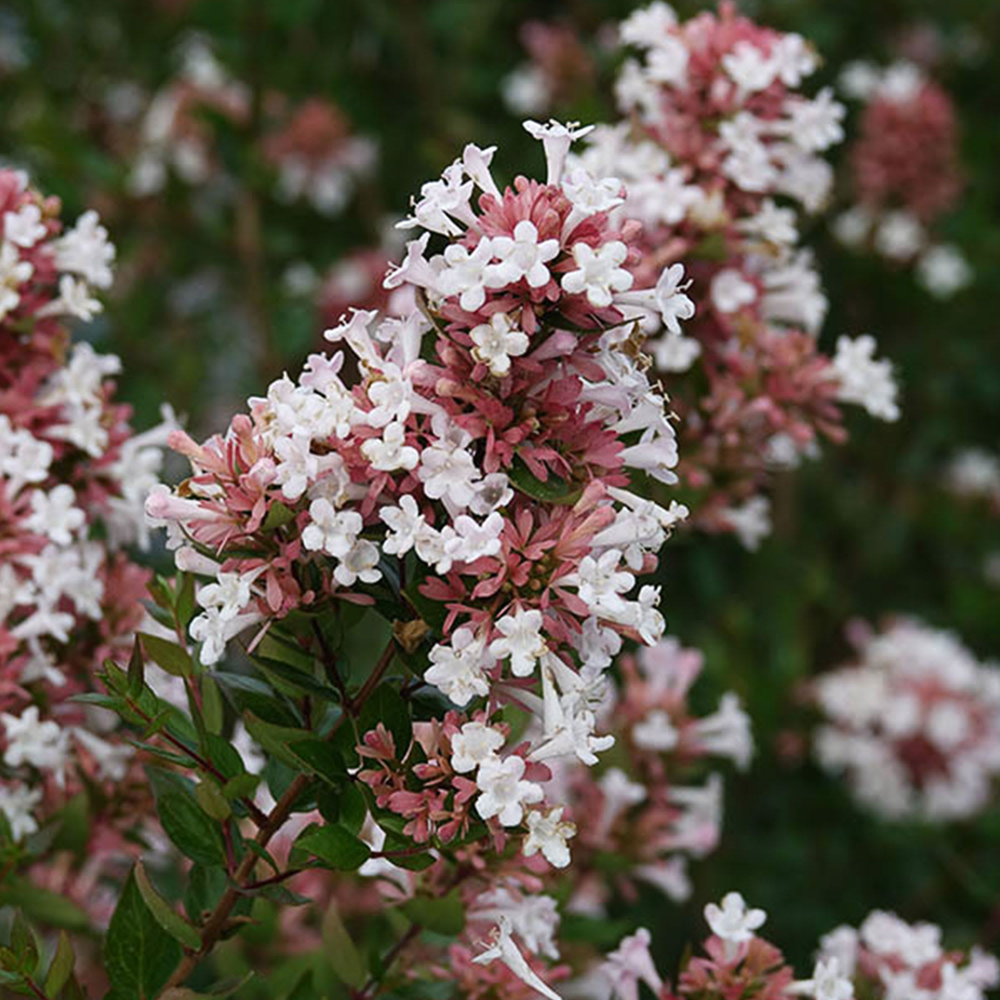
            </td>
            <td>No aguanta muy bien las heladas. Resistente. Flores durante el verano y principios de otoño.</td>
            <td>Atractor de Polinizadores / Refugio para fauna</td>
            <td>
                <b>Necesidad de agua:</b> 2 
                <b>Necesidad de abono:</b> Suelo fértil (3) 
                <b>Exposición solar:</b> Sol directo
            </td>
            <td>
                <b>Días hasta brotar:</b> 1 
                <b>Días hasta crecer:</b> 2 
                <b>Días hasta madurar:</b> 3
            </td>
            <td>2 pétalos</td>
        </tr>
        <tr>
            <td>
                <b>Nombre:</b> Margarita 
                <b>Nombre científico:</b> <i>Bellis perennis</i> 
                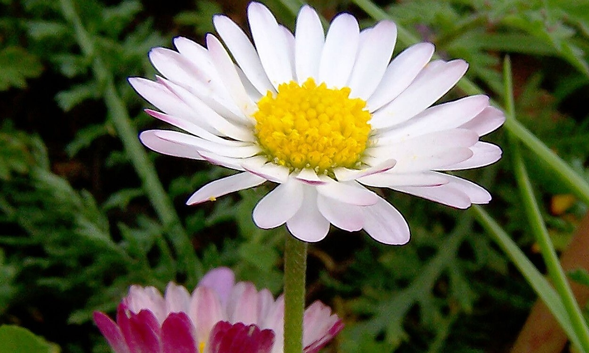
            </td>
            <td>Planta simple y común, de rápido crecimiento. Perfecta para principiantes y para estabilizar suelos secos.</td>
            <td>Atractor de Polinizadores</td>
            <td>
                <b>Necesidad de agua:</b> 1 
                <b>Necesidad de abono:</b> 1 
                <b>Exposición solar:</b> Sol parcial
            </td>
            <td>
                <b>Días hasta brotar:</b> 1 
                <b>Días hasta crecer:</b> 1 
                <b>Días hasta madurar:</b> 2
            </td>
            <td>1 pétalo</td>
        </tr>
        <tr>
            <td>
                <b>Nombre:</b> Lavanda 
                <b>Nombre científico:</b> <i>Lamiaceae lavandula</i> 
                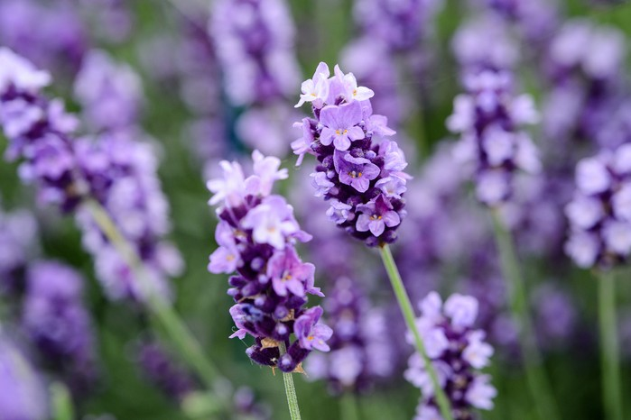
            </td>
            <td>Planta aromática resistente a la sequía. Mejora la salud del suelo y atrae abejas incluso en climas secos.</td>
            <td>Atractor de Polinizadores</td>
            <td>
                <b>Necesidad de agua:</b> 1 
                <b>Necesidad de abono:</b> 1 
                <b>Exposición solar:</b> Sol directo
            </td>
            <td>
                <b>Días hasta brotar:</b> 1 
                <b>Días hasta crecer:</b> 2 
                <b>Días hasta madurar:</b> 3
            </td>
            <td>2 pétalos</td>
        </tr>
        <tr>
            <td>
                <b>Nombre:</b> Lirio 
                <b>Nombre científico:</b> <i>Lilium candidum</i> 
                
            </td>
            <td>Planta elegante de crecimiento equilibrado. Sus flores blancas mejoran la biodiversidad del jardín.</td>
            <td>Atractor de Polinizadores</td>
            <td>
                <b>Necesidad de agua:</b> 2 
                <b>Necesidad de abono:</b> 2 
                <b>Exposición solar:</b> Sol parcial
            </td>
            <td>
                <b>Días hasta brotar:</b> 1 
                <b>Días hasta crecer:</b> 2 
                <b>Días hasta madurar:</b> 3
            </td>
            <td>2 pétalos</td>
        </tr>
        <tr>
            <td>
                <b>Nombre:</b> Adelfa 
                <b>Nombre científico:</b> <i>Nerium oleander</i> 
                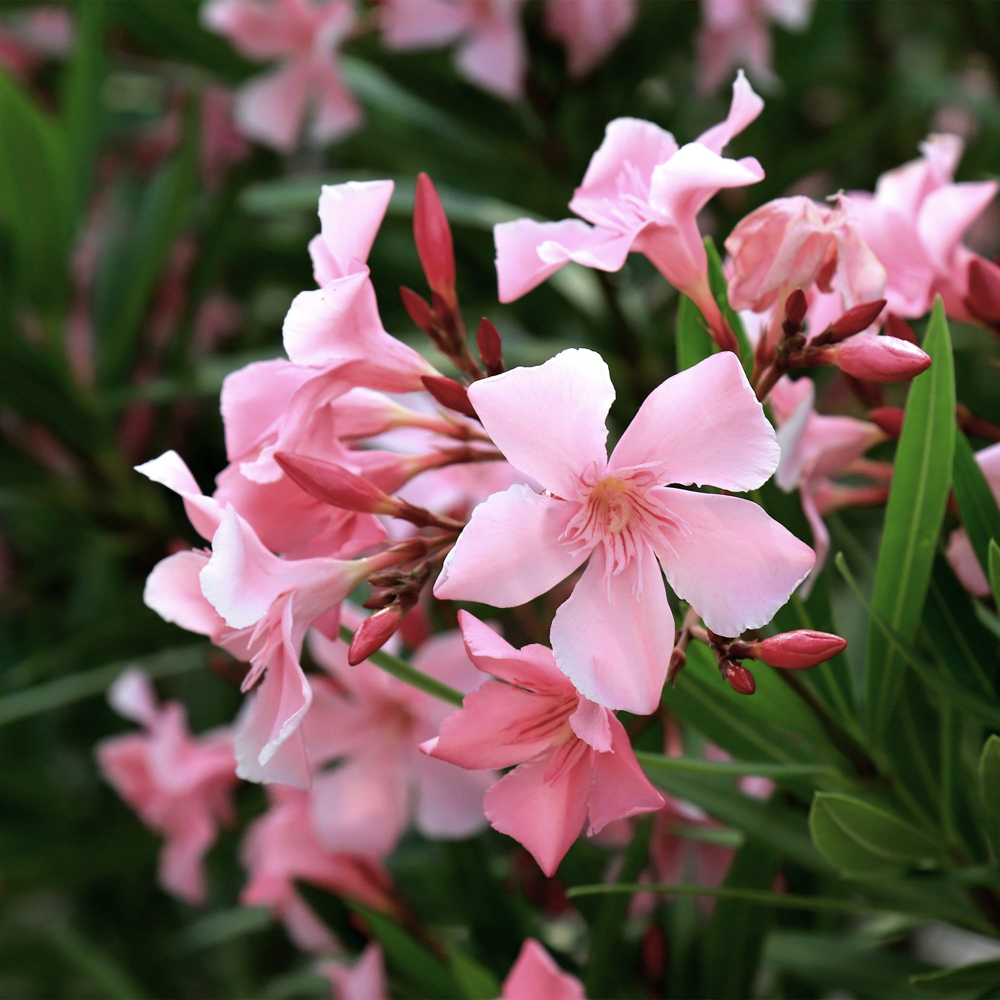
            </td>
            <td>Arbusto muy resistente al calor y suelos pobres. Florece incluso en condiciones difíciles, aunque es tóxica si se manipula mal.</td>
            <td>Refugio de Fauna</td>
            <td>
                <b>Necesidad de agua:</b> 1 
                <b>Necesidad de abono:</b> 2 
                <b>Exposición solar:</b> Sol directo
            </td>
            <td>
                <b>Días hasta brotar:</b> 1 
                <b>Días hasta crecer:</b> 2 
                <b>Días hasta madurar:</b> 3
            </td>
            <td>2 pétalos</td>
        </tr>
        <tr>
            <td>
                <b>Nombre:</b> Orquídea 
                <b>Nombre científico:</b> <i>Orchidaceae</i> 
                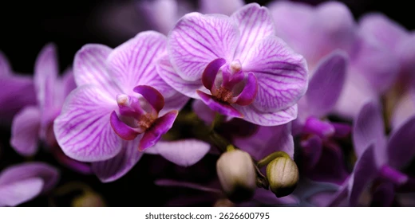
            </td>
            <td>Planta exótica que florece lentamente. Necesita humedad constante y suelos ricos.</td>
            <td>Atractor de Polinizadores</td>
            <td>
                <b>Necesidad de agua:</b> 2 
                <b>Necesidad de abono:</b> 3 
                <b>Exposición solar:</b> Sombra
            </td>
            <td>
                <b>Días hasta brotar:</b> 2 
                <b>Días hasta crecer:</b> 3 
                <b>Días hasta madurar:</b> 4
            </td>
            <td>3 pétalos</td>
        </tr>
        </tr>
        <tr>
            <td>
                <b>Nombre:</b> Rosa 
                <b>Nombre científico:</b> <i>Rosa chinensis</i> 
                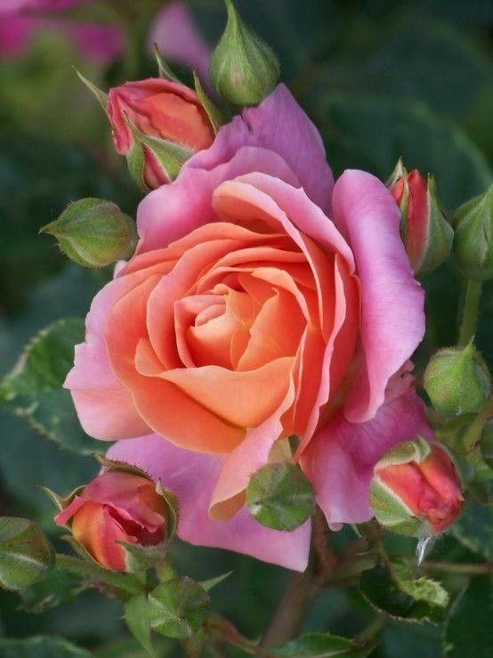
            </td>
            <td>Flor clásica, de crecimiento medio y sensible a plagas. Su presencia incrementa la polinización general del jardín.</td>
            <td>Atractor de Polinizadores</td>
            <td>
                <b>Necesidad de agua:</b> 2 
                <b>Necesidad de abono:</b> 2 
                <b>Exposición solar:</b> Sol parcial
            </td>
            <td>
                <b>Días hasta brotar:</b> 1 
                <b>Días hasta crecer:</b> 2 
                <b>Días hasta madurar:</b> 3
            </td>
            <td>2 pétalos</td>
        </tr>
        <tr>
            <td>
                <b>Nombre:</b> Tulipán 
                <b>Nombre científico:</b> <i>Tulipa</i> 
                
            </td>
            <td>Planta de temporada con floración intensa y breve. Ideal para marcar el ciclo natural del jardín y dar color temporal.</td>
            <td>Atractor de Polinizadores</td>
            <td>
                <b>Necesidad de agua:</b> 2 
                <b>Necesidad de abono:</b> 2 
                <b>Exposición solar:</b> Sol directo
            </td>
            <td>
                <b>Días hasta brotar:</b> 1 
                <b>Días hasta crecer:</b> 2 
                <b>Días hasta madurar:</b> 3
            </td>
            <td>2 pétalos</td>
        </tr>
        <tr>
            <td>
                <b>Nombre:</b> Agave 
                <b>Nombre científico:</b> <i>Agave americana</i> 
                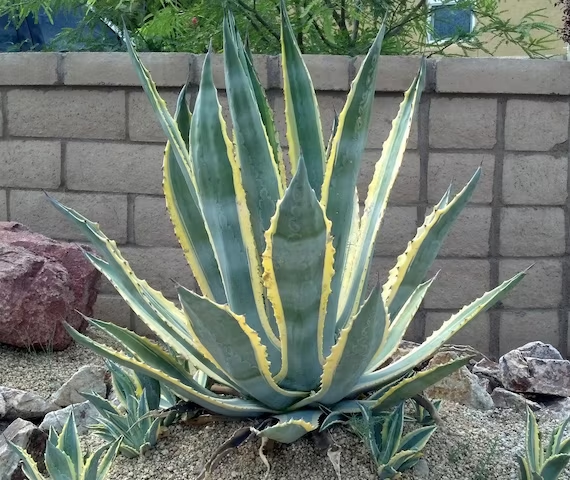
            </td>
            <td>Planta suculenta resistente a la sequía. Genera sombra densa a su alrededor, reduciendo la evaporación del suelo y protegiendo especies sensibles al sol.</td>
            <td>Sombra</td>
            <td>
                <b>Necesidad de agua:</b> 1 
                <b>Necesidad de abono:</b> 1 
                <b>Exposición solar:</b> Sol directo
            </td>
            <td>
                <b>Días hasta brotar:</b> 1 
                <b>Días hasta crecer:</b> 2 
                <b>Días hasta madurar:</b> 4
            </td>
            <td>2 pétalos</td>
        </tr>
        <tr>
            <td>
                <b>Nombre:</b> Bambú 
                <b>Nombre científico:</b> <i>Bambusoideae</i> 
                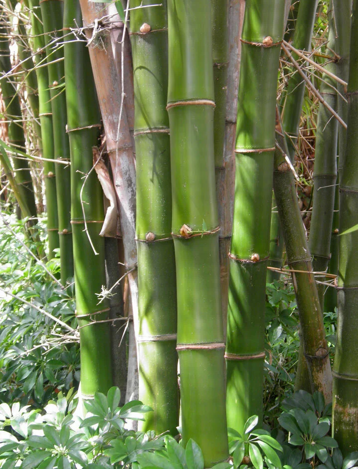
            </td>
            <td>Planta de rápido crecimiento vertical. Su sombra amplia y su capacidad para retener humedad lo convierten en una pieza clave para equilibrar zonas áridas del jardín.</td>
            <td>Sombra</td>
            <td>
                <b>Necesidad de agua:</b> 3 
                <b>Necesidad de abono:</b> 2 
                <b>Exposición solar:</b> Semisombra
            </td>
            <td>
                <b>Días hasta brotar:</b> 1 
                <b>Días hasta crecer:</b> 3 
                <b>Días hasta madurar:</b> 4
            </td>
            <td>3 pétalos</td>
        </tr>
        <tr>
            <td>
                <b>Nombre:</b> Garambullo 
                <b>Nombre científico:</b> <i>Myrtillocactus geometrizans</i> 
                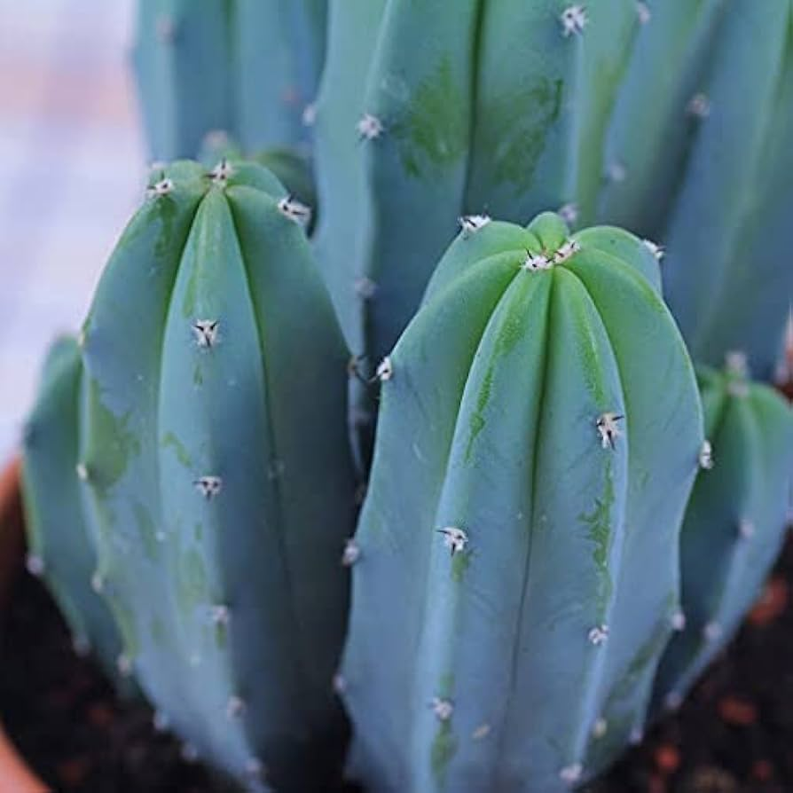
            </td>
            <td>Cactus arborescente que genera sombra ligera y florece con pequeñas flores que atraen polinizadores. Su fruto comestible añade valor ecológico y económico.</td>
            <td>Sombra / Atractor de Polinizadores</td>
            <td>
                <b>Necesidad de agua:</b> 1 
                <b>Necesidad de abono:</b> 2 
                <b>Exposición solar:</b> Sol directo
            </td>
            <td>
                <b>Días hasta brotar:</b> 1 
                <b>Días hasta crecer:</b> 2 
                <b>Días hasta madurar:</b> 3
            </td>
            <td>3 pétalos</td>
        </tr>
        <tr>
            <td>
                <b>Nombre:</b> Trompetilla 
                <b>Nombre científico:</b> <i>Bouvardia ternifolia</i> 
                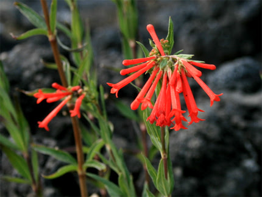
            </td>
            <td>Arbusto de flores tubulares y racimos de intenso color rojo. Planta muy vistosa y compacta, apreciada en la jardinería por su floración duradera y su capacidad para atraer colibríes.</td>
            <td>Productora</td>
            <td>
                <b>Necesidad de agua:</b> 2 
                <b>Necesidad de abono:</b> 3 
                <b>Exposición solar:</b> Sol directo
            </td>
            <td>
                <b>Días hasta brotar:</b> 1 
                <b>Días hasta crecer:</b> 2 
                <b>Días hasta madurar:</b> 3
            </td>
            <td>2 pétalos</td>
        </tr>
        <tr>
            <td>
                <b>Nombre:</b> Tomatera 
                <b>Nombre científico:</b> <i>Solanum lycopersicum</i> 
                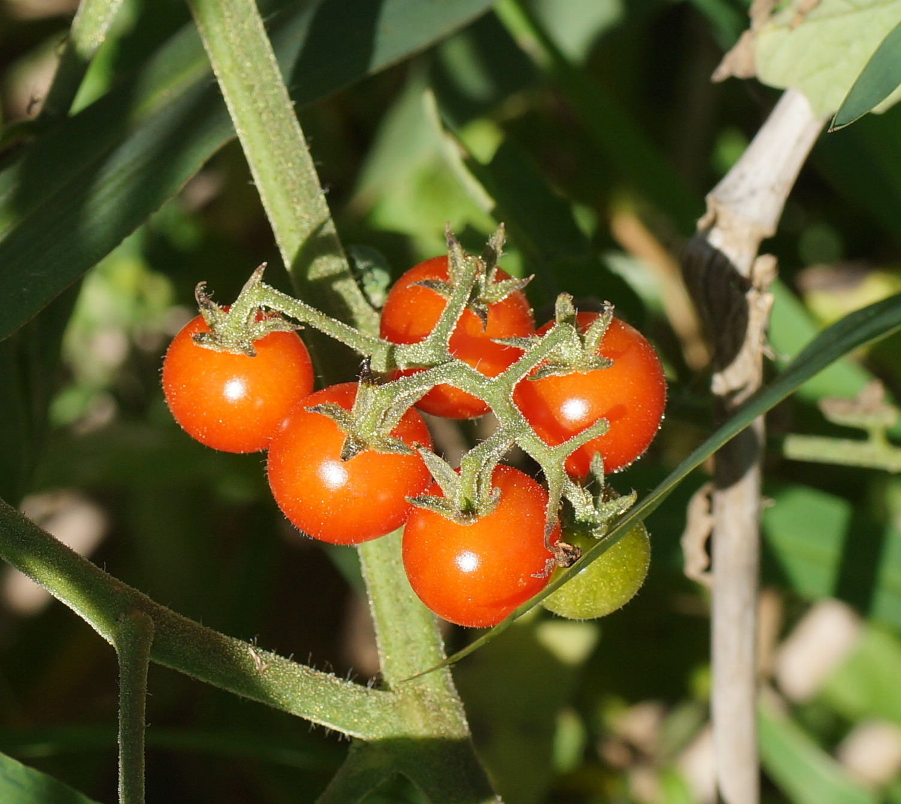
            </td>
            <td>Planta de fruto comestible. Requiere riego constante y suelos ricos. Al madurar, produce tomates que pueden venderse o usarse como recurso alimenticio.</td>
            <td>Productora</td>
            <td>
                <b>Necesidad de agua:</b> 3 
                <b>Necesidad de abono:</b> 3 
                <b>Exposición solar:</b> Sol directo
            </td>
            <td>
                <b>Días hasta brotar:</b> 1 
                <b>Días hasta crecer:</b> 2 
                <b>Días hasta madurar:</b> 3
            </td>
            <td>3 pétalos</td>
        </tr>
        <tr>
            <td>
                <b>Nombre:</b> Fresa 
                <b>Nombre científico:</b> <i>Fragaria vesca</i> 
                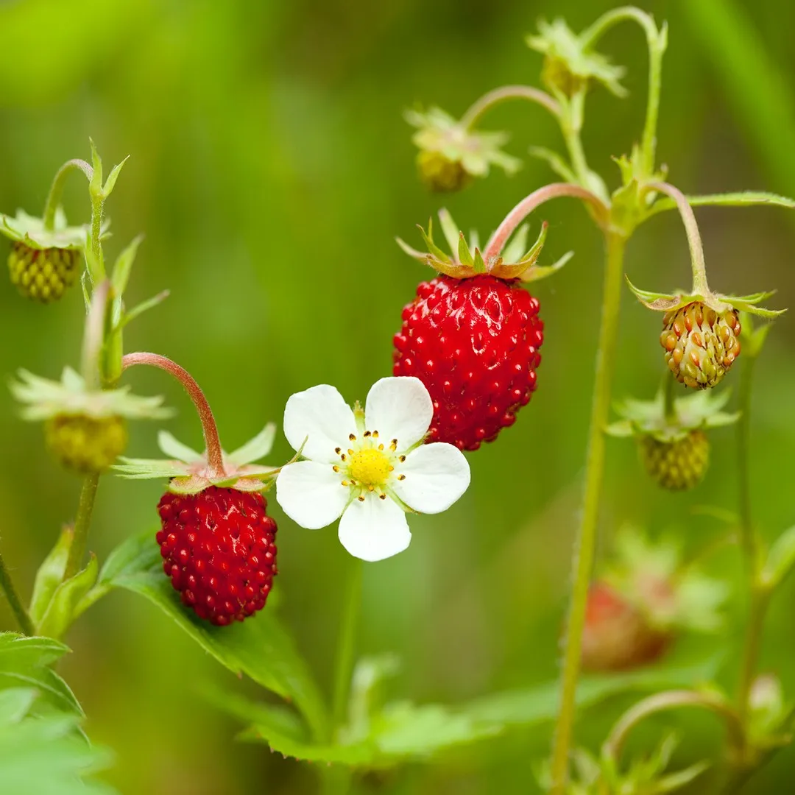
            </td>
            <td>Planta pequeña y frutal que crece en zonas húmedas. Produce frutos dulces que atraen fauna y aportan ingresos moderados.
            </td>
            <td>
                <b>Necesidad de agua:</b> 2 
                <b>Necesidad de abono:</b> 2 
                <b>Exposición solar:</b> Sol parcial
            </td>
            <td>
                <b>Días hasta brotar:</b> 1 
                <b>Días hasta crecer:</b> 2 
                <b>Días hasta madurar:</b> 3
            </td>
            <td>2 pétalos</td>
        </tr>
        <tr>
            <td>
                <b>Nombre:</b> Acebo 
                <b>Nombre científico:</b> <i>Ilex aquifolium</i> 
                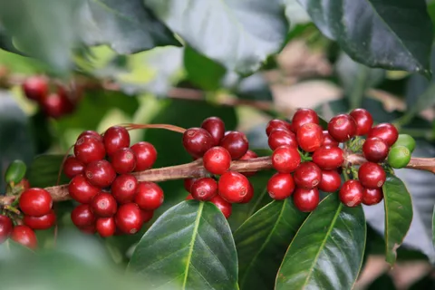
            </td>
            <td>Arbusto de clima templado, famoso por sus hojas espinosas y frutos rojos brillantes. Muy valorado como ornamento invernal y por su madera dura y blanca. Resistente al frío, pero de crecimiento lento.</td>
            <td>Refugio de Fauna</td>
            <td>
                <b>Necesidad de agua:</b> 2 
                <b>Necesidad de abono:</b> 1 
                <b>Exposición solar:</b> Sombra
            </td>
            <td>
                <b>Días hasta brotar:</b> 1 
                <b>Días hasta crecer:</b> 4 
                <b>Días hasta madurar:</b> 3
            </td>
            <td>3 pétalos</td>
        </tr>
        <tr>
            <td>
                <b>Nombre:</b> Trigo 
                <b>Nombre científico:</b> <i>Triticum aestivum</i> 
                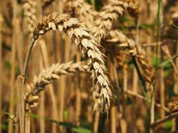
            </td>
            <td>Cereal básico de bajo mantenimiento. Aporta alimento, semillas y refugio para pequeños animales e insectos. Favorece la fauna y la estabilidad del suelo.</td>
            <td>Productora / Refugio para fauna</td>
            <td>
                <b>Necesidad de agua:</b> 2 
                <b>Necesidad de abono:</b> 2 
                <b>Exposición solar:</b> Sol directo
            </td>
            <td>
                <b>Días hasta brotar:</b> 1 
                <b>Días hasta crecer:</b> 2 
                <b>Días hasta madurar:</b> 3
            </td>
            <td>2 pétalos</td>
        </tr>
        <tr>
            <td>
                <b>Nombre:</b> Cheflera 
                <b>Nombre científico:</b> <i>Schefflera arboricola</i> 
                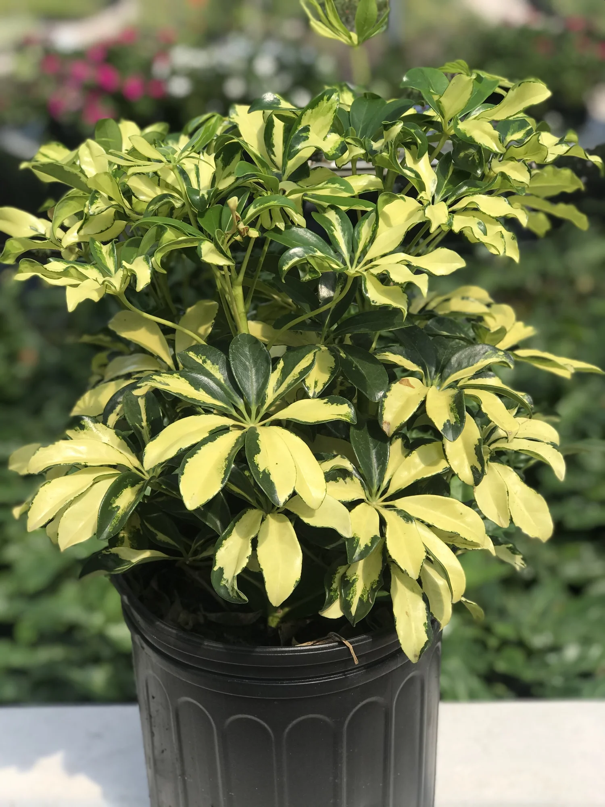
            </td>
            <td>Arbusto de hojas grandes y brillantes que crea un microclima fresco bajo su copa. Sirve como refugio para insectos y aves pequeñas, estabilizando la humedad del entorno y mejorando la salud general del jardín.</td>
            <td>Refugio para fauna</td>
            <td>
                <b>Necesidad de agua:</b> 2 
                <b>Necesidad de abono:</b> 2 
                <b>Exposición solar:</b> Sol parcial
            </td>
            <td>
                <b>Días hasta brotar:</b> 1 
                <b>Días hasta crecer:</b> 2 
                <b>Días hasta madurar:</b> 4
            </td>
            <td>2 pétalos</td>
        </tr>
    </tbody>
</table>

<table>
    <tbody>
        <tr>
            <td>
                <b>Regadera:</b> La regadera es la herramienta utilizada para regar cada casilla de la cuadrícula. La regadera tiene un depósito que podrás usar en cada una de las parcelas. Cada día, el depósito de agua se rellena.
            </td>
            <td style="text-align: center;">
                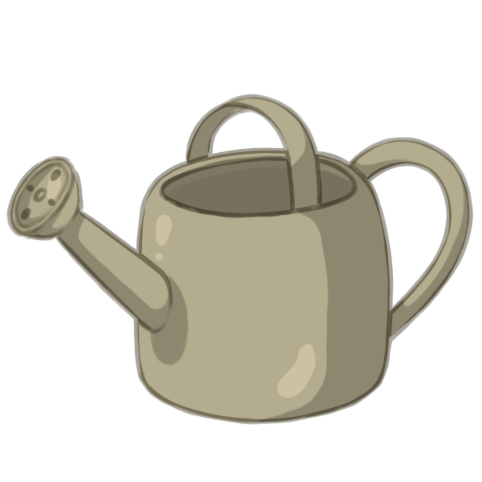
            </td>
        </tr>
        <tr>
            <td>
                <b>Saco de abono:</b> El saco de abono es la herramienta utilizada para abonar cada casilla de la cuadrícula. El saco de abono tiene un depósito que podrás usar en cada una de las parcelas. Cada día, el saco de abono se rellena.
            </td>
            <td style="text-align: center;">
                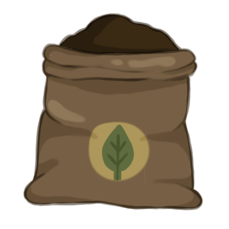
            </td>
        </tr>
        <tr>
            <td>
                <b>Pala:</b> La pala es la herramienta que permite eliminar las plantas muertas del terreno, o incluso las plantas vivas que no estén aportando al ecosistema. 
            </td>
            <td style="text-align: center;">
                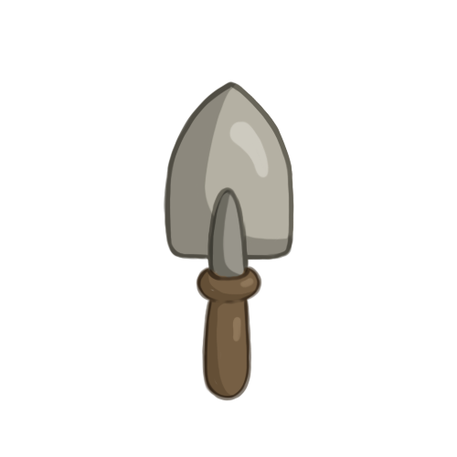
            </td>
        </tr>
    </tbody>
</table>

### 4.6. A futuro: Sistema de Temporadas
Para fomentar la retención a largo plazo y expandir el valor educativo del juego, The Living Garden operará bajo un sistema de **Temporadas Trimestrales**. Cada temporada será una **Expedición Ecológica** a una nueva región del mundo.

#### 4.6.1. Santuario Base
Para complementar el ciclo de partidas cortas (runs) y dar sentido a la progresión a largo plazo, se introduce El Santuario Base. Este espacio actúa como el nexo central de la experiencia y justifica la narrativa del Programa de Santuarios Botánicos (PSB).

El Santuario Base será un invernadero o jardín seguro que el jugador conserva para siempre. Aquí las plantas no mueren, no hay plagas y no requieren gasto de recursos (agua/abono) para sobrevivir, solo para crecer o cambiar. Es el lugar donde se visualizan los logros.

Ganando partidas, el jugador conseguirá semillas que podrá plantar aquí. Así, el Santuario se irá llenando poco a poco de todas las especies que el jugador ha logrado dominar en sus partidas, convirtiéndose en una **"Colección de Trofeos" viva**. Dado que el Santuario Base es permanente, es el espacio ideal para la personalización.

#### 4.6.2. Funcionamiento del ciclo de temporada:
 - **Nuevos Biomas (Escenarios)**:  Cada temporada desbloquea temporalmente una nueva parcela en una ubicación geográfica distinta (ej. "La Selva Amazónica", "La Tundra Ártica", "El Mediterráneo Seco").
 - **Modificadores Climáticos Específicos**: Al cambiar de región, las reglas del clima (ver 4.2.3) se adaptan a la realidad de ese bioma, obligando al jugador a aprender nuevas estrategias:
    - Ejemplo - Temporada Monzónica: Lluvias constantes (riesgo de hongos por exceso de humedad), pero necesidad de gestionar drenaje en lugar de riego.
    - Ejemplo - Temporada Desértica: Calor extremo (evaporación rápida), necesidad de plantas de sombra y cactus.
 - **Flora y Fauna Exclusiva:** Cada temporada introduce una **"Colección de Temporada"**, introduciendo nuevas plantas y fauna que el jugador debe descubrir y catalogar.

## 5. Trasfondo
### 5.1. Descripción detallada de la historia y la trama
El marco narrativo de _The Living Garden_ se sitúa en un futuro cercano, marcado por la inevitable consecuencia del colapso climático. No ha sido un evento cataclísmico, sino un lento y constante deterioro que ha alterado drásticamente los patrones estacionales y la estabilidad de los ecosistemas:

- Las estaciones se han vuelto erráticas. Los veranos son brutalmente secos e intensos; los inviernos, impredecibles con nevadas tardías o sequías. Esta variabilidad climática extrema ha desequilibrado la flora y la fauna, volviendo inhabitables vastas extensiones de tierra. 

- La respuesta dominante de la humanidad fue la centralización y la tecnología. La gran mayoría de la población migró a las Neo-ciudades autosuficientes (a veces llamadas “Arcas”), megaestructuras cerradas y tecnológicamente avanzadas. Dentro de sus muros, la naturaleza es un archivo digital o una instalación de laboratorio controlada. El mundo exterior, el mundo rural, fue abandonado. 

- Sin la mano de obra, los ciudadanos y la inversión que mantenían el campo, los vastos ecosistemas naturales entraron en una espiral de declive ecológico. Especies vegetales y de fauna, incapaces de adaptarse a los patrones climáticos alterados, están al borde de la extinción en el exterior. 

En medio de esta resignación global, surge una iniciativa de esperanza, financiada por fundaciones y biólogos disidentes que rechazan la idea de que la única solución sea rendirse al control tecnológico total.

#### 5.1.1. La iniciativa
El Programa de Santuarios Botánicos (PSB) es una red descentralizada de micro-reservas dispersas por el mundo rural. Su filosofía es simple: la supervivencia de la vida silvestre no puede depender de los archivos digitales, sino de la creación de focos de resistencia ecológica _in situ_.

#### 5.1.2. El rol del jugador
El jugador encarna a un joven idealista que ha rechazado la comodidad y el confinamiento de las Neo-Ciudades y que, motivado por un profundo respeto por la biología y la interconexión de la vida, se une al PSB como “Curador de Santuario”.

#### 5.1.3. La tarea inicial
El PSB asigna al jugador una parcela estéril. Esta parcela es el lienzo inicial, un entorno desafiante pero con el potencial de convertirse en una micro-Arca de Noé biológica. El programa facilita una asignación diaria de recursos básicos (pétalos, agua, abono) para compensar las condiciones extremas y los desafíos iniciales.

#### 5.1.4. La trama
La trama no es lineal ni cinemática, sino ecológica y de propósito. Se centra en el proceso de curación y la lucha constante contra un entorno hostil. 

El **objetivo principal** es transformar la parcela olvidada en un Jardín Santuario que no solo sobreviva a los adversos eventos climáticos, sino que prospere, logrando la máxima biodiversidad y autosuficiencia ecológica. 

El jugador debe dominar los principios de la interdependencia de especies. La trama se desarrolla a través del reto de crear micro-ecosistemas de resistencia donde cada planta, insecto y la salud del suelo interactúan dinámicamente. Esto se evidencia en la necesidad de:
- Gestionar la sombra de las plantas altas para proteger a las sensibles. 
- Atraer polinizadores y controladores de plagas.
- Mejorar la salud del suelo para mitigar la escasez de agua.

El **clímax** de la partida es alcanzar y mantener el **equilibrio crítico**, un número predefinido de especies raras (ej. 10 plantas y 5 especies de fauna) que ya no pueden sobrevivir en el exterior. Lograr este equilibrio significa que el jardín es autosuficiente y que las especies más vulnerables están seguras. 

Al alcanzar el objetivo, el Santuario se valida como un “Laboratorio de resistencia”. El PSB lo utiliza como una prueba tangible de que la ecología puede restablecerse con cuidado y conocimiento, ofreciendo un legado de esperanza biológica, en un mundo que ha optado por la seguridad tecnológica. El jardín del jugador se convierte en un modelo crucial para futuras iniciativas de reforestación y conservación. 

#### 5.1.5. El conflicto
El principal conflicto no proviene de un antagonista humano, sino del entorno hostil y la mala gestión.

El enemigo principal es la variabilidad climática y los eventos extremos (sequías intensas, lluvias torrenciales, plagas súbitas). Estos se generan procedimentalmente, garantizando que el jugador deba adaptarse constantemente.

Este lucha contra la interdependencia y la escasez de recursos. Un error de cálculo (demasiada sombra, escasez de agua, falta de abono) puede provocar un efecto dominó que afecte a todo el ecosistema del jardín. 

#### 5.2. Personajes
El juego es íntimo y centrado en la simulación, por lo que los personajes se limitarán a figuras clave que apoyan la jugabilidad y la narrativa del PSB (Programa de Santuarios Botánicos). El protagonista es el personaje central del jugador.

#### 5.2.1. El curador (Protagonista - Jugador)
Es el guardián del santuario, la voz de la acción, la paciencia y el conocimiento ecológico. Un joven idealista que ha rechazado el aislamiento tecnológico de las Neo-Ciudades. 

Su motivación no es la riqueza, sino el profundo convencimiento de que la vida silvestre debe ser protegida in situ, no solo archivada digitalmente. 

No tiene un modelo de personaje visible en pantalla. Su presencia se manifiesta únicamente a través de la mano invisible de la gestión: la interfaz de usuario, la colocación de objetos, el riego, la plantación. Esta ausencia refuerza la inmersión, permitiendo al jugador ser directamente el gestor del jardín.

Es el agente del Core Loop. El jugador interactúa directamente con el jardín: regando, plantando, comprando, investigando y observando el ecosistema. Su éxito se mide por la salud y biodiversidad de la parcela. 

#### 5.2.2. El contacto del PSB
Es el asesor y administrador de recursos. Es la única conexión directa y regular del curador con el mundo exterior y el Programa de Santuarios Botánicos. Esta figura tampoco aparece nunca físicamente, solo a través de mensajes o notas. Es la fuente de la recompensa diaria (pétalos, agua y abono) y el receptor de la producción del jardín. 

Gestiona la venta de la producción excedente del jardín a cambio de pétalos para la investigación y la compra de semillas raras y envía informes de progreso y reconocimiento al alcanzar hitos de biodiversidad. 

#### 5.2.3. Leo (El loro guía/mascota)
Leo es un pequeño loro que lucha por sobrevivir en el exterior. Fue rescatado y asignado al Curador por el PSB para guiarle y acompañarle en su misión. Es inteligente y vocal, y simboliza el éxito inicial de la conservación. 

Dado que no hay un avatar visible del jugador, Leo ofrece una presencia emocional en la pantalla.

Su función es guiar al jugador a través de los primeros pasos, explicando el Core Loop (regar, plantar, abonar) mediante cuadros de texto y flechas. Además, sirve como una forma de comunicar el estado del jardín al jugador, sin recurrir a menús secos (ej. Durante la sequía: “¡Hace mucho calor! El suelo se ve muy triste…”). También es el primero en reaccionar visiblemente al atraer una nueva especie de fauna o al florecer una planta, con animaciones de celebración. 

Con Leo, la experiencia se vuelve más personal y el tutorial se integra de forma orgánica con la estética del juego. 

#### 5.3. Entornos y lugares
El juego opera con una perspectiva top-down inclinada y se enfoca en un solo espacio jugable altamente detallado, rodeado de un entorno de fondo ilustrativo. 

El **Jardín Santuario**, es el espacio jugable primario, el foco de toda la simulación y gestión. Un terreno rectangular dividido en una cuadrícula de parcelas. La vista cenital inclinada permite una lectura clara de la cuadrícula para la planificación, mientras que el ángulo frontal sutil mantiene la expresividad de los elementos, como las plantas o los alrededores del jardín. 

Está compuesto por **parcelas de cultivo**, donde se plantan las semillas y que muestran visualmente el estado del suelo (fertilidad, humedad).

El entorno inmediato al jardín incluye la **casa de campo**, un edificio pequeño y acogedor donde se hospeda el jugador, que proyecta sombra sobre algunas parcelas, lo que debe ser tenido en cuenta en la planificación; y un **árbol perenne** grande en la frontera del terreno. Este árbol es un factor de rejugabilidad clave, ya que su posición se genera procedimentalmente en cada partida, impactando dónde caen las sombras e influyendo en la planificación inicial. 

### 5.4. Tutorial

El juego incorpora un tutorial interactivo y contextual que guía al jugador durante su primera partida.

Los mensajes aparecen en función de las acciones del jugador y de eventos del propio Santuario, como el clima, las plagas o la aparición de strikes.

Al comenzar una nueva partida, Leo pregunta al jugador si desea recibir ayuda.

- Si el jugador elige “Guíame, Leo”, el tutorial se activa.
- Si el jugador elige “Me las apaño solo”, ningún mensaje tutorial aparecerá durante toda la partida.

### 5.4.1. Mensajes iniciales (día 1)

Estos mensajes aparecen automáticamente al iniciar el juego si el jugador acepta recibir ayuda. No dependen de ninguna acción del jugador.

**Mensaje 1 – Bienvenida**  
Leo dice:  
*“Buenos días, Curador.  
Soy Leo, y estaré contigo para ayudarte a despertar este Santuario.”*

**Mensaje 2 – La tienda**  
Leo dice:  
*“A tu izquierda tienes la tienda.  
Aquí puedes elegir semillas para plantar.  
También puedes comprar agua y abono, pero cuidado con no quedarte sin pétalos.”*

**Mensaje 3 – Pronóstico del clima**  
Leo dice:  
*“Ah, y no olvides mirar el pronóstico del clima, Curador.  
Arriba a la derecha verás el tiempo de los próximos días.  
El clima puede ayudarte… o sorprenderte, así que consúltalo a menudo.”*

**Mensaje 4 – Biodiversidad**  
Leo dice:  
*“Curador… antes de seguir, hay algo importante.  
La biodiversidad es la vida del Santuario.  
Aumenta cada vez que logras hacer crecer distintas especies,  
y baja si alguna planta muere.  
Cuanta más biodiversidad tengas, más pétalos ganarás cada día…  
y si alcanzas el objetivo, ¡restaurarás el Santuario!”*

### 5.4.2. Mensajes según acciones del jugador

Los siguientes mensajes aparecen cuando el jugador realiza acciones clave por primera vez.

#### 5.4.2.1. Primera planta plantada

**Mensaje 1**  
Leo dice:  
*“¡Perfecto, Curador!  
Has plantado tu primera especie en el Santuario.”*

**Mensaje 2**  
Leo dice:  
*“Ahora toca cuidarla bien.  
Usa la regadera para darle agua y el abono para enriquecer el suelo.  
También puedes hacer uso de la pala para quitar plantas; recuperarás parte de la inversión.  
Cuanto mejor atendida esté la parcela, más fuerte crecerá la planta.”*

#### 5.4.2.2. Seleccionar una parcela (primera vez)

Leo dice:  
*“Esta es la ficha de la parcela.  
Aquí ves cuánta agua y abono tiene el suelo y qué exposición solar recibe.  
Si hay una planta, también verás su estado y sus necesidades.”*

#### 5.4.2.3. Primer riego y primer abonado: cuidados básicos completados

Este mensaje aparece cuando el jugador ha regado al menos una vez y abonado al menos una vez.

Leo dice:  
*“¡Vaya, Curador!  
Veo que ya dominas los cuidados básicos de una planta.  
Si alguna vez se te olvida algo, puedes consultar la guía rápida con el botón de la interrogación arriba.”*

#### 5.4.2.4. Mensajes según el tipo de planta plantada

##### A. Plantas productoras

Leo dice:  
*“Has plantado una productora, Curador.  
Son las plantas que generan pétalos, pero necesitan un buen entorno para hacerlo.”*

Leo dice:  
*“Para producir frutos necesitan cumplir tres condiciones:  
- Estar en buena o moderada salud.  
- Estar libres de plagas.  
- Tener polinizadores cerca (de una atractora sana).”*

Leo dice:  
*“Piensa en ellas como el corazón económico del Santuario.  
Protégelas con refugios de fauna y sitúalas en la exposición solar adecuada  
para que den lo mejor de sí.”*

##### B. Plantas de sombra

Leo dice:  
*“Has plantado una planta de sombra.  
Su función es modificar la luz de las parcelas cercanas cuando crece lo suficiente.”*

Leo dice:  
*“La sombra puede transformar una zona soleada en semisombra o sombra.  
Esto ayuda a plantas que sufren con demasiado sol,  
pero puede perjudicar a las que necesitan luz directa.”*

Leo dice:  
*“Si colocas varias plantas de sombra alrededor de una parcela,  
la acumulación puede generar zonas muy umbrías.  
Úsalas para ajustar la exposición solar al tipo exacto que cada especie necesita.”*

##### C. Atractoras de polinizadores

Leo dice:  
*“Acabas de plantar una atractora de polinizadores.  
Estas plantas atraen la vida necesaria para que tus productoras puedan dar frutos.”*

Leo dice:  
*“Las parcelas cercanas recibirán polinizadores.  
Sin ellos, las productoras no generan pétalos aunque estén sanas.  
Colócalas estratégicamente para alimentar varias productoras a la vez.”*

Leo dice:  
*“Recuerda: polinizadores + productoras sanas = economía fuerte.  
Cuida también de las atractoras, porque si enferman o mueren,  
las productoras dejarán de recibir polinizadores.”*

##### D. Refugios de fauna

Leo dice:  
*“Has plantado un refugio de fauna.  
Estas plantas atraen animales que protegen el Santuario.”*

Leo dice:  
*“La fauna evita que aparezcan plagas en las parcelas cercanas  
y además puede llegar a curar plagas existentes con el paso de los días.”*

Leo dice:  
*“Son esenciales para que tus productoras y atractoras no queden inutilizadas.  
Distribuye los refugios alrededor de las zonas importantes  
para mantener a raya las plagas.”*

### 5.4.3. Tutoriales contextuales

Estos mensajes aparecen automáticamente la primera vez que ocurre cada evento en la partida.

#### 5.4.3.1. Resumen del día

Leo dice:  
*“Este es el resumen del día, Curador.  
Aquí ves cuántos pétalos has ganado, los bonos por tu jardín  
y las pérdidas por plantas muertas o usar la pala.  
También verás si recibes agua o abono extra.  
Échale un vistazo cada noche para entender cómo evoluciona el Santuario.”*

#### 5.4.3.2. Clima

Los mensajes se disparan la primera vez que aparece cada tipo de clima (excepto el primer día).

##### A. Día soleado

Leo dice:  
*“Vaya, Curador… hoy tenemos un día soleado.  
El sol no riega el suelo, al contrario: poco a poco lo va secando.”*

Leo dice:  
*“Fíjate bien en el pronóstico de arriba a la derecha:  
el sol puede aparecer con tres intensidades:  
- Intensidad 1: a veces seca 1 punto de agua.  
- Intensidad 2: puede secar 1 o 2 puntos.  
- Intensidad 3: puede secar hasta 3 puntos de agua.”*

Leo dice:  
*“El sol por sí solo no mata plantas,  
pero si dejas el suelo demasiado seco,  
tus plantas sufrirán luego por falta de recursos.  
Revisa el agua de tus parcelas y riega cuando lo necesiten.”*

##### B. Cielo nublado

Leo dice:  
*“Hoy el cielo está cubierto, Curador.  
Este clima es muy tranquilo: no riega ni seca el suelo,  
da igual la intensidad.”*

Leo dice:  
*“Piensa en él como un respiro para el jardín:  
puedes aprovechar para planificar, reorganizar tus plantas  
y prepararte para días más duros.”*

##### C. Día lluvioso

Leo dice:  
*“Vaya, Curador… hoy llueve en el Santuario.  
La lluvia siempre aumenta el agua del suelo de todas las parcelas.”*

Leo dice:  
*“La lluvia también tiene tres intensidades:  
- Intensidad 1: lluvia suave, +2 de agua.  
- Intensidad 2: lluvia moderada, +4 de agua.  
- Intensidad 3: lluvia torrencial, +6 de agua y riesgo para plantas débiles.”*

Leo dice:  
*“La lluvia suave y moderada son perfectas para recuperar parcelas secas.  
Pero con lluvia torrencial, las plantas con mala salud pueden llegar a morir.  
Si ves una lluvia muy fuerte acercarse en el pronóstico,  
intenta que tus plantas estén lo más sanas posible antes de que llegue.”*

##### D. Granizo

Leo dice:  
*“Vaya, Curador… hoy cae granizo.  
Es uno de los climas más peligrosos para tu jardín.”*

Leo dice:  
*“El granizo puede caer con tres intensidades  
y también añade agua al suelo:  
- Intensidad 1: +1 de agua.  
- Intensidad 2: +2 de agua.  
- Intensidad 3: +3 de agua y un golpe muy duro.”*

Leo dice:  
*“Lo importante del granizo no es el agua, sino el daño:  
puede matar plantas en mala salud, y cuanto más fuerte es,  
más sufre incluso una planta moderada.  
Si ves granizo en el pronóstico, procura que tus plantas  
estén lo más sanas posible.”*

#### 5.4.3.3. Plagas

**Primera vez que aparece una plaga**

Leo dice:  
*“Curador… veo que una de tus plantas ha sido atacada por una plaga.  
La reconocerás por el icono que aparece sobre ella.  
No la mata al instante, pero es una mala señal para el Santuario.”*

Leo dice:  
*“Mientras tenga plaga, esa planta no podrá recuperar salud,  
aunque la riegues y abones correctamente.  
Y si es una productora, dejará de darte frutos  
aunque tenga polinizadores cerca.”*

Leo dice:  
*“Para librarte de las plagas tienes dos caminos:  
- Plantar refugios de fauna cerca: protegen parcelas adyacentes  
  y con los días la fauna puede limpiar la plaga.  
- Usar la pala sobre la planta infectada: eliminas la planta y la plaga,  
  aunque perderás parte de lo invertido.  
Combina refugios, productoras y polinizadores  
para que tu jardín sea resistente.”*

**Plaga curada por fauna**

Leo dice:  
*“¿Lo ves, Curador?  
La fauna del refugio ha limpiado la plaga de esa planta.  
Los refugios protegen las parcelas cercanas  
y con el tiempo pueden curar plagas que haya en su área.”*

Leo dice:  
*“Si tienes productoras importantes, compensa rodearlas de refugios.  
Así evitas nuevas plagas y, si aparece alguna,  
la fauna tendrá donde vivir para poder limpiarla.”*

**Planta infectada eliminada con pala**

Leo dice:  
*“Cuando usas la pala sobre una planta con plaga,  
eliminas la planta y también la plaga de esa parcela.  
Es una solución rápida cuando la infección está fuera de control,  
pero perderás parte de los pétalos invertidos.  
Úsala para cortar plagas difíciles mientras rediseñas el jardín  
con más refugios de fauna alrededor.”*

#### 5.4.3.4. Strikes

**Strike normal**

Leo dice:  
*“Curador… acabas de recibir un strike.  
Son avisos de que el Santuario está en peligro.  
Si llegas a 5 strikes, el Santuario colapsará y perderás la partida.”*

Leo dice:  
*“Los strikes normales aparecen cuando descuidas el jardín:  
- Cada 2 plantas que mueren suman un strike.  
- También si pasas varios días sin plantar teniendo pétalos suficientes.”*

Leo dice:  
*“La parte buena es que los strikes normales se pueden quitar.  
Si mantienes al menos 3 plantas vivas  
y pasas 5 días seguidos sin que muera ninguna,  
el Santuario perdonará uno de tus strikes.”*

**Strike permanente**

Leo dice:  
*“Esta vez es más grave, Curador…  
Te has quedado sin plantas y sin pétalos suficientes para volver a plantar.  
El Santuario te ha dado algunos pétalos para ayudarte,  
pero a cambio has recibido un strike permanente rojo.”*

Leo dice:  
*“Los strikes permanentes no se pueden limpiar nunca.  
Cuentan igual para el límite de 5 strikes,  
así que intenta no volver a quedarte sin jardín.”*

**Strike eliminado**

Leo dice:  
*“¡Muy bien, Curador!  
Has cuidado tan bien de tu jardín durante varios días  
que el Santuario ha decidido perdonarte un strike normal.  
Si sigues manteniendo tus plantas sanas,  
podrás limpiar más avisos.”*

## 6. Arte
Esta sección define la filosofía visual de _The Living Garden_, garantizando que la estética refuerce la jugabilidad de simulación y el trasfondo de esperanza ecológica. 

### 6.1. Estética general del videojuego
La estética visual se centra en tres pilares fundamentales:

* **Cozy (calidez y cercanía):** El juego debe generar una sensación de refugio y confort. Esto se logra mediante colores suaves, animaciones fluidas y la representación de materiales con una textura amable. La meta es que el jardín se sienta como un santuario vital y personal, un lugar de calma frente al caos del exterior. 
* **Minimalista (claridad y legibilidad):** Puesto que es un juego de gestión y planificación, la claridad visual es primordial. El diseño evita el detalle excesivo y el desorden vital. Los elementos clave deben ser iconográficos y fácilmente legibles a simple vista. 
* **Armónica (paleta controlada):** La paleta de colores será restringida y muy cuidada para asegurar que el conjunto sea visualmente agradable. El contraste se utiliza para dirigir la atención del jugador, no para crear tensión visual.

#### 6.1.1. Paleta de color y tono
Predominio de tonos pasteles, verdes suaves, terrosos claros y colores primarios atenuados. Los colores vivos (como el rojo de una flor) se reservarán para destacar los elementos de la biodiversidad y las recompensas visuales, manteniendo el resto del entorno en calma. 

Los eventos climáticos extremos se comunicarán principalmente a través de la iluminación y los efectos de filtro sobre el entorno en lugar de colores agresivos. Las alertas de plaga o de salud baja de una planta se señalizarán con un halo suave y diferenciado que no rompa la armonía visual.

#### 6.1.2. Estilo de ilustración
El estilo de arte se basa en la ilustración 2D pintada digitalmente con una sutil aplicación de textura para dar personalidad y calidez, similar a un papel o tela. Esto evita que el arte se sienta demasiado plano o digital, reforzando la sensación cozy y manual del jardinero. 

El contorno es muy suave, primando las formas y los bloques de color para definir los objetos.  

La fauna (Leo y otros) tiene diseños expresivos y adorables. Las animaciones de los insectos y pájaros son suaves y centradas en el movimiento, no en la velocidad o la agresividad. 

#### 6.1.3. Perspectiva
La perspectiva (vista cenital inclinada), mantiene el equilibrio entre la claridad de gestión y la expresividad visual. Permite ver el diseño de la cuadrícula de parcelas y facilita la planificación de la sombra, a la vez que el ligero ángulo frontal permite apreciar la altura de las plantas, la textura de la fachada de la Casa de Campo y la tridimensionalidad de los elementos, como se ve en juegos cozy con vista isométrica.

#### 6.1.4. Interfaz de usuario (UI)
La interfaz es una extensión de la estética cozy y minimalista. La iconografía es plana, clara y coherente con la paleta de colores suaves. Se prioriza la legibilidad y el uso de símbolos e ilustraciones sencillas sobre el texto siempre que sea posible. 

Las transiciones de los menús son suaves y fluidas para mantener la sensación de tranquilidad. Los medidores de recursos son también minimalistas y ocupan un espacio discreto en la pantalla. 

### 6.2. Apartado visual
En este apartado se incluyen las descripciones detalladas de los elementos visuales del videojuego.

#### 6.2.1. Plantas y especies
Cada planta sigue un proceso de crecimiento y putrefacción que se observa también visualmente. 

Empezando por la semilla, continuando con un brote pequeño, uno un poco más grande y, por último, la planta madura. Esta última etapa es distinta para cada especie.

Una planta se puede encontrar en tres niveles de salud en cualquiera de sus etapas: bueno, regular y malo. Esto se visualiza con la pérdida de color y el decaimiento de las hojas, de las flores y la putrefacción de los frutos.

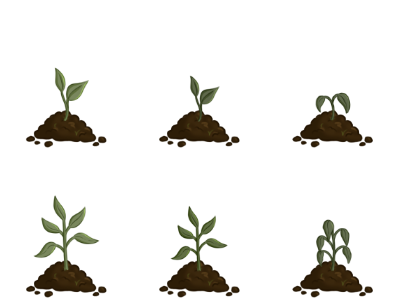

Abelia
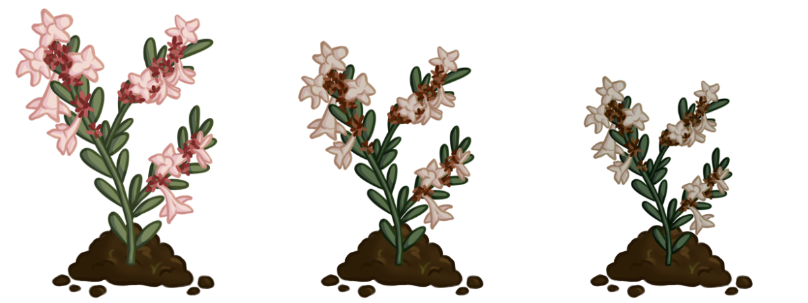

Acebo
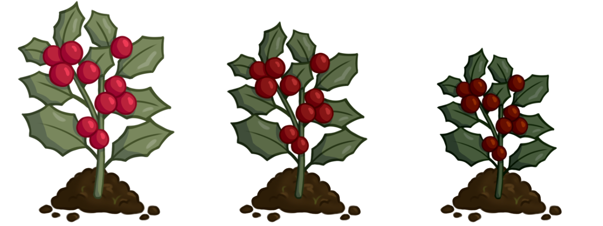

Agabe
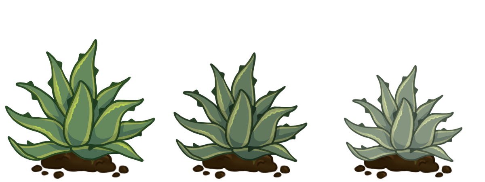

Bambú
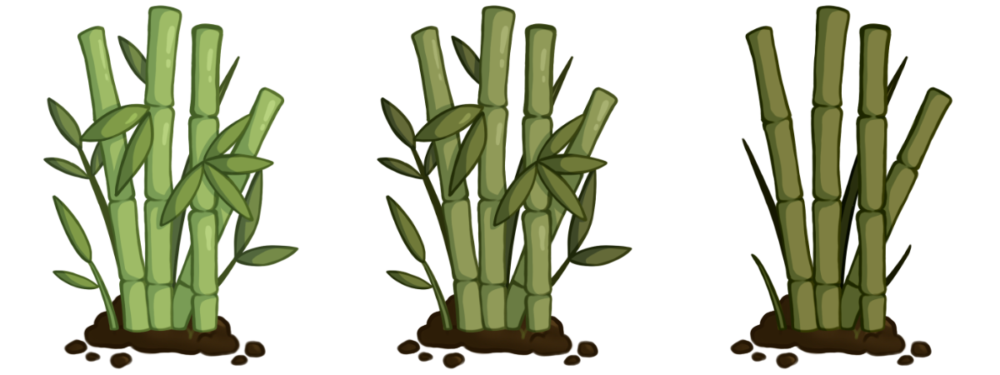

Cheflera
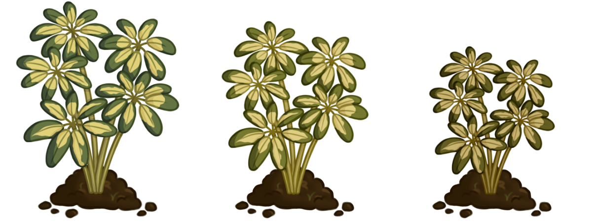

Fresa
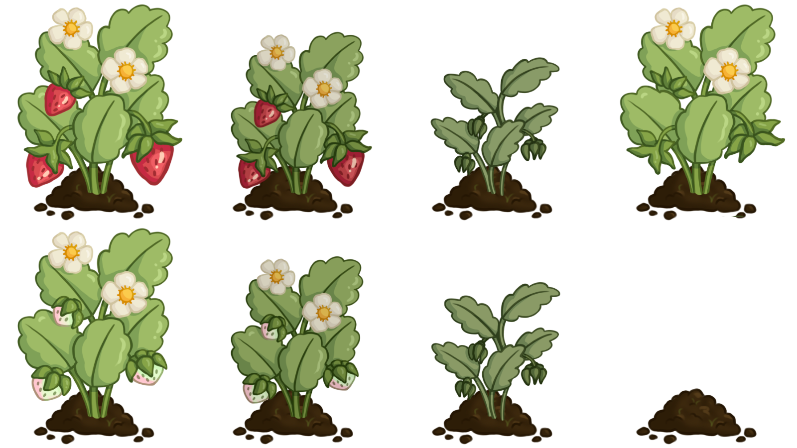

Garambullo
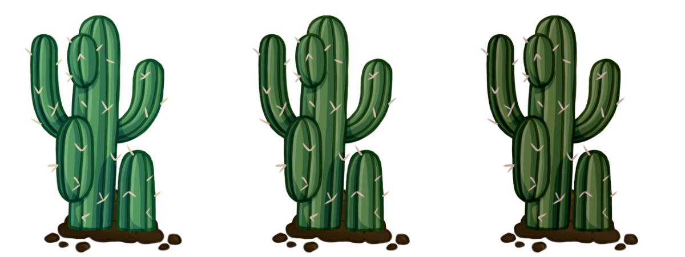

Lavanda
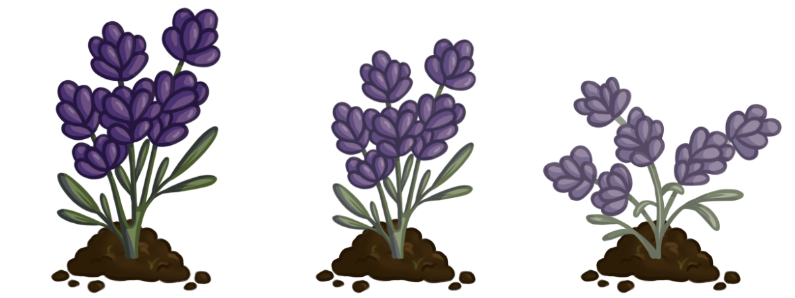

Lirio
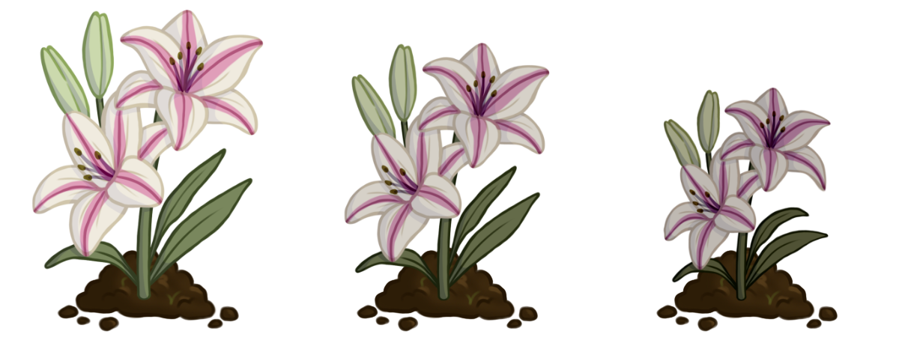

Margarita
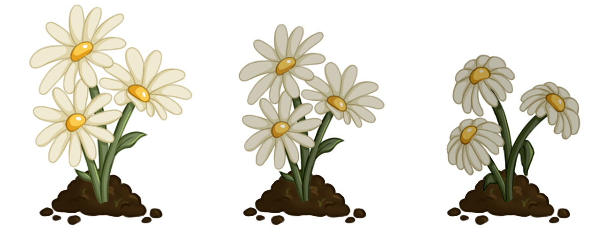

Tulipán
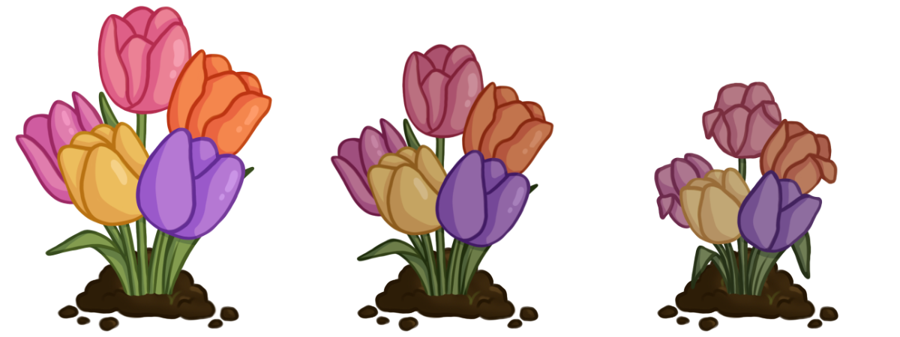

Orquídea
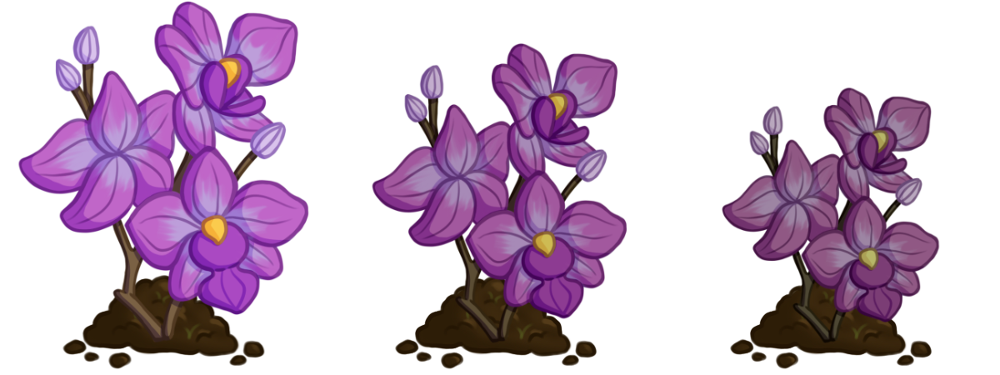

Rosa
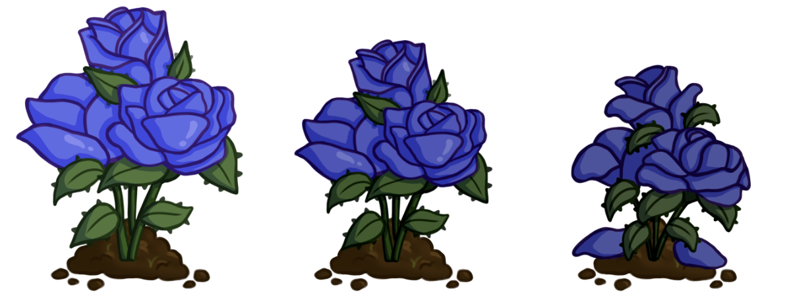

Trigo
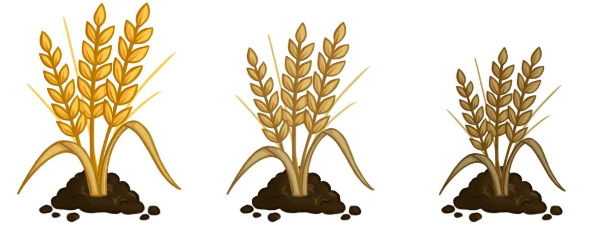

Tomatera
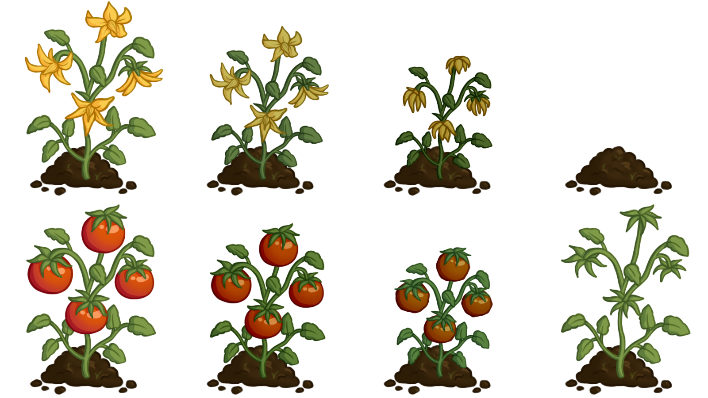

Trompetilla
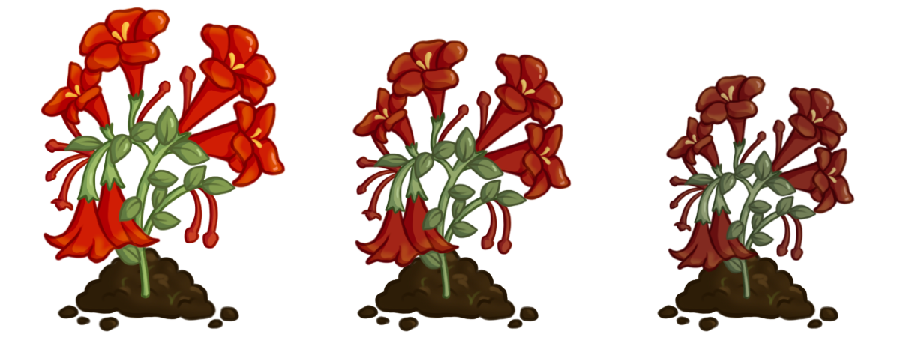

#### 6.2.2. Fauna
La fauna se diseñará para ser expresiva, adorable y funcionalmente clara, manteniendo el estilo de ilustración 2D y la paleta de colores suaves. 

- **El guía y mascota Leo:** Como personaje constante y guía del jugador, Leo requiere un diseño que equilibre adorabilidad con claridad funcional en la UI. Utiliza colores primarios y brillantes pero suavizados, para que destaque sin romper la armonía general. 

  Contará con poses y expresiones para:
    * Alerta/Advertencia
    * Éxito/Celebración
    * Ocio

  A continuación se muestran algunos bocetos del personaje:

  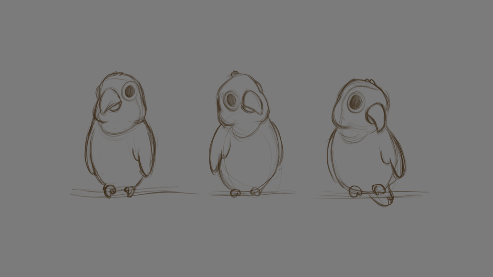
  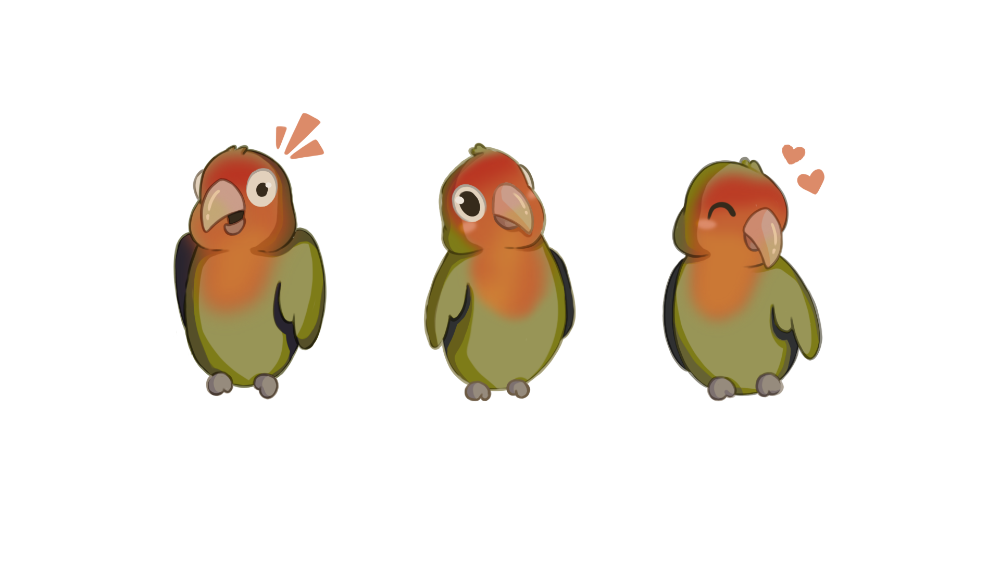

- **Fauna jugable:** Todos los animales tendrán una clara diferenciación visual que dirija la atención del jugador de manera sutil, coherente con el principio de Armonía Visual.

| Tipo de fauna | Objetivo del diseño | Ejemplos |
| --- | --- | --- |
| Polinizadores (fauna beneficiosa) | Deben evocar movimiento fluido, pureza y brillo. | Abejas, mariposas, colibríes, etc. |
| Plagas y amenazas | Deben ser fácilmente legibles, pero su diseño debe ser más aburrido o apagado, no agresivo. | Pulgón, caracoles, etc. |
| Fauna | Se aplica la estética beneficiosa pero con un diseño más complejo. | Conejos, mariquitas, ranas, etc. |

<table>
    <tbody>
        <tr>
            <td style="text-align: center;">
                 
                Abejas
            </td>
            <td style="text-align: center;">
                 
                pajarito
            </td>
            <td style="text-align: center;">
                 
                Pulgón
            </td>
        </tr>
    </tbody>
</table>

#### 6.2.3. Recursos y objetos
<table>
    <tbody>
        <tr>
            <td style="text-align: center;">
                 
                Regadera
            </td>
            <td style="text-align: center;">
                 
                Pala
            </td>
            <td style="text-align: center;">
                 
                Saco de abono
            </td>
        </tr>
        <tr>
            <td style="text-align: center;">
                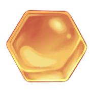 
                Néctar
            </td>
            <td style="text-align: center;">
                 
                Pétalo
            </td>
        </tr>
    </tbody>
</table>

#### 6.2.4. Escenario
El escenario consiste en una vista cenital inclinada del Jardín santuario, que combina la claridad de la cuadrícula con la calidez del estilo cozy. El espacio jugable se centra en una cuadrícula central de parcelas de tierra rodeada de césped de textura suave. En el borde superior, la Casa de campo y un árbol perenne proyectan sombras suaves sobre las parcelas, un factor de diseño clave. Los tonos son armónicos, enfatizando que este espacio es un refugio de vida y calma frente al mundo exterior. 

El color de las parcelas de tierra cambia visualmente en función de si están fértiles, abonados o secos, es decir, en función del agua y el abono que tengan. 

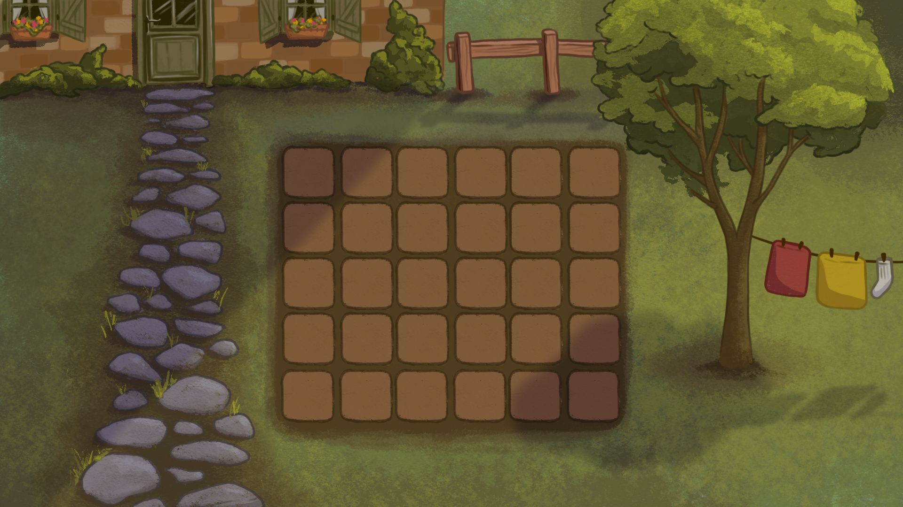
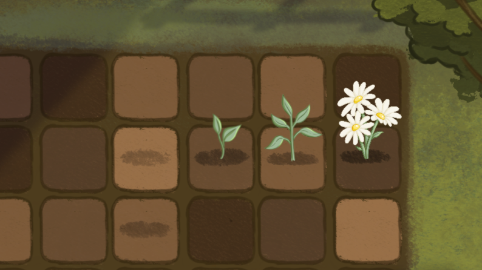

### 6.3. Música
La música de _The Living Garden_ busca transmitir serenidad y sensación de refugio emocional. Algunas de las influencias más grandes que se han tenido ha sido el álbum de Mort Garson ***Mother Earth’s Plantasia***, ***Minecraft*** de C418 y ***Ambient 1*** de Brian Eno. Esto implica ciertas técnicas en el sonido que se quiere buscar: Sintetizadores cálidos, acústica suave y textura ambiental para dar vida al movimiento de las plantas.

El enfoque musical se estructura por capas ambientales que evolucionan con el jardín:
- **Inicio (parcela estéril):** música minimalista y melancólica, con acordes suspendidos, respiración amplia y sonidos suaves que sugieren calma.
- **Crecimiento:** progresión armónica ascendente con incorporación gradual de instrumentos orgánicos: marimba, glockenspiel… además de ligeros toques de percusión natural (chasquidos o gotas).
- **Madurez y equilibrio ecológico:** temas más melódicos y armónicos, donde el ritmo y la instrumentación se estabilizan; el jardín suena más vivo.
- **Eventos climáticos:** variaciones dinámicas (sonidos más densos en sequías, ecos metálicos en tormentas…) para  expresar la tensión del evento natural.

### 6.4. Ambiente sonoro
El diseño sonoro refuerza la idea de un ecosistema íntimo, respirando y respondiendo a las acciones del jugador. El objetivo es crear una **atmósfera viva y reactiva**, donde los sonidos contribuyan a la sensación de cuidado y evolución. El ambiente sonoro tendrá las siguientes caracteristicas:
- **Interactividad ecológica:** cada acción del jugador tiene respuesta sensorial, por ejemplo, regar produce un goteo claro y relajante, abonar genera un sonido terroso y húmedo, las plantas al crecer emiten pequeños “suspiros” o brotes armónicos.
- **Fauna y vida:** Leo (el loro) aporta calidez y personalidad mediante silbidos y sonidos suaves. Otros sonidos naturales (abejas, ranas, viento, lluvia sobre hojas) aparecen gradualmente a medida que el ecosistema prospera.
- **Eventos climáticos:** el sonido es el primer indicador del cambio ambiental. La lluvia se aproxima con un murmullo distante, el sol intenso reduce los insectos y genera un zumbido térmico, las tormentas traen graves envolventes. 
- **Silencio expresivo:** en los momentos críticos (muerte de una planta, sequía extrema), el paisaje sonoro se apaga parcialmente, reforzando el impacto emocional.

### 6.5. Referencias
Los principales videojuegos que se han tomado de referencia para _The Living Garden_ son el “Animal Crossing” y el “Stardew Valley”, que comparten esa estética cozy, la gestión de cultivos y el ciclo temporal.
Estas son algunas de las referencias visuales para el diseño del juego:
<table>
    <tbody>
        <tr>
            <td style="text-align: center;">
                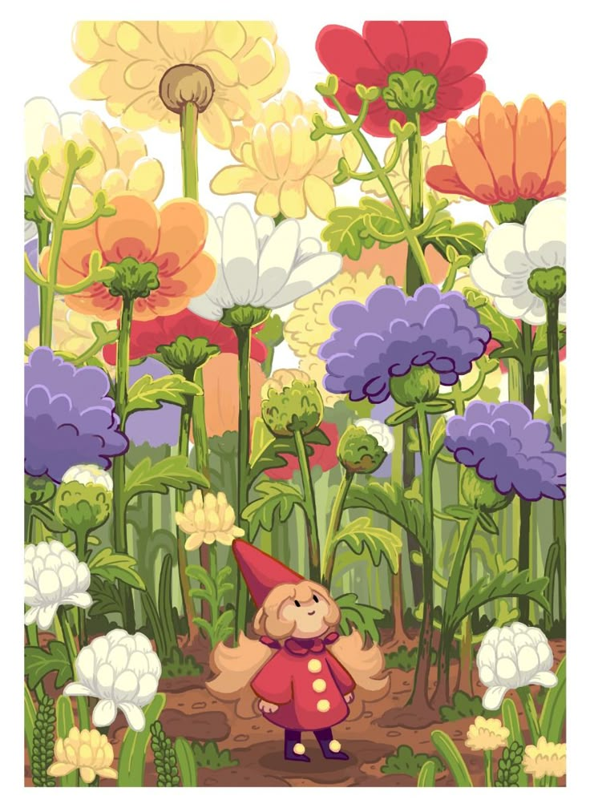
            </td>
            <td style="text-align: center;">
                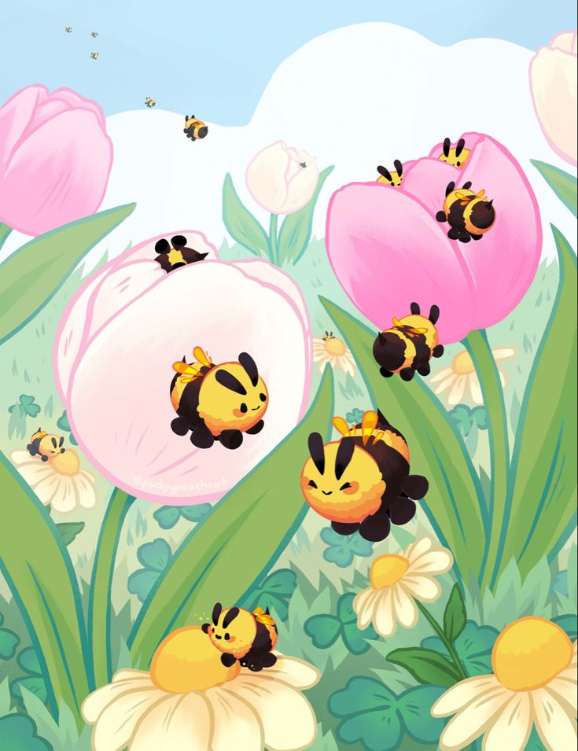
            </td>
            <td style="text-align: center;">
                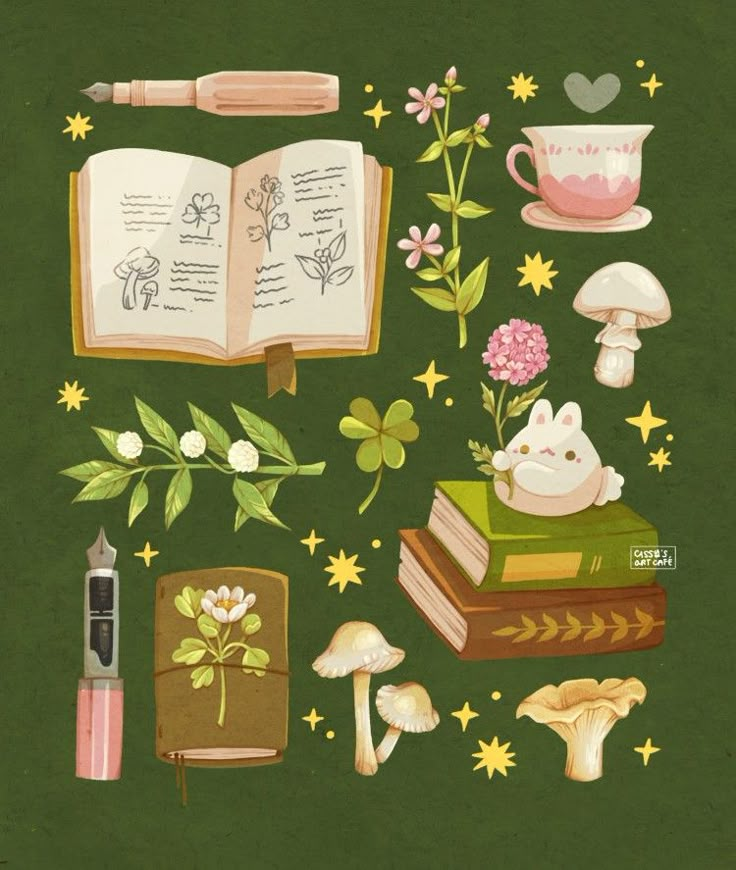
            </td>
        </tr>
    </tbody>
</table>

## 7. Interfaz
En esta sección se detallarán las pantallas clave que componen la experiencia de _The Living Garden_ manteniendo siempre un diseño que fomente la calma, la claridad y el foco en el entorno natural (acorde con la filosofía _Cozy Game_). Se especificarán las transiciones entre las vistas principales, así como la utilidad y el posicionamiento de cada elemento de la Interfaz Gráfica de Usuario (GUI).

### 7.1. Diagrama de flujo
El siguiente diagrama de flujo muestra las pantallas a lo largo del juego y las transiciones entre ellas:
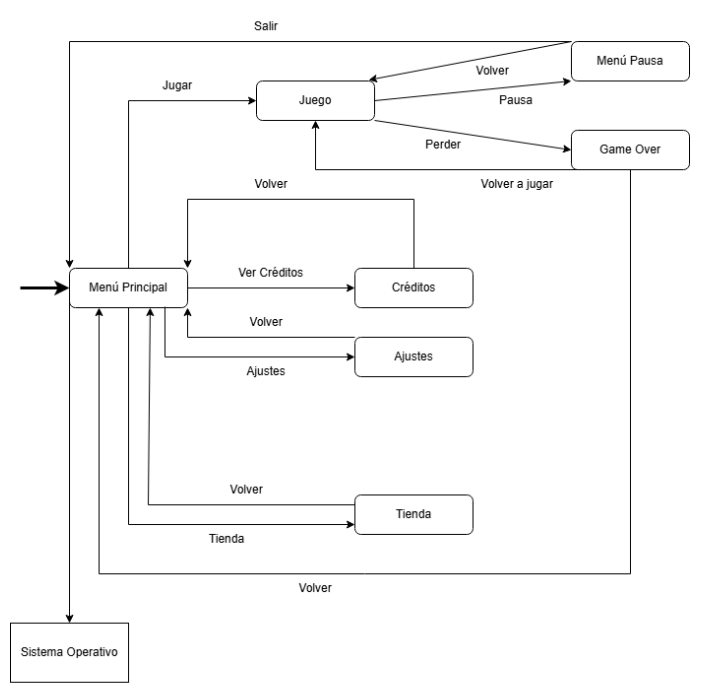

### 7.2. Diseños básicos de los menús
A continuación, se muestran unos bocetos de cómo serían las diferentes pantallas a lo largo del juego y sus botones.

**Menú principal:**

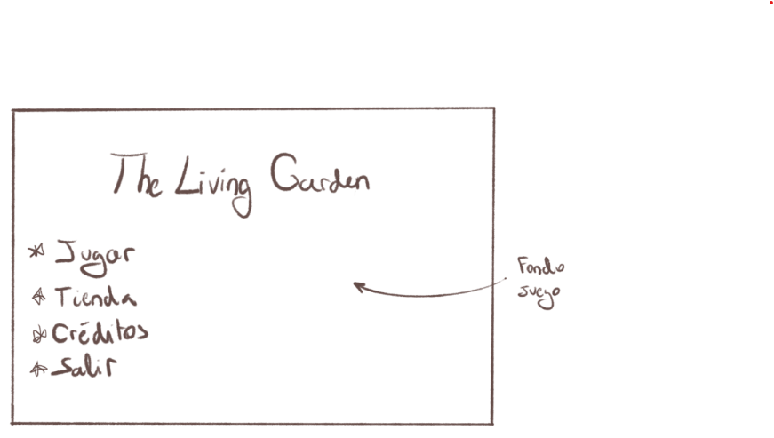

**Ajustes:**

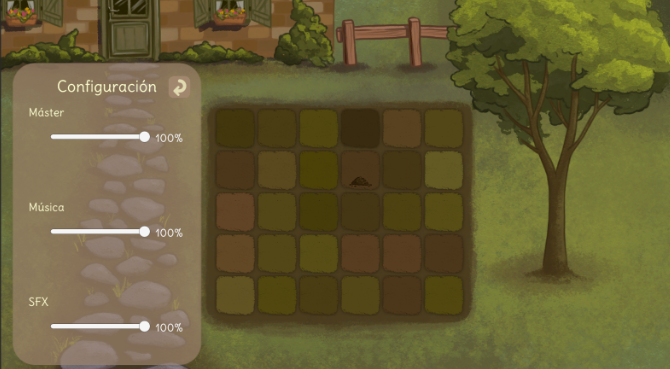

**Pantalla de juego:**

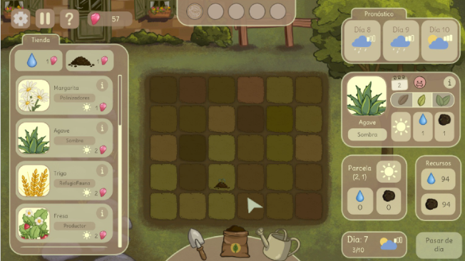
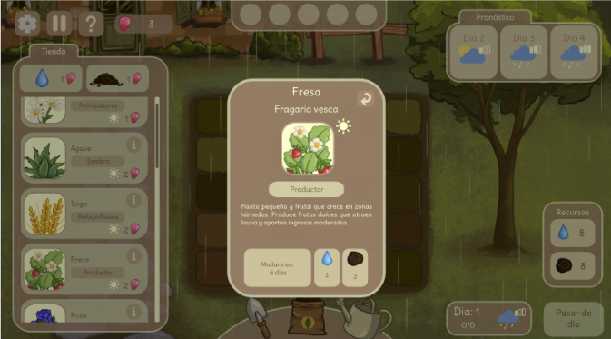

**Menú de pausa:**

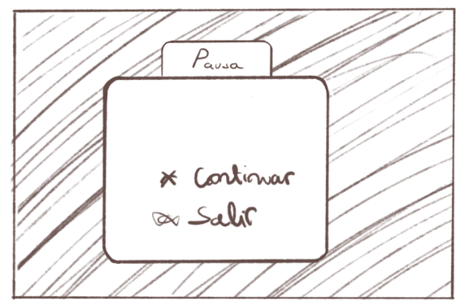

**Menú de créditos:**

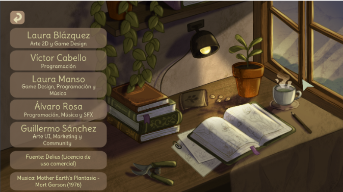

**Menú de guía rápida:**

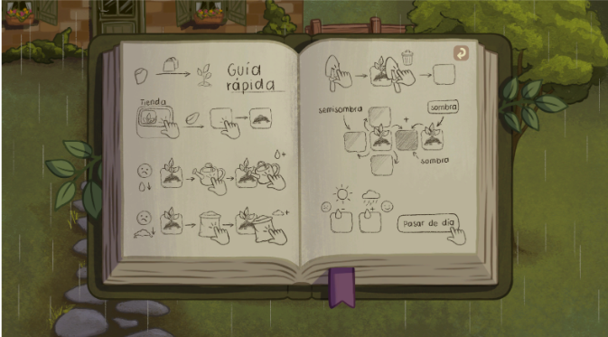

## 8. Hoja de ruta de desarrollo
| Hito | Descripción | Fecha |
|-----------|-----------|-----------|
| 1 | GDD | 19/10/25 |
| 2 | Prototipo | 19/10/25 |
| 3 | Integración estética | 16/11/25 |
| 4 | Mecánicas completas | 16/11/25 |
| 5 | Contenido final y narrativa | 16/11/25 |
| 6 | Pulido completo | 09/12/2025 |
| 7 | Día de lanzamiento | 10/10/25 |

## 9. Historial de Versiones y Cambios

### 9.1. Versión v.0.3 Gold Release (Diciembre 2025)
Esta revisión se centra en la redefinición del modelo de negocio hacia un enfoque social y en la implementación de mecánicas de retención a largo plazo.

#### Modelo de Negocio (Sección 2)
- **Enfoque "Serious Game"**: Se reorienta el proyecto para optar a financiación institucional y subvenciones culturales/medioambientales, priorizando el valor educativo sobre la monetización agresiva.

- **Publicidad Nativa (Product Placement)**: Se sustituye la publicidad intrusiva por la integración de marcas reales en las herramientas y consumibles del juego (ej. sacos de abono de marca real).

- **Monetización In-Game**: Se han eliminado las ventas de objetos que afectan a la jugabilidad, dejando en la tienda solo objetos cosméticos.

- **Impacto Real**: Se introduce la mecánica de "Retos Comunitarios" donde los logros en el juego se traducen en acciones físicas (plantación de árboles reales) patrocinadas por marcas.

#### Strikes (Sección 4.2.5)
Se han modificado ligeramente los motivos de los strikes, ya que se ha detectado que esta mecánica era bastante fácil de evadir.
- **Strike normal**: Cambio de 3 a solo 2 plantas muertas.
- **Nuevo strike**: Si pasas de día muchas veces sin plantas.
- **Quitar strike**: Se ha cambiado a que tengas que estar 5 días sin muertes con al menos 3 plantas en el jardín.

#### Plantas (Sección 4.5)
Se ha ajustado la economía para hacer el juego más interesante, por lo que se han modificado los valores de las diferentes especies. Además se han eliminado las especies que finalmente se ha decidido que no van a estar en el juego.

#### Sistema de temporadas (Sección 4.6)
- **Sistema de Temporadas**: Para mejorar la retención de usuario se ha incluido, como proyecto para implementar en el futuro, las "Temporadas Trimestrales". Cada temporada desbloquea nuevos biomas globales y colecciones de flora/fauna específicas para mantener la frescura del juego.
- **Santuario Base**: Se mantiene el gameplay original, pero se añade un entorno persistente y seguro que no se resetea. Aquí el jugador conserva y colecciona las especies "rescatadas" en las expediciones, permitiendo la personalización y la venta de cosméticos.

#### Tutorial (Sección 5.4)
El tutorial era demasiado pesado y no se entendía, por lo que además de modificar su implementación, se ha modificado su guión.

### 9.2. Versión v.0.2 Beta (Octubre 2025) 

#### Mecánicas de Juego (Core Gameplay)

El cambio más significativo se encuentra en la profundización y definición de las mecánicas de juego, que han pasado de ser conceptos generales a reglas de sistema específicas:

* Definición del Sistema de Strikes (Sección 4.2.5): Se ha implementado el sistema de 5 strikes para la derrota. Se diferencian Strikes Amarillos (No permanentes, se obtienen por cada 3 muertes de plantas ) y Strikes Rojos (Permanentes, se obtienen por bancarrota total, quedando a 0 pétalos y 0 plantas ).
* Sistema Detallado de Clima y Plagas (Sección 4.2.3): Se ha añadido una sección completa que define la jugabilidad de los eventos externos.
    * Clima: Se han definido los efectos positivos y negativos del Soleado (3 intensidades de sequía probabilística ), Lluvia (añade agua, pero la Intensidad 3 es peligrosa para plantas débiles ) y Granizo (añade poca agua y es peligroso para plantas débiles ).
    * Plagas: Se ha definido la mecánica completa: probabilidad de aparición (10% por día ), anulación de efectos de la planta , expansión a plantas adyacentes de la misma especie y la cura (plantar refugios de fauna adyacentes ).
* Categorías de Plantas y Sinergias (Sección 4.2.2): El sistema de cultivo se ha expandido para incluir formalmente 4 categorías de plantas (Productoras, Polinizadores, Sombra, Refugio de Fauna). Estas interactúan entre sí (ej. polinizadores activan la producción de las plantas productoras).
* Economía Detallada (Pétalos) (Sección 4.2.1): Se han definido las fórmulas exactas para la obtención de ingresos diarios, que ahora incluyen:
Ingreso Base (+1 pétalo, solo si se tienen plantas).
    * Bono por Cantidad (+1 pétalo por cada 2 de biodiversidad).
    * Bono de Madurez (+1 pétalo por cada 2 plantas maduras).
    * Bono de Diversidad (+1 pétalo si hay 4 categorías maduras).
    * Bono de Exposición Solar (+1 pétalo si todas las plantas están correctas).
* Adquisición de Recursos (Agua/Abono) (Sección 4.2.1): Se ha establecido la fórmula de adquisición diaria de recursos: 0 si no hay biodiversidad, o 1 + Biodiversidad Actual si hay más de 0.
* Definición de Victoria y Biodiversidad (Sección 4.2.5): Se ha establecido el objetivo de victoria en 10 puntos de Biodiversidad. Se ha definido la fórmula de cálculo de biodiversidad: (Nº de especies únicas en estado 'Brote' o superior) + (1 si hay Polinizadores) + (1 si hay Fauna de Refugio).

#### Interfaz y Arte (UI/UX y Assets)

El GDD v1 presentaba bocetos y arte conceptual. La v2 integra los recursos finales:
* Implementación de la Interfaz Final (Sección 7.2): Se han reemplazado todos los bocetos dibujados a mano por los diseños y capturas de la interfaz (UI) finales del juego, incluyendo la Pantalla de Juego, Menú Principal, Ajustes y Créditos.
* Integración de Recursos Artísticos (Assets) (Sección 6.2): Todos los placeholders han sido reemplazados por los sprites 2D finales de las plantas (mostrando sus 3 estados de salud) , los personajes (Leo) , los objetos (herramientas, monedas) y el escenario de juego.

#### Narrativa y Documentación

* Guión Completo del Tutorial (Sección 5.4): Se ha redactado el guión completo y detallado del tutorial, guiado por el personaje Leo. El guión ahora explica todas las mecánicas principales implementadas (ciclo de día, categorías de plantas, clima, plagas, strikes) .
* Detalle de Objetos (Sección 4.5): La lista de plantas se ha formalizado en una tabla detallada que especifica todos sus atributos de gameplay (coste, tiempos de crecimiento, demandas de agua/abono/sol, categoría).
